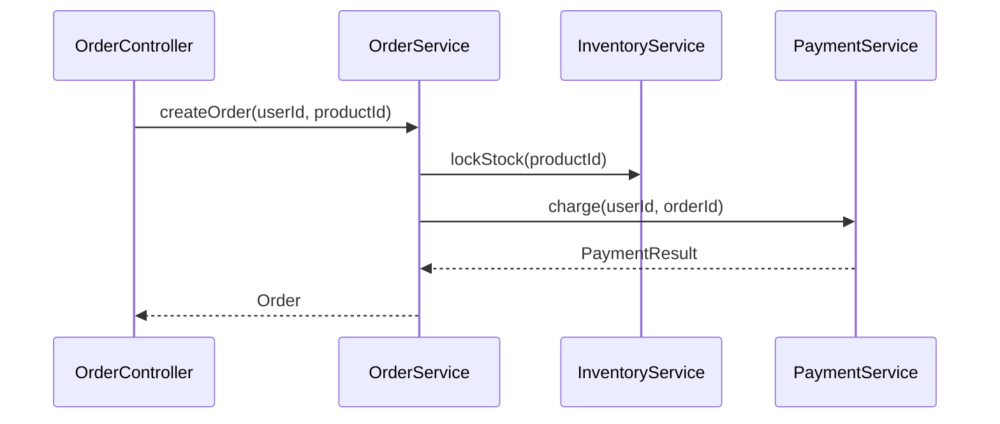

# AI 工作流解释器功能实现方案

## 一、功能概述

### 1.1 功能目标

AI 工作流解释器（AI Workflow Explainer）是一个 IntelliJ IDEA 插件功能，旨在帮助开发者理解代码方法的调用上下文和业务流程。当用户在代码编辑器中选中某个方法调用时，插件能够：

- 自动分析方法的调用链（上行和下行）
- 提取方法的上下文信息（类、注解、注释等）
- 生成结构化的上下文数据
- 通过 AI 生成可视化的调用时序图和业务逻辑说明

### 1.2 核心能力

**获取方法的调用上下文信息**，包括：

| 信息类型           | 说明          | 示例                                                        |
|----------------|-------------|-----------------------------------------------------------|
| 当前方法签名         | 光标所在的方法调用   | `OrderController#createOrder(...)`                        |
| 当前调用点所在类       | 调用发生的类      | `OrderController`                                         |
| 调用链上层          | 谁调用了当前方法    | `UserController -> OrderController -> OrderService`       |
| 被调用方法定义位置      | 目标方法的定义     | `OrderService#createOrder(...)`                           |
| 下层依赖关系         | 当前方法调用了哪些方法 | `InventoryService#lockStock()`, `PaymentService#charge()` |
| 所在包、模块、文件      | 项目结构信息      | `com.company.project.module.order`                        |
| 相关注解           | 方法/类上的注解    | `@Transactional`, `@Service`, `@RestController`           |
| Javadoc / 注释内容 | 文档注释        | 便于 AI 理解业务语义                                              |

## 二、技术实现方案

### 2.1 技术架构

基于 IntelliJ 平台的 **PSI（Program Structure Interface）** 和索引机制实现：

```
用户操作（光标定位）
    ↓
PSI 元素定位
    ↓
调用链分析（上行/下行）
    ↓
上下文信息提取
    ↓
结构化数据生成（JSON）
    ↓
AI 处理（生成时序图和说明）
```

### 2.2 核心 API 使用

#### 2.2.1 获取光标位置的 PSI 元素

```java
Editor editor = FileEditorManager.getInstance(project).getSelectedTextEditor();
PsiFile psiFile = PsiDocumentManager.getInstance(project).getPsiFile(editor.getDocument());
PsiElement elementAtCaret = psiFile.findElementAt(editor.getCaretModel().getOffset());
```

**说明**：获取光标对应的语法节点（PsiElement），然后逐层向上查找是否在方法调用或声明中。

#### 2.2.2 判断是否是方法调用表达式

```java
if (elementAtCaret instanceof PsiIdentifier) {
    PsiElement parent = elementAtCaret.getParent();
    if (parent instanceof PsiMethodCallExpression) {
        PsiMethodCallExpression callExpr = (PsiMethodCallExpression) parent;
        PsiMethod resolvedMethod = callExpr.resolveMethod();
        // 获取方法信息
        String methodName = resolvedMethod.getName();
        PsiClass containingClass = resolvedMethod.getContainingClass();
        PsiParameterList parameterList = resolvedMethod.getParameterList();
        PsiModifierList modifierList = resolvedMethod.getModifierList();
    }
}
```

**说明**：通过 `resolveMethod()` 获取目标方法，可以提取方法名、所属类、参数列表、注解等信息。

#### 2.2.3 获取当前所在方法与类

```java
PsiMethod currentMethod = PsiTreeUtil.getParentOfType(elementAtCaret, PsiMethod.class);
PsiClass currentClass = PsiTreeUtil.getParentOfType(elementAtCaret, PsiClass.class);
```

**说明**：确定当前上下文（在哪个类的哪个方法里调用的）。

#### 2.2.4 分析调用关系：上行调用链

```java
Query<PsiReference> query = ReferencesSearch.search(
    resolvedMethod, 
    GlobalSearchScope.projectScope(project)
);
for (PsiReference ref : query) {
    PsiElement caller = ref.getElement();
    PsiMethod callerMethod = PsiTreeUtil.getParentOfType(caller, PsiMethod.class);
    if (callerMethod != null) {
        // 收集调用者信息
    }
}
```

**说明**：使用 `ReferencesSearch` 查找所有调用该方法的位置，可以递归地查出所有"谁调用了这个方法"。

**注意**：这类搜索是基于索引的，不是即时分析。如果项目特别大，建议异步执行 + 缓存结果。

#### 2.2.5 分析调用关系：下行调用链

```java
method.accept(new JavaRecursiveElementVisitor() {
    @Override
    public void visitMethodCallExpression(PsiMethodCallExpression expression) {
        PsiMethod called = expression.resolveMethod();
        if (called != null) {
            // 收集被调用方法信息
        }
    }
});
```

**说明**：遍历方法体，找出当前方法中调用的所有方法，从而向下扩展调用链。

### 2.3 调用链构建算法

#### 2.3.1 递归构建调用链

```java
public class CallGraphBuilder {
    private static final int MAX_DEPTH = 3; // 限制深度，避免性能问题
    private final Map<PsiMethod, CallGraph> cache = new ConcurrentHashMap<>();
    
    public CallGraph build(PsiMethod method, int depth) {
        // 深度限制
        if (depth > MAX_DEPTH) {
            return new CallGraph(method);
        }
        
        // 缓存检查
        if (cache.containsKey(method)) {
            return cache.get(method);
        }
        
        CallGraph graph = new CallGraph(method);
        
        // 下层调用（callees）
        method.accept(new JavaRecursiveElementVisitor() {
            @Override
            public void visitMethodCallExpression(PsiMethodCallExpression expression) {
                PsiMethod target = expression.resolveMethod();
                if (target != null && !target.equals(method)) {
                    CallGraph calleeGraph = build(target, depth + 1);
                    graph.addCallee(calleeGraph);
                }
            }
        });
        
        // 上层调用（callers）
        Query<PsiReference> query = ReferencesSearch.search(
            method, 
            GlobalSearchScope.projectScope(project)
        );
        for (PsiReference ref : query) {
            PsiMethod caller = PsiTreeUtil.getParentOfType(
                ref.getElement(), 
                PsiMethod.class
            );
            if (caller != null && !caller.equals(method)) {
                CallGraph callerGraph = build(caller, depth + 1);
                graph.addCaller(callerGraph);
            }
        }
        
        // 缓存结果
        cache.put(method, graph);
        return graph;
    }
}
```

#### 2.3.2 调用链获取流程

1. **定位光标** → 方法调用表达式
    - 获取被调用方法与当前上下文

2. **分析调用关系**（ReferencesSearch + RecursiveVisitor）
    - 递归生成上/下行调用树

3. **缓存结果**（SmartPsiElementPointer）
    - 避免重复解析，提升性能

4. **提供结构化 JSON**（供 AI）
    - AI Prompt 可以直接用这个上下文生成可视化说明、时序描述、业务解释等

## 三、数据结构设计

### 3.1 上下文数据结构（JSON）

目标：既能让 AI 准确理解上下文逻辑，又不至于太长或冗余。

```json
{
  "project": {
    "name": "order-platform",
    "package": "com.company.project.order"
  },
  "currentClass": {
    "name": "OrderService",
    "qualifiedName": "com.company.project.order.service.OrderService",
    "annotations": ["@Service", "@Transactional"],
    "docComment": "Service responsible for handling order creation and payment workflow."
  },
  "currentMethod": {
    "name": "createOrder",
    "signature": "public Order createOrder(Long userId, Long productId)",
    "parameters": [
      {
        "name": "userId",
        "type": "Long",
        "description": "ID of the user creating the order"
      },
      {
        "name": "productId",
        "type": "Long",
        "description": "ID of the product being ordered"
      }
    ],
    "returnType": "Order",
    "annotations": ["@Transactional"],
    "docComment": "Creates a new order and triggers related operations like inventory lock and payment.",
    "bodySummary": [
      "Validate user and product",
      "Lock product inventory",
      "Create order record",
      "Trigger payment service"
    ]
  },
  "callers": [
    {
      "class": "OrderController",
      "method": "createOrder",
      "signature": "public Response createOrder(Long userId, Long productId)",
      "annotations": ["@PostMapping(\"/orders\")"],
      "docComment": "Handles user requests to create an order."
    }
  ],
  "callees": [
    {
      "class": "InventoryService",
      "method": "lockStock",
      "signature": "public void lockStock(Long productId, Integer count)",
      "docComment": "Locks product stock before payment."
    },
    {
      "class": "PaymentService",
      "method": "charge",
      "signature": "public PaymentResult charge(Long userId, Long orderId)",
      "docComment": "Processes payment for the given order."
    }
  ]
}
```

### 3.2 字段说明

| 字段              | 说明                | 用途                                  |
|-----------------|-------------------|-------------------------------------|
| `project`       | 项目名、包路径           | 给 AI 业务范围上下文                        |
| `currentClass`  | 当前类信息             | 判断层级（Controller/Service/Repository） |
| `currentMethod` | 当前方法详细信息          | 主体逻辑描述                              |
| `parameters`    | 参数类型与用途           | 生成时序图中对象节点                          |
| `callers`       | 谁调用了当前方法          | 生成上层调用链                             |
| `callees`       | 当前方法调用了哪些方法       | 生成下层流程                              |
| `bodySummary`   | 方法中关键步骤（通过静态分析提取） | 帮助 AI 理解逻辑内容                        |

## 四、性能优化策略

### 4.1 性能问题与解决方案

| 问题        | 优化方向  | 实现方式                                                        |
|-----------|-------|-------------------------------------------------------------|
| 大项目调用链过长  | 限制深度  | 设置 `MAX_DEPTH = 2~3`                                        |
| 同步执行阻塞 UI | 异步执行  | 使用 `ProgressManager.runProcessWithProgressAsynchronously()` |
| 重复解析相同方法  | 缓存结果  | `ConcurrentHashMap<PsiMethod, CallGraph>`                   |
| 接口方法精度问题  | 查找实现类 | 结合 `ImplementationSearch` 查找实际类实现                           |

### 4.2 异步执行实现

```java
ProgressManager.getInstance().runProcessWithProgressAsynchronously(
    new Task.Backgroundable(project, "分析调用链...", true) {
        @Override
        public void run(@NotNull ProgressIndicator indicator) {
            indicator.setIndeterminate(true);
            // 执行调用链分析
            CallGraph graph = callGraphBuilder.build(method, 0);
            // 生成 JSON
            String json = generateContextJson(graph);
            // 调用 AI 处理
            ApplicationManager.getApplication().invokeLater(() -> {
                processWithAI(json);
            });
        }
    },
    null
);
```

### 4.3 缓存策略

```java
private final Map<SmartPsiElementPointer<PsiMethod>, CallGraph> cache = 
    new ConcurrentHashMap<>();

public CallGraph build(PsiMethod method, int depth) {
    SmartPsiElementPointer<PsiMethod> pointer = 
        SmartPointerManager.getInstance(project).createSmartPsiElementPointer(method);
    
    if (cache.containsKey(pointer)) {
        return cache.get(pointer);
    }
    
    // ... 构建调用链 ...
    
    cache.put(pointer, graph);
    return graph;
}
```

**说明**：使用 `SmartPsiElementPointer` 可以安全地缓存 PSI 元素，即使文件被修改也能正确处理。

## 五、AI 集成方案

### 5.1 Prompt 模板（中文版）

```
你是一名资深的系统架构师和技术分析师。

请根据以下方法上下文信息，分析该方法的业务流程，并生成一份清晰的调用时序图（Mermaid 格式）与业务逻辑说明。

要求：
1. 理解该方法在系统调用链中的位置（谁调用了它、它调用了谁）。
2. 绘制完整的调用顺序图，展示方法之间的交互关系。
3. 用简洁的技术语言解释该方法的主要职责和业务作用。
4. 不要编造上下文中不存在的细节。

以下是方法上下文（JSON）：

{你的 JSON 数据}

请输出：
- 一段 **Mermaid 时序图**
- 一段 **中文技术说明（3-5 句话）**
```

### 5.2 Prompt 模板（英文版）

```
You are a senior software architect and system analyst.

Your task is to analyze the following method context and generate a clear explanation
of its workflow, including a visual call sequence (Mermaid format) and a concise business logic summary.

Requirements:

1. Understand how this method fits into the overall call chain.
2. Identify the sequence of method calls from the caller to the callees.
3. Generate a readable sequence diagram in Mermaid format.
4. Explain in plain technical language what this method does, and its role in the system.
5. Avoid adding any speculative details that are not supported by the given context.

Here is the method context (JSON):

{your JSON data here}

Now please output:

- A **Mermaid sequence diagram** describing the call flow.
- A **technical explanation** (3-5 sentences) summarizing the business logic and purpose of this method.
```

### 5.3 AI 输出示例

**输入**：

```json
{
  "currentMethod": "OrderService#createOrder",
  "callerChain": ["OrderController#createOrder", "OrderFacade#processOrder"],
  "calleeChain": ["InventoryService#lockStock", "PaymentService#charge"]
}
```

**输出**：

#### Sequence Diagram



#### Explanation

该方法位于订单创建流程的核心逻辑中，由 `OrderController#createOrder`
调用。它依次锁定库存并触发支付，属于订单业务的事务性聚合层。典型调用顺序为：Controller → Service → Repository。整体属于订单提交的主业务流。

## 六、实现步骤

### 6.1 阶段一：核心功能实现

1. **PSI 元素定位模块**
    - 实现光标位置检测
    - 实现方法调用表达式识别
    - 实现当前上下文获取

2. **调用链分析模块**
    - 实现上行调用链分析（ReferencesSearch）
    - 实现下行调用链分析（RecursiveVisitor）
    - 实现调用链构建算法

3. **上下文信息提取模块**
    - 提取类信息（名称、包、注解、注释）
    - 提取方法信息（签名、参数、返回值、注解、注释）
    - 提取项目信息

### 6.2 阶段二：数据结构与序列化

1. **数据结构定义**
    - 定义 `CallGraph` 类
    - 定义 `MethodContext` 类
    - 定义 `ClassContext` 类

2. **JSON 序列化**
    - 实现上下文数据到 JSON 的转换
    - 处理循环引用问题
    - 优化 JSON 大小

### 6.3 阶段三：性能优化

1. **异步执行**
    - 实现后台任务执行
    - 添加进度指示器
    - 处理取消操作

2. **缓存机制**
    - 实现调用链缓存
    - 实现 PSI 元素指针缓存
    - 处理缓存失效

### 6.4 阶段四：AI 集成

1. **AI 服务调用**
    - 集成 AI 服务提供商接口
    - 实现 Prompt 构建
    - 实现响应解析

2. **结果展示**
    - 实现 Mermaid 图表渲染
    - 实现说明文本展示
    - 实现结果导出功能

## 七、涉及的文件和类

### 7.1 核心类设计

```
ai-common/src/main/java/dev/dong4j/zeka/stack/idea/plugin/common/workflow/
├── CallGraphBuilder.java          # 调用链构建器
├── CallGraph.java                  # 调用图数据结构
├── MethodContextExtractor.java    # 方法上下文提取器
├── WorkflowContext.java            # 工作流上下文数据结构
├── WorkflowExplainerAction.java   # 主 Action（触发功能）
└── WorkflowExplainerService.java  # 工作流解释服务
```

### 7.2 工具类

```
ai-common/src/main/java/dev/dong4j/zeka/stack/idea/plugin/common/workflow/util/
├── PSIUtil.java                    # PSI 工具类
├── MethodInfoExtractor.java        # 方法信息提取工具
└── JSONSerializer.java             # JSON 序列化工具
```

## 八、测试计划

### 8.1 单元测试

- PSI 元素定位测试
- 调用链构建测试
- 上下文信息提取测试
- JSON 序列化测试

### 8.2 集成测试

- 完整工作流测试（从光标定位到 AI 输出）
- 大项目性能测试
- 边界情况测试（循环调用、深度调用等）

### 8.3 用户体验测试

- 响应时间测试
- UI 交互测试
- 错误处理测试

## 九、注意事项

### 9.1 线程安全

- PSI 操作必须在 `ReadAction` 中执行
- UI 更新必须在 EDT 中执行
- 使用 `ApplicationManager.getApplication().invokeLater()` 进行线程切换

### 9.2 异常处理

- 处理 PSI 元素可能为 null 的情况
- 处理索引未就绪的情况
- 处理 AI 服务调用失败的情况

### 9.3 性能考虑

- 限制调用链深度，避免无限递归
- 使用缓存减少重复计算
- 异步执行避免阻塞 UI
- 对于超大项目，考虑增量分析

## 十、后续扩展

### 10.1 功能扩展

- 支持多语言（Kotlin、Python 等）
- 支持类级别的调用链分析
- 支持依赖关系可视化
- 支持调用链导出（JSON、XML、图片等）

### 10.2 优化方向

- 增量分析（只分析变更部分）
- 并行分析（多线程构建调用链）
- 智能过滤（过滤框架方法、工具类方法等）
- 结果缓存持久化（跨会话缓存）

---


