# IntelliJ AI Javadoc 插件操作手册

## 📋 目录

1. [背景](#背景)
2. [插件功能概览](#插件功能概览)
3. [用户入口和触发方式](#用户入口和触发方式)
4. [操作步骤和效果](#操作步骤和效果)
5. [设置页面配置详解](#设置页面配置详解)
6. [开发者指南](#开发者指南)
7. [常见问题解答](#常见问题解答)

---

## 📖 背景

### 插件简介

**AI Javadoc: You Know, for Javaer, Fun**

专为批量生成符合规范的 JavaDoc 注释而设计，满足公司标准和 Checkstyle 检测要求。与通用 AI 工具或简单翻译工具不同，本插件专门针对快速、准确地为整个项目生成
JavaDoc 进行了优化。

### 为什么选择这个插件？

当需要为不符合规范的项目添加标准的 JavaDoc 时，通常会遇到以下问题：

- **翻译工具（如 EasyDoc）**：只是翻译现有注释，生成的内容没有实际意义
- **仅格式生成器**：只生成规范的 JavaDoc 格式，注释内容没有任何意义
- **通用 AI 工具**：功能太重，批量处理整个项目时速度非常慢，且不一定能一次完成

**本插件通过结合 AI 生成有意义的注释内容与优化的批量处理能力**，专门针对企业级 JavaDoc 合规任务而设计，完美解决了这些问题。

### 核心优势

- **有意义的 AI 生成注释**：使用 AI 理解代码并生成有意义的 JavaDoc，而非仅生成格式模板
- **快速批量处理**：针对整个项目快速处理进行了优化，支持并行处理和性能模式
- **合规导向**：生成符合 Checkstyle 和公司标准的 JavaDoc
- **多种 AI 提供商支持**：支持通义千问、Ollama、OpenAI 等多种 AI 服务
- **灵活的触发方式**：可通过快捷键、右键菜单、Generate 菜单等多种方式触发
- **智能识别**：自动识别类、方法、测试方法等不同元素
- **异步处理**：后台处理，不阻塞 IDE
- **进度显示**：实时显示处理进度和结果统计

### 安全特性

- **API Key 加密存储**：使用 IntelliJ Platform 的 PasswordSafe 机制，API Key 不会保存到配置文件中
- **系统级加密**：
    - **macOS**：使用 Keychain Access（钥匙串）
    - **Linux**：使用 GNOME Keyring 或 KWallet
    - **Windows**：使用 Credential Manager

### 相关链接

- [Website](https://aij.dong4j.site)
- [GitHub](https://github.com/zeka-stack/zeka-idea-plugin/tree/main/ai-javadoc)
- [Issues](https://github.com/zeka-stack/zeka-idea-plugin/issues)
- [Help](https://aij.dong4j.site/docs)

---

## 🚀 插件功能概览

### 核心功能

IntelliJ AI Javadoc 插件是一个功能强大的工具，利用人工智能为您的 Java 代码自动生成高质量的 JavaDoc 注释。插件支持多种 AI
服务提供商，提供智能且上下文感知的文档建议。

#### 主要特性

- **📝 AI 自动生成 JavaDoc**：利用 AI 技术自动为代码生成高质量的 JavaDoc 注释，支持类、方法、字段和测试方法
- **🤖 多 AI 提供商支持**：支持通义千问（阿里云）、Ollama 本地模型、自定义 OpenAI 兼容服务，灵活选择适合的 AI 服务
- **🔄 多种触发方式**：支持快捷键、右键菜单、Generate 菜单、Intention Action 和 Git 提交页面集成，使用便捷
- **📦 批量处理**：支持为整个文件、目录或多个文件批量生成文档，提高大规模项目的文档生成效率
- **⚡ 代码压缩**：智能压缩长代码，减少发送给 AI 的 token 数量，降低 API 调用成本，提高处理速度
- **🎨 格式化**：自动格式化生成的 JavaDoc，支持中英文间添加空格、中文标点转英文标点等格式优化
- **🏷️ 自定义 JavaDoc 标签**：支持添加自定义 JavaDoc 标签，让 IDE 识别项目特定的标签，避免警告提示
- **📊 详细日志**：提供详细的处理过程日志，在优化提示词和排查问题时非常有用
- **✅ 配置验证**：内置连接测试功能，确保 AI 服务配置正确，避免使用时的错误

#### 技术特点

- **异步处理**：后台生成文档，不阻塞 IDE UI
- **进度显示**：实时显示处理进度和统计信息
- **错误隔离**：单个任务失败不影响其他任务
- **自动格式化**：生成的 JavaDoc 自动格式化
- **智能定位**：根据光标位置自动识别处理范围

---

## 🎯 用户入口和触发方式

插件提供了 6 种不同的触发方式，满足不同用户的使用习惯：

### 1. 快捷键方式（推荐）

**快捷键**：

- **Windows/Linux**：`Ctrl + Shift + D`
- **macOS**：`Cmd + Shift + D`

**特点**：

- 最快捷的触发方式
- 智能定位：根据光标位置自动识别要生成文档的元素
- 支持所有代码元素（类、方法、字段）

**智能定位逻辑**：

- 光标在方法上 → 只为该方法生成文档
- 光标在字段上 → 只为该字段生成文档
- 光标在类声明上 → 只为该类生成文档
- 光标在类内部（但不在特定成员上）→ 为整个类及所有成员生成文档
- 其他情况 → 为整个文件生成文档

### 2. 编辑器右键菜单

**位置**：在编辑器中右键 → "Generate Javadoc with AI"


**特点**：

- 与快捷键功能相同
- 适合不习惯使用快捷键的用户
- 智能定位功能完全一致

### 3. Generate 菜单

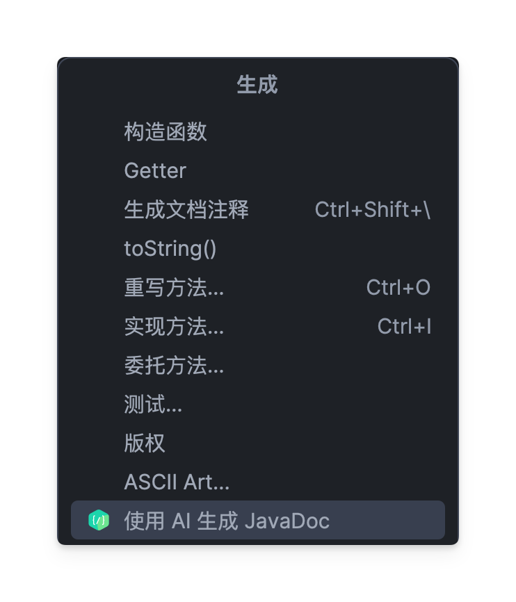

**快捷键**：

- **Windows/Linux**：`Alt + Insert`
- **macOS**：`Cmd + N`

**菜单位置**：Generate 菜单 → "JavaDoc with AI"

**特点**：

- 集成到 IntelliJ 的 Generate 菜单
- 与其他代码生成功能统一入口
- 智能定位功能完全一致

### 4. Intention Action（快速修复）


**快捷键**：

- **Windows/Linux**：`Alt + Enter`
- **macOS**：`Option + Enter`

**特点**：

- 只在可以生成 JavaDoc 的元素上显示
- 更精确的上下文感知
- 不在文件级别显示（避免重复）

**显示条件**：

1. 光标在类、方法或字段上
2. 该元素还没有 JavaDoc 注释
3. 当前文件是 Java 文件

### 5. 文件/目录右键菜单

**位置**：项目视图中，右键文件/目录 → "Generate Javadoc with AI"

**特点**：

- 支持批量处理多个文件或整个目录
- 适合大规模文档生成

### 6. Git 提交页面集成

**位置**：Git 提交工具栏中的 "Generate Javadoc" 按钮

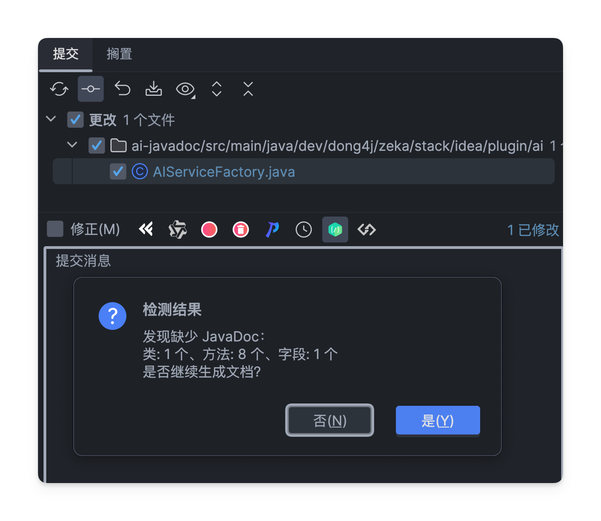

**特点**：

- 在提交代码前快速为缺少 JavaDoc 的代码生成文档
- 批量处理：一次性为所有缺少 JavaDoc 的元素生成文档

**此入口会忽略 [覆盖已有注释] 配置, 即只会为缺失的类, 方法, 字段生成 JavaDoc**

**使用步骤**：

1. 在 IntelliJ IDEA 中打开 Git 提交面板（`Cmd+K` / `Ctrl+K`）
2. 确保有 Java 文件变更（按钮只在有 Java 文件变更时显示）
3. 点击提交工具栏中的 "Generate Javadoc" 按钮
4. 等待检测完成，查看检测结果统计
5. 确认是否继续生成文档
6. 等待生成完成，查看生成结果

**检测结果示例**：

```
检测结果
发现以下元素缺少 JavaDoc：
类: 2 个、方法: 5 个、字段: 1 个
是否继续生成文档？
```

**注意事项**：

- 按钮仅在提交面板打开且有 Java 文件变更时显示
- 只检测提交的 Java 文件，不会处理未提交的文件
- 生成完成后，修改的文件会自动出现在提交列表中
- 如果所有代码元素都已包含 JavaDoc，会显示提示信息

---

## 📝 操作步骤和效果

### 基本操作流程

#### 1. 首次使用配置

**步骤**：

1. 打开 IntelliJ IDEA
2. 进入 **Settings**（macOS 上为 Preferences）→ **Tools** → **AI Javadoc**
3. 选择 AI 提供商（推荐通义千问）
4. 配置 API Key 和模型
5. 点击 **Test Connection** 验证配置
6. 点击 **Apply** 保存配置

#### 2. 生成单个元素文档

**步骤**：

1. 将光标放在要生成文档的元素上（方法、字段、类）
2. 使用任意触发方式（推荐快捷键 `Cmd+Shift+D`）
3. 等待处理完成
4. 查看生成的 JavaDoc 注释

**效果示例**：

**Before**：

```java
public class UserService {
    private String username;
    
    public String getUsername() {
        return username;
    }
}
```

**After**：

```java
/**
 * 用户服务类
 * 
 * <p>提供用户相关的业务逻辑处理
 */
public class UserService {
    /** 用户名 */
    private String username;
    
    /**
     * 获取用户名
     * 
     * @return 用户名
     */
    public String getUsername() {
        return username;
    }
}
```

#### 3. 批量生成文档

**步骤**：

1. 在项目视图中右键点击文件或目录
2. 选择 "Generate Javadoc with AI"
3. 等待处理完成
4. 查看进度和统计信息

**效果**：

- 显示处理进度：`正在处理: 5/10`
- 显示完成统计：`成功: 8, 失败: 1, 跳过: 1`

### 智能定位示例

#### 示例 1：为单个方法生成

```java
public class Calculator {
    
    public int add(int a, int b) {  // 光标在这一行
        return a + b;
    }
    
    public int subtract(int a, int b) {
        return a - b;
    }
}
```

**操作**：将光标放在 `add` 方法上，按 `Cmd+Shift+D`

**结果**：只为 `add` 方法生成 JavaDoc，`subtract` 方法不受影响

#### 示例 2：为单个字段生成

```java
public class User {
    
    private String name;  // 光标在这一行
    
    private int age;
    
    public String getName() {
        return name;
    }
}
```

**操作**：将光标放在 `name` 字段上，按 `Cmd+Shift+D`

**结果**：只为 `name` 字段生成 JavaDoc

#### 示例 3：为整个类生成

```java
public class Product {  // 光标在类名上
    
    private String name;
    
    private double price;
    
    public String getName() {
        return name;
    }
}
```

**操作**：将光标放在类名 `Product` 上，按 `Cmd+Shift+D`

**结果**：为类、所有字段和所有方法生成 JavaDoc

### 测试方法识别

插件能够自动识别 JUnit 4 和 JUnit 5 的测试方法，并使用专门的模板生成更符合测试方法特点的文档。

**示例**：

**Before**：

```java
@Test
public void testCalculateSum() {
    // 测试代码
}
```

**After**：

```java
/**
 * 测试计算总和功能
 * 
 * <p>验证 add 方法能正确计算两个数的和
 * 
 * <p>测试场景：
 * <ul>
 *   <li>正常情况：正数相加</li>
 *   <li>边界情况：零值相加</li>
 *   <li>异常情况：负数相加</li>
 * </ul>
 */
@Test
public void testCalculateSum() {
    // 测试代码
}
```

---

## ⚙️ 设置页面配置详解

### 配置入口

**路径**：Settings → Tools → AI Javadoc

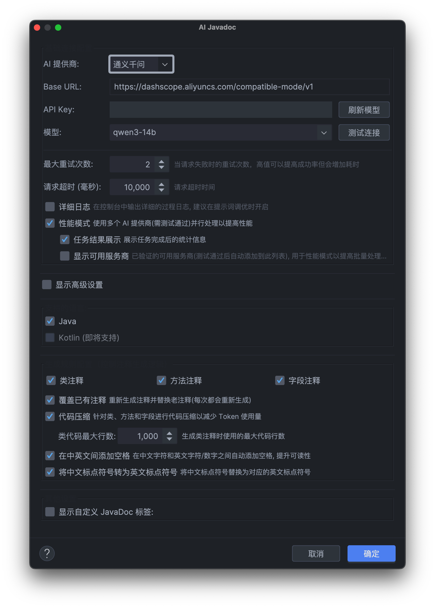

设置页面分为以下几个部分，下面逐一说明每个配置项的作用和使用场景。

---

## 📡 基础连接配置

这是使用插件前必须配置的部分，用于连接 AI 服务。

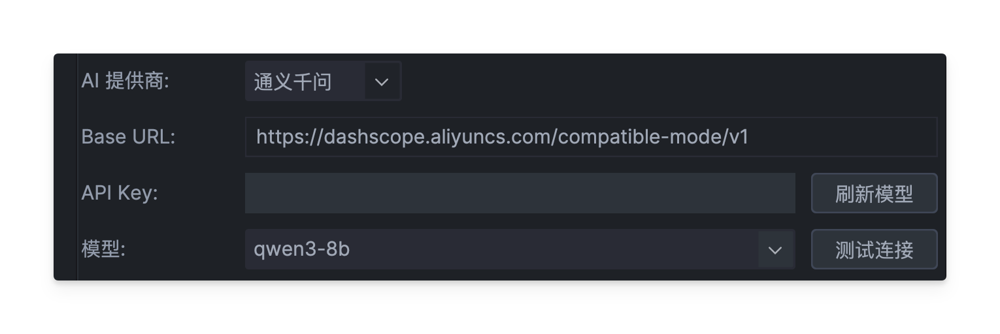

### 1. AI 提供商

**作用**：选择要使用的 AI 服务提供商

**选项说明**：

- **通义千问**：阿里云提供的 AI 服务，适合中文文档生成，需要 API Key，有使用成本
- **硅基流动**：囊括国内大多数 AI 模型, 相当于一个集成商, 有免费模型后收费模型, 且调用频率限制较大, 有使用成本
- **Ollama**：本地运行的 AI 服务，数据完全私有，不需要 API Key，但需要本地安装 Ollama
- **LM Studio**: 同 Ollama, 可以下载使用大量开源模型, 完全本地私有部署
- **自定义服务**：支持任何兼容 OpenAI API 的服务，可以连接自己搭建的 AI 服务

**使用建议**：

- 普通用户推荐使用**通义千问**，配置简单，生成质量高
- 注重数据隐私的用户可以使用 **Ollama**和 **LM Studio**, 但需要本地有足够的计算资源(Ollama 可使用 cloud 模型, 不过需要账号登录 Ollama)
- 有自建 AI 服务的用户可以选择**自定义服务**

### 2. Base URL（服务地址）

**作用**：AI 服务的访问地址

**说明**：

- 通义千问和硅基流动无法填写, LM Studio和 Ollama 会自动填充默认地址，一般不需要修改
- 只有使用自定义服务时才需要手动填写
- 自定义服务默认使用：`https://api.openai.com/v1`, 注意添加 path 路径 **v1**

**使用场景**：

- 使用自定义服务时需要填写
- 如果 Ollama 运行在其他端口，需要修改地址

### 3. API Key（API 密钥）

**作用**：用于身份验证的密钥

**说明**：

- **通义千问** 和 **硅基流动**：必须填写，在阿里云控制台获取
- **Ollama** 和 **LM Studio**：不需要填写（本地服务无需验证）
- **自定义服务**：根据服务要求决定是否需要

**安全提示**：

- API Key 会使用系统密钥管理器加密保存，不会明文显示
- 建议定期更换 API Key，避免泄露

### 4. 模型

**作用**：选择使用的 AI 模型

### 5. 刷新模型

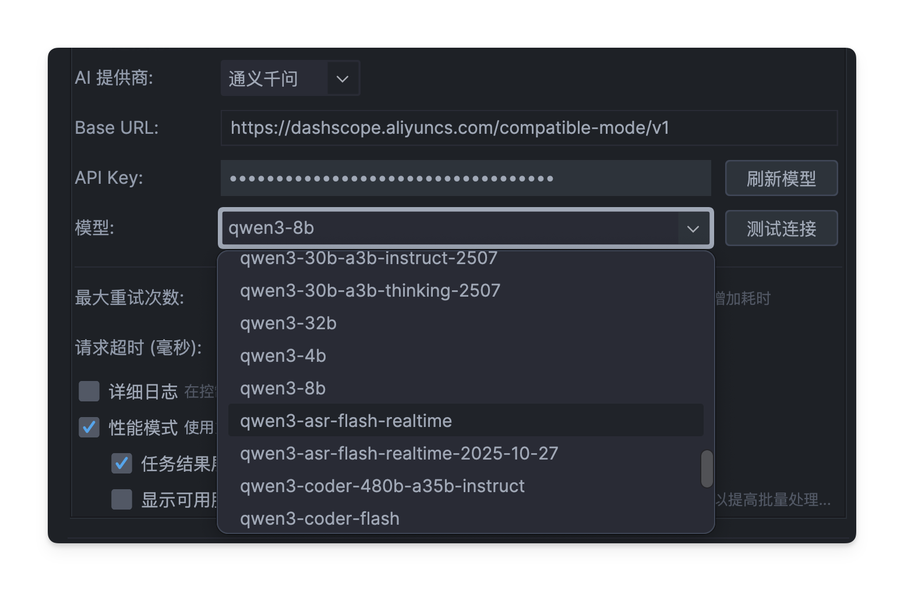

**作用**：从服务提供商获取最新的可用模型列表

**使用场景**：

- 服务商新增了模型时
- 想查看当前可用的所有模型时
- 模型列表可能不完整时

**说明**：

- 点击后会从服务商获取最新的模型列表
- 会自动更新下拉框中的选项
- 如果当前选择的模型仍然可用，会保持选择

### 6. 测试连接

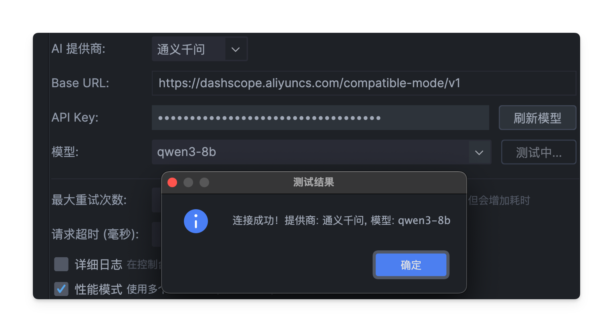

**作用**：验证配置是否正确，能否正常连接 AI 服务

**使用场景**：

- 首次配置后必须测试
- 修改配置后建议测试
- 遇到问题时用于排查

**操作步骤**：

1. 填写完所有配置后点击"测试连接"
2. 等待几秒钟查看结果
3. 如果成功，会显示"连接成功！"
4. 如果失败，会显示错误信息，根据提示修改配置

### 7. 最大重试次数

**作用**：当 AI 服务请求失败时，自动重试的次数

**默认值**：2 次

**范围**：0-10 次

**使用建议**：

- 网络不稳定时，可以增加到 5-7 次
- 网络稳定时，保持默认 2 次即可
- 设置为 0 表示不重试，失败直接报错

**适用场景**：

- 网络环境不稳定
- AI 服务偶尔超时
- 希望提高成功率

### 8. 请求超时（毫秒）

**作用**：等待 AI 服务响应的最长时间

**默认值**：30000 毫秒（30 秒）

**范围**：1000-300000 毫秒（1 秒到 5 分钟）

**使用建议**：

- 网络较慢时可以增加到 60 秒
- 使用本地 Ollama 时可以设置更长（如 120 秒）
- 网络很快时可以保持默认值

**适用场景**：

- 使用本地 AI 服务（响应较慢）
- 网络延迟较高
- 处理复杂代码时需要更长时间

### 9. 详细日志

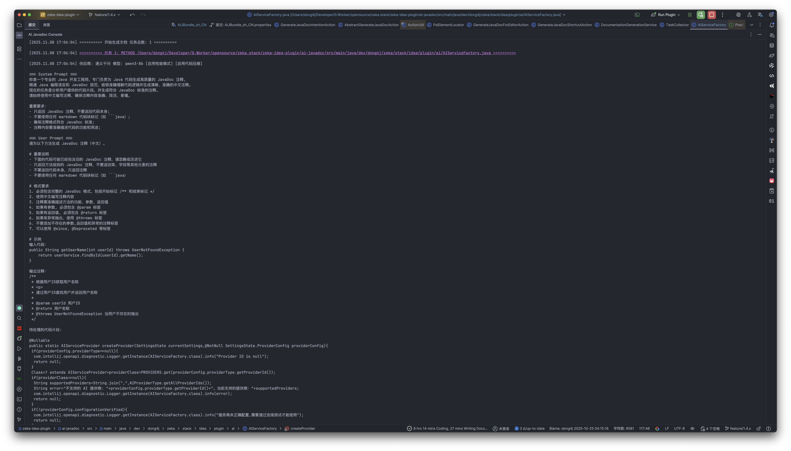

**作用**：在控制台输出详细的处理过程日志

**默认值**：关闭

**使用建议**：

- 正常使用时不需要开启
- 遇到问题时可以开启，便于排查
- 调试 Prompt 模板时可以开启，查看 AI 的响应

**适用场景**：

- 排查生成失败的原因
- 调试和优化 Prompt 模板
- 了解插件的详细工作流程

### 10. 性能模式

**作用**：使用多个 AI 提供商并行处理，提高批量处理速度

**默认值**：关闭

**使用说明**：

- 需要先配置多个可用的服务商（通过"测试连接"验证）
- 启用后，批量生成时会同时使用多个服务商
- 可以显著提高大批量文档生成的速度

**适用场景**：

- 需要为大量文件生成文档
- 有多个可用的 AI 服务商配置
- 追求更快的处理速度

**注意事项**：

- 需要至少有一个已验证的服务商配置
- 会增加 API 调用次数，可能增加成本
- 建议在"显示可用服务商"中管理服务商列表

### 11. 显示可用服务商

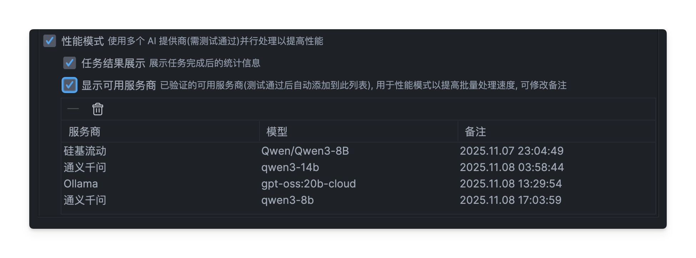

**作用**：显示和管理已验证的可用服务商列表

**使用说明**：

- 只有启用"性能模式"后才有意义
- 列表中显示所有通过"测试连接"验证的服务商
- 可以添加备注，方便识别不同的配置
- 可以删除不需要的配置

**适用场景**：

- 使用性能模式时
- 管理多个服务商配置
- 为不同配置添加备注说明

> 可以为同一个服务商添加多个可用配置, 比如使用 通义千问 时, 可以添加多个不同模型, 且可以使用不同的 apiKey 再次添加相同模型, 备注可修改,
> 比如写明这个模型是来自哪个账号

### 12. 任务结果展示

任务会在后台执行:

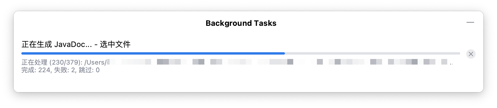

执行完成后可查看任务结果(需要开启 **任务结果展示**):

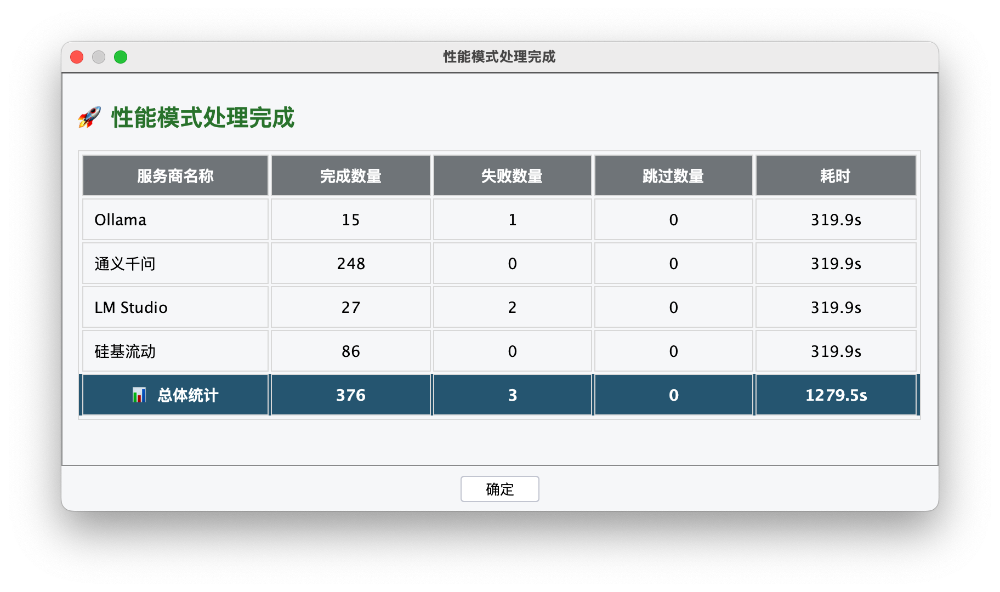

**作用**：在任务完成后显示统计信息

**使用说明**：

- 只有启用"性能模式"后才可用
- 显示每个服务商的处理结果统计
- 帮助了解不同服务商的表现

**适用场景**：

- 使用性能模式时
- 想了解不同服务商的表现
- 优化服务商配置

---

## 🔧 高级设置

高级设置默认是折叠的，点击"显示高级设置"复选框后展开。包含模型参数和 Prompt 模板配置。

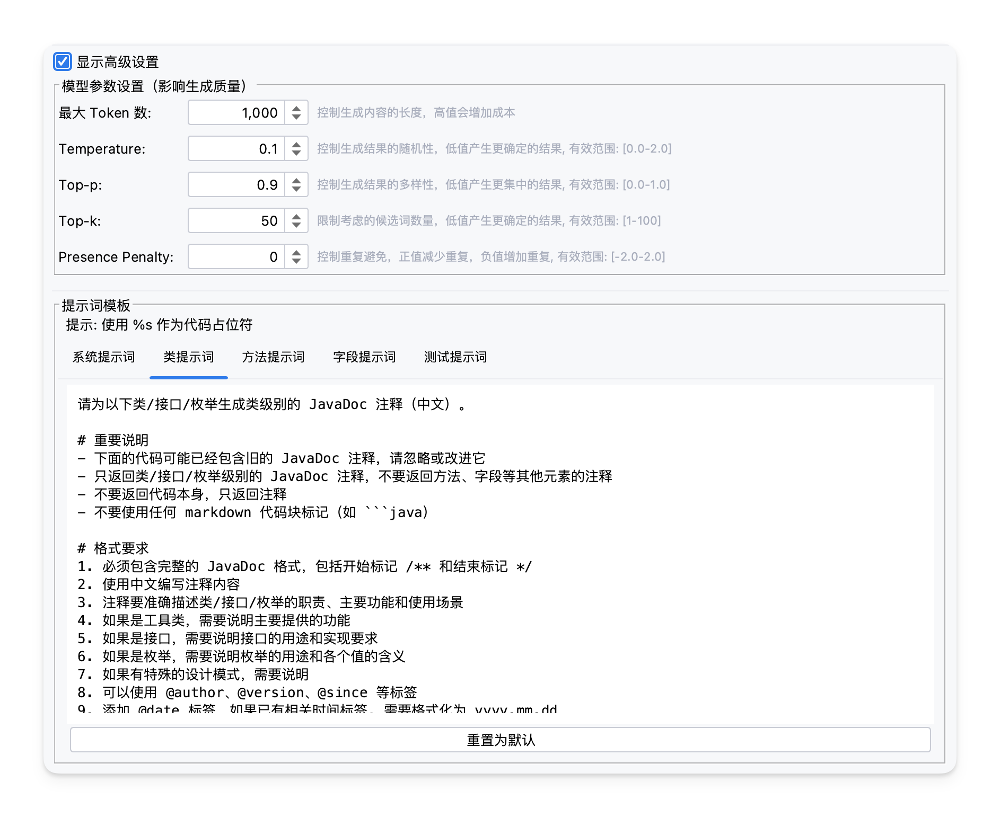

### 模型参数设置

这些参数影响 AI 生成文档的质量和风格，一般使用默认值即可。

#### 1. 最大 Token 数

**作用**：控制生成文档的最大长度

**默认值**：1000

**范围**：100-10000

**使用建议**：

- 简单方法保持默认 1000 即可
- 复杂类或方法可以增加到 2000-3000
- 不需要很长的文档时可以减少到 500-800

**适用场景**：

- 需要生成详细的文档（增加）
- 只需要简洁的文档（减少）
- 控制 API 调用成本（减少）

#### 2. Temperature（温度参数）

**作用**：控制生成内容的随机性和创造性

**默认值**：0.1

**范围**：0.0-2.0

**使用建议**：

- 保持默认 0.1 即可，生成更确定、一致的内容
- 需要更有创造性的描述时可以增加到 0.3-0.5
- 值越高，生成的内容越多样化，但可能不够准确

**适用场景**：

- 需要标准化的文档（低值，默认）
- 需要更有创意的描述（高值）
- 生成测试方法文档时可以适当提高

> 0.0 会非常确定（几乎确定性输出），>1.0 会非常随机，生产环境写文档/代码推荐 0.0–0.3，创意写作可用 0.7 及以上。

#### 3. Top-p

**作用**：控制生成内容的多样性

**默认值**：0.9

**范围**：0.0-1.0

**使用建议**：

- 一般保持默认值即可
- 需要更集中的内容时降低到 0.7-0.8
- 需要更多样化的内容时保持或提高到 0.95

**适用场景**：

- 需要一致的文档风格（低值）
- 需要多样化的表达（高值）

> 与 temperature 联用时通常二者不需同时极端，top-p=0.9 是常见稳妥值。

#### 4. Top-k

**作用**：限制 AI 选择词汇的范围

**默认值**：50

**范围**：1-100

**使用建议**：

- 一般保持默认值即可
- 需要更确定的内容时降低到 30-40
- 需要更多样化的内容时提高到 70-80

**适用场景**：

- 需要更准确的术语（低值）
- 需要更多样化的表达（高值）

> 部分接口/模型可能不同时支持 top-k 与 top-p（或实际实现上以其中一个生效）

#### 5. Presence Penalty（存在惩罚）

**作用**：减少重复内容的生成

**默认值**：0.1

**范围**：-2.0-2.0

**使用建议**：

- 一般保持默认值即可
- 发现生成内容有重复时可以增加到 0.3-0.5
- 正值减少重复，负值增加重复（一般不用）

**适用场景**：

- 生成的文档有重复内容时
- 需要更独特的描述时

### Prompt 模板配置

Prompt 模板是告诉 AI 如何生成文档的"指令"，可以自定义修改。

#### 1. 系统提示词

**作用**：定义 AI 的基本角色和行为规范

**使用说明**：

- 所有文档生成都会使用这个提示词
- 定义了 AI 的基本行为（如使用中文、JavaDoc 格式等）
- 一般不需要修改，除非有特殊需求

**适用场景**：

- 需要改变 AI 的基本行为
- 需要特殊的文档格式要求

#### 2. 类提示词

**作用**：专门用于生成类文档的指令

**使用说明**：

- 生成类、接口、枚举的文档时使用
- 可以自定义要求 AI 关注的重点（如职责、设计意图等）
- 使用 `%s` 作为代码占位符，不要删除

**适用场景**：

- 需要强调类的设计意图
- 需要特定的文档结构
- 项目有特殊的文档规范

#### 3. 方法提示词

**作用**：专门用于生成方法文档的指令

**使用说明**：

- 生成普通方法的文档时使用
- 可以要求 AI 关注参数、返回值、异常等
- 使用 `%s` 作为代码占位符

**适用场景**：

- 需要详细的参数说明
- 需要特定的文档格式
- 强调异常处理说明

#### 4. 字段提示词

**作用**：专门用于生成字段文档的指令

**使用说明**：

- 生成字段的文档时使用
- 可以控制单行/多行格式的选择规则
- 使用 `%s` 作为代码占位符

**适用场景**：

- 需要自定义字段文档格式
- 需要特定的格式规则（如字符数限制）

#### 5. 测试提示词

**作用**：专门用于生成测试方法文档的指令

**使用说明**：

- 生成测试方法的文档时使用
- 可以要求 AI 关注测试场景、边界条件等
- 使用 `%s` 作为代码占位符

**适用场景**：

- 需要详细的测试场景说明
- 需要强调测试策略
- 需要特定的测试文档格式

**提示**：每个 Prompt 模板都有"重置为默认"按钮，可以随时恢复默认模板。

> 默认模板会随版本变更, 所以在恢复默认模板时最好做个备份

---

## 🌐 支持的语言

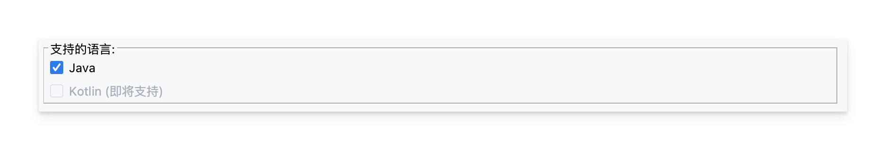

### Java

**作用**：启用 Java 语言的文档生成

**默认值**：启用

**说明**：目前插件主要支持 Java，建议保持启用。

### Kotlin

**作用**：启用 Kotlin 语言的文档生成

**默认值**：禁用（即将支持）

**说明**：这是为未来功能预留的选项，目前尚未实现，可以忽略。

---

## 📋 生成规则配置

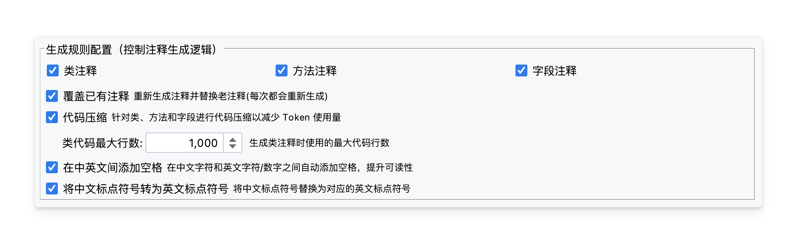

控制插件如何生成文档的规则。

### 生成选项

控制为哪些类型的代码元素生成文档。

#### 1. 类注释

**作用**：是否为类、接口、枚举生成文档

**默认值**：启用

**使用建议**：

- 一般建议启用
- 如果只需要方法文档，可以关闭

#### 2. 方法注释

**作用**：是否为方法生成文档

**默认值**：启用

**使用建议**：一般建议启用，方法是代码的核心。

#### 3. 字段注释

**作用**：是否为字段生成文档

**默认值**：启用

**使用建议**：

- 一般建议启用
- 如果字段都是简单的 getter/setter，可以关闭

### 覆盖已有注释

**作用**：是否为已有 JavaDoc 注释的元素重新生成注释

**默认值**：禁用

**使用说明**：

- **启用**：会重新生成所有元素的文档，替换旧注释
- **禁用**：只生成没有文档的元素，已有文档的元素会跳过

**适用场景**：

- **启用**：需要批量更新所有文档
- **禁用**：只想为新代码生成文档，保留已有文档

### 代码压缩

**作用**：当类代码很长时，只发送部分代码给 AI，减少成本和提高速度

**默认值**：启用

**使用说明**：

- 可以减少 API 调用成本，提高处理速度
- 对于很长的类，可能影响生成质量

**适用场景**：

- 处理大型项目时（启用，节省成本）
- 需要完整上下文时（禁用，但会增加成本）

> 启用后会删除内部单行注释, 多余空格和空行, 使用 1 个空格代替行缩进等方式来减少 token 数量

### 类代码最大行数

**作用**：代码压缩时，发送给 AI 的最大代码行数

**默认值**：1000 行

**范围**：100-300000 行

**使用说明**：

- 只有启用"代码压缩"后才生效
- 超过这个行数的类，只会发送部分代码
- 可以根据项目情况调整

**使用建议**：

- 一般保持默认 1000 行即可
- 如果类都很长，可以增加到 2000-3000 行
- 如果希望更完整的上下文，可以增加到 5000 行

**适用场景**：

- 控制 API 调用成本（较低值）
- 需要更完整的上下文（较高值）

### 在中英文间添加空格

**作用**：自动在中文字符和英文字符/数字之间添加空格

**默认值**：启用

**效果示例**：

- 生成前：`这是一个User类`
- 生成后：`这是一个 User 类`

**使用建议**：

- 建议启用，提升文档可读性
- 符合中文排版规范

**适用场景**：

- 需要规范的文档格式（启用）
- 不需要自动格式化（关闭）

### 将中文标点符号转为英文标点符号

**作用**：将中文标点符号（，、。）替换为英文标点符号（,、.）

**默认值**：启用

**效果示例**：

- 生成前：`这是一个类，用于处理用户数据。`
- 生成后：`这是一个类, 用于处理用户数据.`

**使用建议**：

- 根据项目规范决定
- 如果项目要求使用英文标点，建议启用

**适用场景**：

- 项目要求使用英文标点（启用）
- 项目允许中文标点（关闭）

---

## 🔖 其他设置

### 自定义 JavaDoc 标签

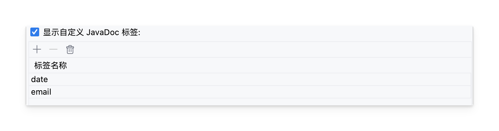

**作用**：添加自定义的 JavaDoc 标签，让 IDE 识别这些标签

**使用说明**：

1. 勾选"显示自定义 JavaDoc 标签"复选框
2. 点击"+"按钮添加标签
3. 输入标签名称（不包含 @ 符号，如输入 `apiNote` 而不是 `@apiNote`）
4. 可以添加多个标签
5. 可以删除不需要的标签

**适用场景**：

- 项目使用了自定义的 JavaDoc 标签（如 `@apiNote`、`@implNote` 等）
- 希望 IDE 能识别这些标签，不显示警告
- 团队有统一的文档标签规范

**注意事项**：

- 标签名称只能包含字母、数字、下划线和连字符
- 标签名称不区分大小写
- 配置保存后会自动同步到 IDE 的检查工具

---

## 👨‍💻 开发者指南

### 架构概览

插件采用分层架构设计，各层职责清晰：

```
┌─────────────────────────────────────────────────────────────┐
│                      IntelliJ IDEA                          │
│  ┌──────────────────────────────────────────────────────┐  │
│  │                   用户界面层                          │  │
│  │  - 快捷键: Ctrl+Shift+D / Cmd+Shift+D                │  │
│  │  - 编辑器右键菜单                                      │  │
│  │  - 文件/目录右键菜单                                   │  │
│  │  - Generate 菜单 (Cmd+N / Alt+Insert)                │  │
│  │  - Git 提交页面工具栏                                  │  │
│  └────────────────┬─────────────────────────────────────┘  │
│                   │                                          │
│  ┌────────────────▼─────────────────────────────────────┐  │
│  │                   动作层 (Actions)                    │  │
│  │  - GenerateJavaDocShortcutAction (快捷键入口)         │  │
│  │  - GenerateJavaDocForEditorAction (编辑器右键)         │  │
│  │  - GenerateJavaDocForFilesAction (文件/目录右键)      │  │
│  │  - GenerateJavaDocGenerateAction (Generate 菜单)     │  │
│  │  - GenerateJavaDocIntentionAction (Intention Action)  │  │
│  │  - GenerateJavaDocForCommitAction (Git 提交页面)      │  │
│  └────────────────┬─────────────────────────────────────┘  │
│                   │                                          │
│  ┌────────────────▼─────────────────────────────────────┐  │
│  │                 任务处理层 (Tasks)                    │  │
│  │  - TaskCollector (收集需要生成文档的任务)            │  │
│  │  - TaskExecutor (异步执行任务队列)                   │  │
│  │  - DocumentationTask (任务数据结构)                  │  │
│  └────────────────┬─────────────────────────────────────┘  │
│                   │                                          │
│  ┌────────────────▼─────────────────────────────────────┐  │
│  │               AI 服务层 (AI Services)                 │  │
│  │  - AIServiceFactory (创建 Provider)                  │  │
│  │  - AIServiceProvider (接口)                          │  │
│  │  - OpenAICompatibleProvider (抽象实现)               │  │
│  │      ├─ QianWenProvider (通义千问)                   │  │
│  │      ├─ OllamaProvider (Ollama 本地)                 │  │
│  │      └─ CustomProvider (自定义服务)                  │  │
│  └────────────────┬─────────────────────────────────────┘  │
│                   │                                          │
│  ┌────────────────▼─────────────────────────────────────┐  │
│  │               配置管理层 (Settings)                   │  │
│  │  - SettingsState (配置持久化)                        │  │
│  │  - JavaDocSettingsConfigurable (配置面板)           │  │
│  │  - JavaDocSettingsPanel (UI 组件)                   │  │
│  └────────────────┬─────────────────────────────────────┘  │
│                   │                                          │
└───────────────────┼──────────────────────────────────────────┘
                    │
        ┌───────────▼───────────┐
        │    外部 AI 服务       │
        │  - 通义千问 API       │
        │  - Ollama (本地)     │
        │  - 自定义服务        │
        └───────────────────────┘
```

### 核心组件

#### 1. 动作层 (Actions)

**职责**：处理用户交互，作为插件的入口点

**主要类**：

- `GenerateJavaDocShortcutAction`：快捷键入口
- `GenerateJavaDocForEditorAction`：编辑器右键菜单
- `GenerateJavaDocForFilesAction`：文件/目录右键菜单
- `GenerateJavaDocGenerateAction`：Generate 菜单
- `GenerateJavaDocIntentionAction`：Intention Action
- `GenerateJavaDocForCommitAction`：Git 提交页面工具栏按钮

**共同模式**：

```java
@Override
public void actionPerformed(@NotNull AnActionEvent e) {
    // 1. 获取编辑器和文件
    Editor editor = e.getData(CommonDataKeys.EDITOR);
    PsiFile psiFile = e.getData(CommonDataKeys.PSI_FILE);
    
    // 2. 智能定位
    PsiElementLocator.LocateResult locateResult = 
        PsiElementLocator.locateElement(editor, psiFile);
    
    // 3. 根据定位结果收集任务
    TaskCollector collector = new TaskCollector(project);
    List<DocumentationTask> tasks = collector.collectFromElement(locateResult.getElement());
    
    // 4. 执行任务
    TaskExecutor executor = new TaskExecutor(project, indicator);
    executor.processTasks(tasks);
}
```

#### 2. 任务处理层 (Tasks)

**职责**：收集和执行文档生成任务

**TaskCollector**：

- 从不同来源收集任务（元素、文件、目录）
- 根据配置过滤需要处理的元素
- 创建 DocumentationTask 对象
- 支持递归处理内部类和目录结构

**TaskExecutor**：

- 异步执行任务队列
- 实时更新进度
- 支持取消操作
- 错误隔离（单个失败不影响其他）
- 自动格式化生成的 JavaDoc

**DocumentationTask**：

- 任务数据结构
- 包含 PSI 元素、代码片段、任务类型、状态等信息

#### 3. AI 服务层 (AI Services)

**职责**：与 AI 服务交互

**AIServiceProvider**：定义 AI 服务的标准接口

```java
public interface AIServiceProvider {
    String generateDocumentation(String code, DocumentationType type, String language);
    boolean validateConfiguration();
    List<String> getSupportedModels();
    String getDefaultModel();
}
```

**OpenAICompatibleProvider**：OpenAI 兼容 API 的通用实现

- HTTP 请求处理
- Prompt 模板加载
- 响应解析
- 错误处理和重试机制

**具体实现**：

- `QianWenProvider`：通义千问的具体实现
- `OllamaProvider`：Ollama 本地模型的具体实现
- `CustomProvider`：自定义服务的具体实现

#### 4. 配置管理层 (Settings)

**职责**：配置的持久化和 UI

**SettingsState**：配置持久化

- 使用 `@State` 注解标记
- 实现 `PersistentStateComponent` 接口
- 支持配置的保存和加载

**JavaDocSettingsConfigurable**：连接设置面板和状态

- 实现 `Configurable` 接口
- 管理设置面板的生命周期

**JavaDocSettingsPanel**：设置 UI 组件

- 包含所有配置项的 UI 组件
- 支持配置的获取和加载
- 提供配置验证功能

### 工作流程

#### 用户触发生成

```
1. 用户触发 (快捷键/右键菜单)
   ↓
2. Action 获取当前文件/选择
   ↓
3. PsiElementLocator 智能定位元素
   ↓
4. TaskCollector 收集任务
   - 遍历 PSI 树
   - 识别类、方法、测试方法
   - 过滤已有文档的元素
   - 创建 DocumentationTask 列表
   ↓
5. 显示进度对话框
   ↓
6. TaskExecutor 在后台处理
   - 遍历任务列表
   - 为每个任务：
     a. 更新进度 (X/Y completed)
     b. 检查是否取消
     c. 调用 AI 生成文档
     d. 插入文档到代码
     e. 自动格式化
     f. 更新统计
   ↓
7. 显示结果统计
   - 完成: X
   - 失败: Y
   - 跳过: Z
```

#### AI 文档生成流程

```
1. TaskExecutor.processTask(task)
   ↓
2. AIServiceFactory.createProvider(settings)
   - 根据设置创建对应的 Provider
   ↓
3. Provider.generateDocumentation(code, type, language)
   ↓
4. 从设置加载 Prompt 模板
   - settings.methodPromptTemplate (方法/类)
   - settings.testPromptTemplate (测试方法)
   - settings.fieldPromptTemplate (字段)
   - settings.classPromptTemplate (类)
   ↓
5. 构建完整 Prompt
   - String.format(template, code)
   ↓
6. 发送 HTTP 请求
   - buildHeaders() (添加 Authorization)
   - buildRequestBody() (构建 JSON)
   - sendRequest() (发送请求)
   - 重试机制 (指数退避)
   ↓
7. 解析响应
   - parseResponse() (提取内容)
   - 清理 Markdown 标记
   ↓
8. 返回生成的 JavaDoc
   ↓
9. 插入到文档
   - 在写入线程中执行
   - 自动格式化 (CodeStyleManager)
   ↓
10. 更新任务状态
```

### 扩展指南

#### 添加新的 AI 提供商

**步骤 1**：创建 Provider 类

```java
public class MyAIProvider extends OpenAICompatibleProvider {
    
    public MyAIProvider(SettingsState settings) {
        super(settings);
    }
    
    @Override
    public String getProviderId() {
        return "myai";
    }
    
    @Override
    public String getProviderName() {
        return "My AI Service";
    }
    
    @Override
    public String getDefaultBaseUrl() {
        return "https://api.myai.com/v1";
    }
    
    @Override
    public List<String> getSupportedModels() {
        return Arrays.asList("model-1", "model-2");
    }
    
    @Override
    public boolean requiresApiKey() {
        return true;
    }
}
```

**步骤 2**：注册到 Factory

```java
// AIServiceFactory.java
public static AIServiceProvider createProvider(SettingsState settings) {
    switch (settings.aiProvider) {
        case "qianwen": return new QianWenProvider(settings);
        case "ollama": return new OllamaProvider(settings);
        case "myai": return new MyAIProvider(settings);  // 添加这行
        default: throw new IllegalArgumentException(...);
    }
}
```

**步骤 3**：更新设置面板

```java
// JavaDocSettingsPanel.java
providerComboBox = new ComboBox<>(new String[]{"qianwen", "ollama", "myai"});
```

#### 添加新的语言支持

**步骤 1**：更新设置

```java
// SettingsState.java
public Set<String> supportedLanguages = new HashSet<String>() {{
    add("java");
    add("kotlin");  // 添加新语言
}};
```

**步骤 2**：创建语言特定的 Prompt

```java
// SettingsState.java
public String kotlinPromptTemplate = "...";
```

**步骤 3**：更新 TaskCollector

```java
// TaskCollector.java
public List<DocumentationTask> collectFromFile(PsiFile file) {
    if (file instanceof PsiJavaFile) {
        // Java 处理逻辑
    } else if (file instanceof KtFile) {  // Kotlin
        // Kotlin 处理逻辑
    }
}
```

### 设计模式

1. **工厂模式** - `AIServiceFactory`
2. **策略模式** - `AIServiceProvider` 接口
3. **模板方法** - `OpenAICompatibleProvider`
4. **访问者模式** - PSI 元素遍历
5. **状态模式** - `DocumentationTask.TaskStatus`

### 技术特点

- ✅ **分层架构**：清晰的职责分离
- ✅ **接口抽象**：易于扩展和测试
- ✅ **异步处理**：不阻塞 UI
- ✅ **依赖注入**：低耦合
- ✅ **配置化**：灵活可定制

---

## ❓ 常见问题解答

### Q: 为什么插件没有反应？

**A**: 请检查以下几点：

1. **确保已正确配置 AI 提供商**
2. **确认当前文件是 Java 文件**
3. **检查 IDE 是否正在索引**（状态栏显示索引进度）
4. **查看 IDE 日志中的错误信息**
5. **确保配置已通过连接测试**
6. **在编辑器中使用右键菜单, Generate 菜单, 快速修复 3 类操作时, 请确保光标在类代码中 **

### Q: 如何查看 API 调用失败的原因？

**A**: 查看 IDE 日志文件：

- **macOS**: `~/Library/Logs/JetBrains/IntelliJIdea<Version>/idea.log`

- **Windows**: `%USERPROFILE%\AppData\Local\JetBrains\IntelliJIdea<Version>\log\idea.log`

- **Linux**: `~/.cache/JetBrains/IntelliJIdea<Version>/log/idea.log`

  > Help -> Diagnostic Tools -> Debug Log Settings...
  >
  > ```
  > # 添加如下行将输出所有日志
  > dev.dong4j.zeka.stack.idea.plugin:all
  > ```

### Q: 如何自定义 Prompt 模板？

**A**: 在设置面板的 "提示词模板n" 部分可以自定义：

- **System Prompt**：系统提示词模板
- **Class Prompt**：类文档模板
- **Method Prompt**：方法文档模板
- **Field Prompt**：字段文档模板
- **Test Method Prompt**：测试方法文档模板

使用 `%s` 作为代码占位符

### Q: 如何选择 AI 提供商？

**A**: 根据需求选择：

- **通义千问**：适合中文文档生成，需要 API Key，有使用成本
- **Ollama**：本地运行，数据私有，无需 API Key，需要足够的系统资源
- **自定义服务**：支持任何兼容 OpenAI API 的服务

### Q: 如何批量重新生成所有注释？

**A**: 操作步骤：

1. **勾选** "覆盖已有注释" 选项
2. 右键点击项目根目录
3. 选择 "Generate Javadoc with AI for Directory"
4. 等待处理完成

### Q: 智能定位功能如何工作？

**A**: 插件会根据光标位置智能决定生成范围：

- **光标在方法上** → 只为该方法生成
- **光标在字段上** → 只为该字段生成
- **光标在类声明上** → 只为该类生成类注释
- **光标在类内部（但不在特定成员上）** → 为类生成类注释
- **其他情况** → 为整个文件生成

### Q: 如何配置字段的单行/多行格式？

**A**: 在字段 Prompt 模板中可以自定义规则：

```
- 如果字段说明简单（不超过 80 个字符，没有 @tag 标签），必须使用单行格式：/** 字段说明 */
- 如果字段说明复杂（包含多个信息点、有 @tag 标签、或超过 80 个字符），使用多行格式
```

可以修改字符数限制来调整规则。

> 这个需要代码格式化配置配合使用, 否则即使返回了单行注释也会被格式化为多行:
>
> 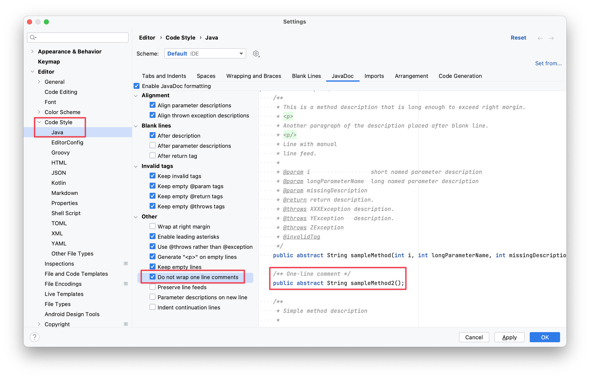

### Q: 插件支持哪些 IntelliJ IDEA 版本？

**A**: 插件支持：

- **IntelliJ IDEA 2022.3** 及以上版本
- **Android Studio** 兼容版本
- **其他基于 IntelliJ Platform 的 IDE**

### Q: 如何提高生成质量？

**A**: 建议：

1. **选择合适的 AI 模型**（推荐通义千问的 `qwen-max`）
2. **自定义 Prompt 模板**，根据项目特点调整
3. **调整模型参数**（temperature、maxTokens 等）
4. **提供更多上下文**，确保代码完整

### Q: 如何处理生成失败的情况？

**A**: 插件提供多种处理方式：

1. **自动重试**：配置的重试次数内自动重试
2. **错误隔离**：单个失败不影响其他任务
3. **详细日志**：记录失败原因供排查
4. **手动重试**：可以单独重新生成失败的文档

