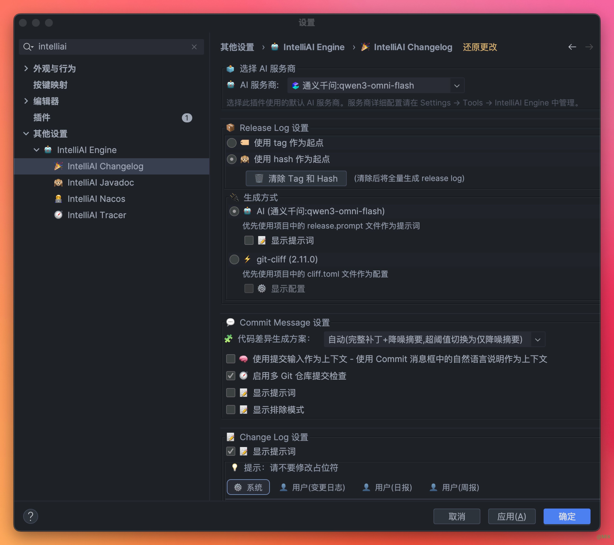
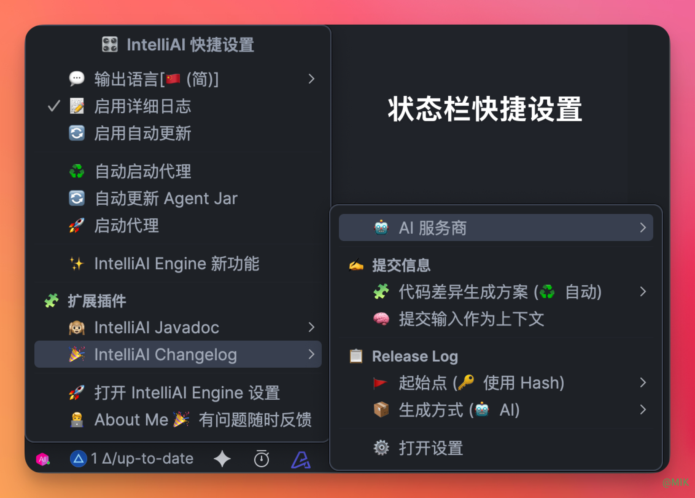
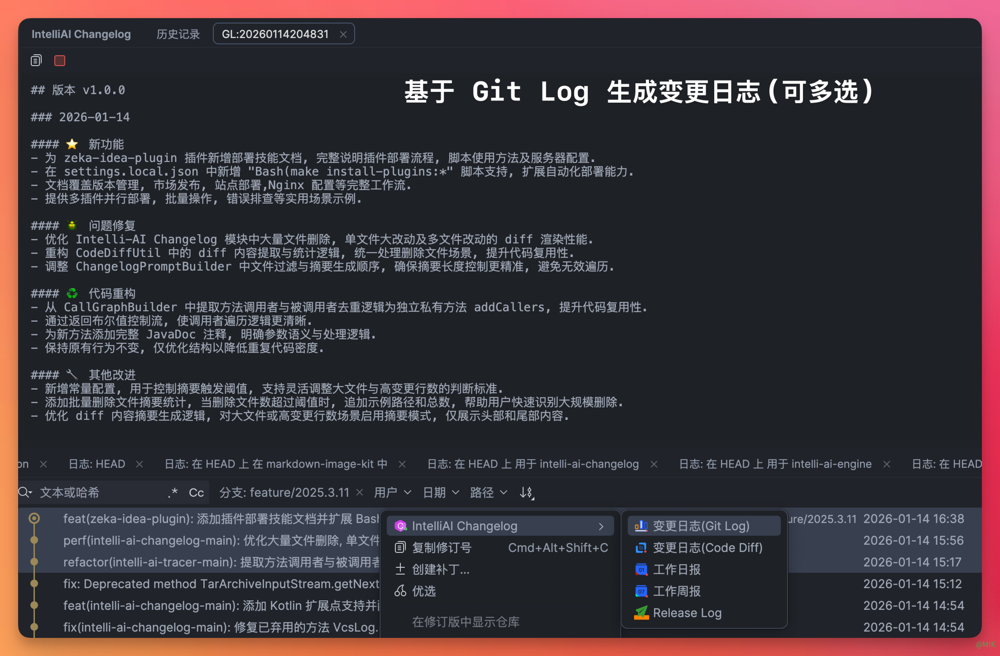
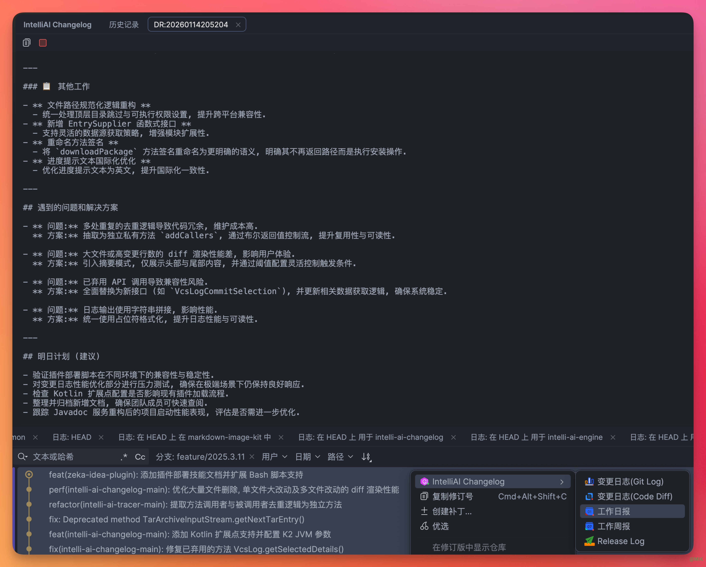
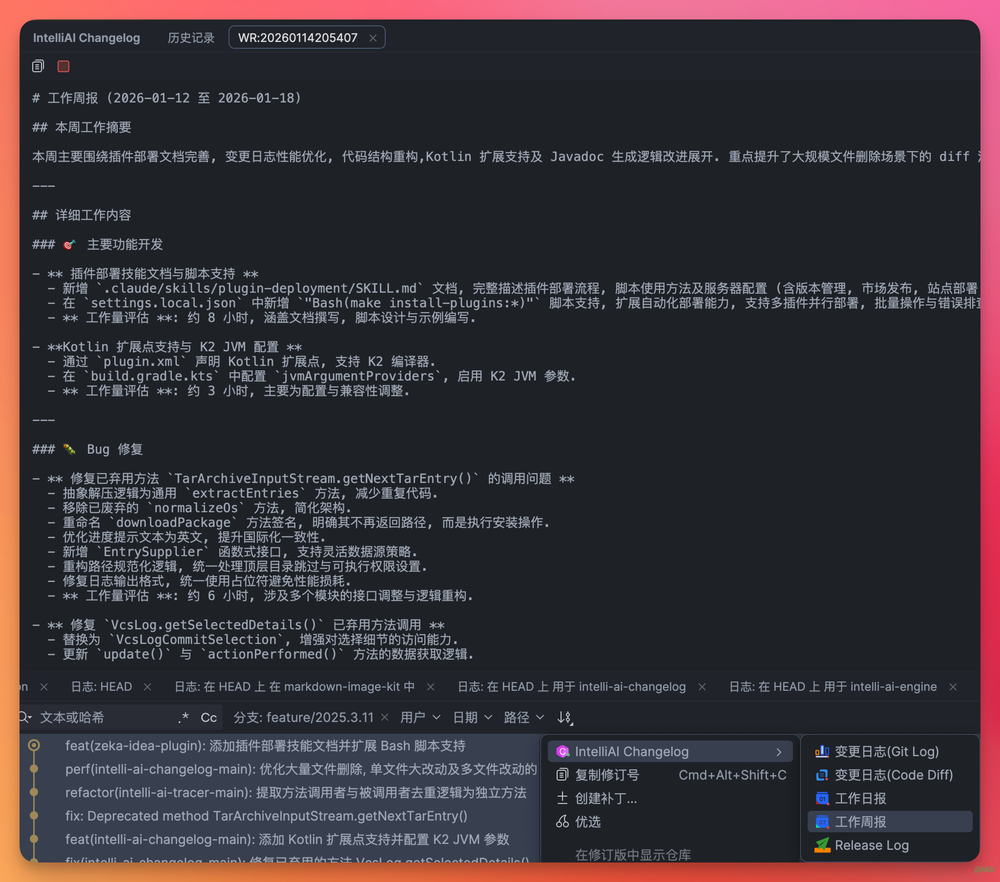
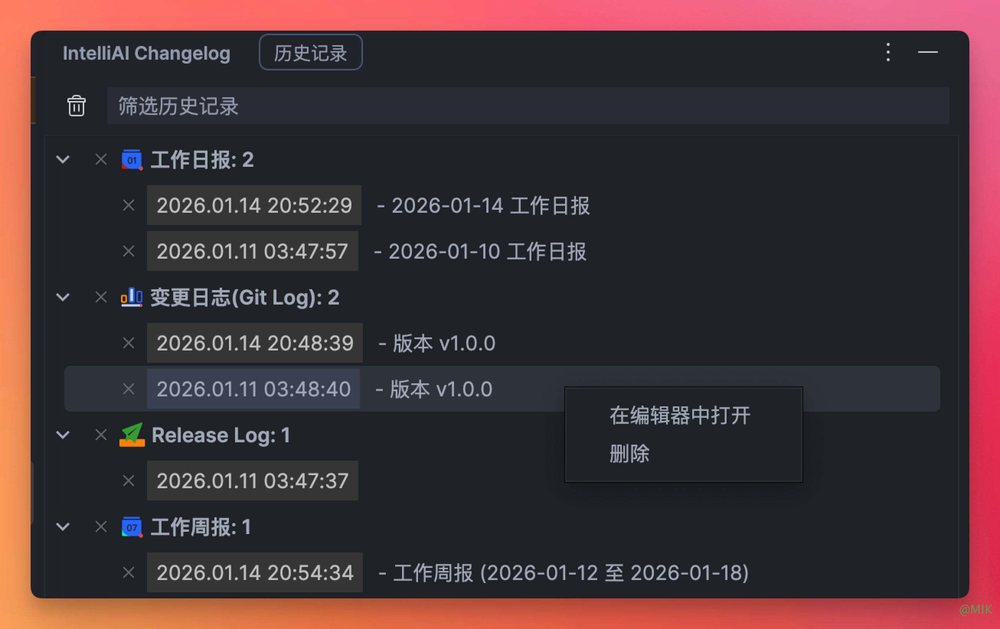

# IntelliAI Changelog

基于 AI 的智能变更日志生成插件，帮助开发者从 Git 提交记录自动生成高质量的变更日志、工作日报和智能提交信息。

[](https://opensource.org/licenses/Apache-2.0)
[](https://www.jetbrains.com/idea/)
[](https://www.oracle.com/java/)

## 🎯 项目概述

IntelliAI Changelog 是一个基于 IntelliAI Engine 的 IntelliJ IDEA 插件，专门用于将 Git 提交记录转换为结构化的文档内容。插件集成了多种 AI
服务提供商，能够智能理解代码变更并生成符合规范的文档。

## ✨ 核心特性

### 🤖 AI 驱动的智能生成

- **深度理解**: 基于 AI 理解代码变更的真正含义，而非简单的文本拼接
- **多语言支持**: 特别优化中文处理能力，同时完美支持英文内容
- **智能分类**: 自动识别功能开发、问题修复、文档更新等不同类型的变更

### 📝 多样化文档生成

- **变更日志**: 生成版本发布说明和项目变更记录
- **工作日报**: 将日常提交转化为结构化的工作汇报
- **工作周报**: 汇总一周工作内容，生成进度报告
- **提交信息**: 基于代码变更智能生成规范的提交信息

### 🎯 灵活的使用方式

- **Git Log 集成**: 直接在 Git Log 工具窗口中选择提交记录
- **提交窗口集成**: 在 Git 提交界面一键生成提交信息
- **批量处理**: 支持同时处理多个提交记录
- **实时预览**: 生成内容后支持编辑和实时调整

### ⚙️ 高度可定制

- **模板系统**: 内置多种专业模板，支持自定义
- **提示词配置**: 可调整 AI 角色和生成要求
- **多 AI 提供商**: 支持通义千问、OpenAI、硅基流动等多种服务
- **国际化**: 完整的中英文界面支持

## 🚀 快速开始

### 系统要求

- **IntelliJ IDEA**: 2022.3 及以上版本
- **Java**: 17 及以上
- **Git**: 项目必须使用 Git 进行版本控制
- **网络连接**: 需要连接 AI 服务提供商

### 安装步骤

#### 方式一：从 JetBrains Marketplace 安装（推荐）

1. 打开 IntelliJ IDEA
2. 进入 `File` → `Settings` → `Plugins`
3. 搜索 `IntelliAI Changelog`
4. 点击 `Install` 并重启 IDE

#### 方式二：手动安装

1. 从 [Releases](https://github.com/zeka-stack/zeka-idea-plugin/releases) 下载插件包
2. 进入 `File` → `Settings` → `Plugins` → ⚙️ → `Install Plugin from Disk...`
3. 选择下载的 ZIP 文件并安装

### 初始配置

#### 1. 安装依赖插件

确保已安装 **IntelliAI Engine** 插件：

- 插件会自动提示安装 IntelliAI Engine
- 或手动在 Marketplace 搜索并安装

#### 2. 配置 AI 服务

1. 打开 `File` → `Settings` → `Tools` → `IntelliAI Engine`
2. 点击 `+` 添加 AI 提供商
3. 推荐配置：
    - **通义千问**: 中文处理最佳
    - **硅基流动**: 性价比高
    - **OpenAI**: 英文内容优秀

#### 3. 测试连接

配置完成后点击 `测试连接`，确保显示"连接成功"。

## 设置



## 状态栏



## 💻 使用指南

### 生成变更日志



1. **打开 Git Log**: `Git` → `Show Git Log`
2. **选择提交记录**: 单个或多个提交（Ctrl/Cmd+Click 多选）
3. **右键生成**: 右键点击 → `IntelliAI Changelog` → `生成变更日志`
4. **查看结果**: 在弹出对话框中查看和编辑生成的内容

### 生成工作日报



1. **选择今日提交**: 在 Git Log 中选择当天的提交记录
2. **生成日报**: 右键 → `IntelliAI Changelog` → `生成工作日报`
3. **完善内容**: 在结果中补充遇到的问题和明日计划

### 生成工作周报



1. **选择一周提交**: 使用日期筛选器选择一周内的提交
2. **生成周报**: 右键 → `IntelliAI Changelog` → `生成工作周报`
3. **结构调整**: AI 自动按工作日组织内容

### Changelog 生成历史记录



### 智能提交信息

#### 在提交窗口中

1. **生成信息**: 点击提交区域右侧的 `生成提交信息` 按钮
2. **应用提交**: 编辑后使用生成的提交信息完成提交

#### 为已有提交重新生成

1. **选择提交**: 在 Git Log 中选择要重新生成的提交
2. **重新生成**: 右键 → `IntelliAI Changelog` → `生成提交信息`
3. **复制使用**: 复制生成的规范提交信息

## ⚙️ 配置选项

### 插件设置

打开 `File` → `Settings` → `Tools` → `IntelliAI Changelog`

#### 基础设置

- **默认 AI 提供商**: 选择常用的 AI 服务
- **显示高级设置**: 启用模板自定义功能
- **语言偏好**: 设置生成内容的主要语言

#### 高级设置

##### 模板自定义

**变更日志模板**:

```
请根据以下 Git 提交记录生成版本变更日志。

版本：{version}
提交记录：
{commits}

要求：
1. 按功能分类组织内容
2. 使用清晰的标题结构
3. 突出重要的功能更新
```

**日报模板**:

```
请根据以下 Git 提交记录生成工作日报。

日期：{date}
提交记录：
{commits}

要求：
1. 按工作类型分类
2. 包含遇到的问题和解决方案
3. 添加明日工作计划
```

**周报模板**:

```
请根据以下 Git 提交记录生成工作周报。

时间范围：{dateRange}
提交记录：
{commits}

要求：
1. 按工作日组织内容
2. 突出重要进展
3. 识别风险和问题
```

**提交信息模板**:

```
请根据以下代码变更生成简洁准确的提交信息。

代码变更：
{codeDiffs}

要求：
1. 使用规范的提交格式（type: description）
2. 突出变更的主要目的
3. 长度控制在 50-100 字符
```

### 系统提示词优化

可以自定义 AI 的角色和行为：

```markdown
你是一位资深的技术文档编写者，擅长将技术代码转化为业务价值描述。

在生成文档时，请遵循以下原则：
1. 重点关注功能对用户的价值
2. 使用通俗易懂的语言
3. 突出技术改进带来的收益
4. 保持客观专业的语气
```

## 🎨 使用场景和最佳实践

### 版本发布管理

**场景**: 软件版本发布时需要编写发布说明

**操作流程**:

1. 选择版本相关的所有提交记录
2. 生成变更日志
3. 添加版本号和发布日期
4. 编辑补充重要的业务价值说明

**最佳实践**:

- 选择 10-20 个相关提交，避免过多
- 确保提交信息规范清晰
- 在高级设置中明确版本号格式

### 团队工作汇报

**场景**: 开发团队需要定期汇报工作进展

**日报生成**:

- 选择当日所有提交
- 生成日报后补充问题总结和明日计划
- 在团队会议中分享

**周报汇总**:

- 选择一周内的提交
- 生成周报后添加项目整体进度
- 提交给项目经理汇总

### 代码质量提升

**提交信息规范化**:

- 在提交时使用 AI 生成规范的提交信息
- 学习 AI 的生成方式，提升自己的提交质量
- 建立团队统一的提交规范

## 🔧 开发指南

### 项目结构

```
intelli-ai-changelog/
├── src/main/java/dev/dong4j/zeka/stack/idea/plugin/changelog/
│   ├── action/           # 动作类
│   │   ├── AbstractGitLogAction.java              # Git Log 动作基类
│   │   ├── GenerateChangelogForGitLogAction.java  # 生成变更日志
│   │   ├── GenerateDailyReportForGitLogAction.java # 生成日报
│   │   ├── GenerateWeeklyReportForGitLogAction.java # 生成周报
│   │   ├── GenerateCommitMessageForGitLogAction.java # 生成提交信息(Git Log)
│   │   └── GenerateCommitMessageForCommitAction.java # 生成提交信息(提交窗口)
│   ├── service/          # 服务层
│   │   └── ChangelogService.java                # 核心业务逻辑
│   ├── settings/         # 设置相关
│   │   ├── SettingsState.java                   # 持久化配置
│   │   ├── ChangelogSettingsConfigurable.java    # 设置页面
│   │   └── ui/
│   │       └── ChangelogSettingsPanel.java      # 设置 UI 组件
│   ├── ui/               # UI 组件
│   │   └── ChangelogResultDialog.java          # 结果显示对话框
│   ├── util/             # 工具类
│   │   ├── NotificationUtil.java               # 通知工具
│   │   ├── ChangelogBundle.java                # 国际化资源
│   │   └── CodeDiffUtil.java                 # 代码差异处理
│   ├── git/              # Git 相关
│   │   └── CommitMessageGenerator.java         # 提交信息生成
│   └── model/            # 数据模型
│       └── CodeDiff.java                      # 代码变更模型
├── src/main/resources/
│   ├── messages/         # 国际化资源
│   │   ├── ChangelogBundle.properties          # 英文
│   │   └── ChangelogBundle_zh_CN.properties   # 中文
│   └── icons/           # 图标资源
└── build.gradle.kts      # 构建配置
```

### 核心组件说明

#### Action 系统

- **AbstractGitLogAction**: 所有基于 Git Log 的动作的基类
    - 处理提交记录的选择和提取
    - 统一的错误处理和通知机制
    - 支持批量选择和单个选择

- **GenerateCommitMessageForCommitAction**: 专门处理提交窗口的场景
    - 获取当前暂存的代码变更
    - 实时生成提交信息建议
    - 与 Git 提交流程深度集成

#### Service 层

- **ChangelogService**: 核心业务逻辑处理
    - 调用 AI 服务生成内容
    - 模板处理和变量替换
    - 结果格式化和优化

#### 设置系统

- **SettingsState**: 使用 `@State` 注解实现配置持久化
- **ChangelogSettingsConfigurable**: 实现 `Configurable` 接口
- **ChangelogSettingsPanel**: 基于 Swing 的设置界面

### 扩展点集成

插件注册到 IntelliAI Engine 的扩展点：

```xml
<!-- 注册到 intelli-ai-engine 的扩展点 -->
<extensions defaultExtensionNs="dev.dong4j.zeka.stack.idea.plugin.common.ai">
    <!-- AI 控制台日志提供者 -->
    <aiConsoleLoggerProvider implementation="dev.dong4j.zeka.stack.idea.plugin.changelog.util.ChangelogAIConsoleLoggerProvider"/>
</extensions>
```

### 本地开发

#### 环境准备

1. **克隆项目**:
```bash
git clone https://github.com/zeka-stack/zeka-idea-plugin.git
cd intelli-ai-changelog
```

2. **构建插件**:
```bash
./gradlew buildPlugin
```

3. **运行调试**:
```bash
./gradlew runIde
```

#### 依赖管理

插件依赖 IntelliAI Engine，本地开发时自动处理：

```kotlin
// 自动构建和安装 engine 插件
./gradlew runIde  // 会自动执行 buildAiCommonPlugin 和 copyAiCommonPlugin
```

#### 测试

```bash
# 运行所有测试
./gradlew test

# 运行特定测试类
./gradlew test --tests "ChangelogServiceTest"
```

## 🤝 贡献指南

欢迎为 IntelliAI Changelog 贡献代码！

### 开发流程

1. **Fork 项目**到你的 GitHub 账户
2. **创建特性分支**:
   ```bash
   git checkout -b feature/new-feature
   ```
3. **编写代码**和测试用例
4. **运行测试**确保通过:
   ```bash
   ./gradlew test verifyPlugin
   ```
5. **提交代码**:
   ```bash
   git commit -m "feat: add new feature"
   ```
6. **推送分支**:
   ```bash
   git push origin feature/new-feature
   ```
7. **创建 Pull Request**

### 代码规范

- **Java 代码**: 使用 Google Java Format
- **提交信息**: 遵循 Conventional Commits 规范
- **测试覆盖**: 新功能必须包含单元测试
- **文档更新**: 重要变更需要更新相关文档

### 问题报告

报告 Bug 时请包含：

- IntelliJ IDEA 版本
- 插件版本
- 操作系统和 Java 版本
- 详细的重现步骤
- 错误日志（如果有）

## 📊 性能和限制

### 性能考虑

- **批量处理**: 建议每次处理 10-20 个提交记录
- **网络延迟**: AI 生成时间取决于网络和提供商
- **内存使用**: 大量提交记录可能增加内存消耗

### 已知限制

- 仅支持 Git 版本控制系统
- 需要 AI 服务商的网络连接
- 生成的质量依赖于提交记录的质量
- 暂不支持离线模式

### 优化建议

1. **提高提交质量**:
    - 使用规范的提交信息格式
    - 避免含糊不清的描述
    - 及时提交，避免大量变更堆积

2. **合理使用 AI**:
    - 选择合适的 AI 提供商
    - 中文内容推荐通义千问
    - 英文内容推荐 OpenAI

3. **模板优化**:
    - 根据团队需求定制模板
    - 调整提示词获得更好效果
    - 定期更新和维护模板

## 📚 相关资源

### 文档

- [用户手册](./docs/用户手册.md) - 详细的使用说明和最佳实践
- [开发指南](./DEVELOPMENT_GUIDE.md) - 开发者指南
- [快速开始](./QUICK_START.md) - 快速上手指南

### 技术文档

- [方案设计](./docs/方案设计.md) - 插件架构和设计思路
- [AI 服务集成](./docs/AI服务提供商模块抽离方案.md) - AI 集成方案
- [部署方案](./docs/部署脚本与Nginx配置实现方案.md) - 部署和发布相关

### 外部资源

- [IntelliJ Platform SDK](https://plugins.jetbrains.com/docs/intellij/welcome.html)
- [IntelliAI Engine](https://plugins.jetbrains.com/plugin/29152) - AI 能力基础引擎
- [Git 文档](https://git-scm.com/doc) - Git 版本控制文档

## 📄 许可证

本项目基于 MIT 开源许可证。详见 [LICENSE](https://github.com/zeka-stack/zeka-stack/blob/main/LICENSE) 文件。

## 🙏 致谢

特别感谢以下项目和贡献者：

- [IntelliJ Platform](https://www.jetbrains.com/idea/) - 优秀的开发平台
- 所有 AI 服务提供商 - 提供强大的 AI 能力
- 社区贡献者 - 持续改进和反馈

---

**JetBrains Marketplace**: [IntelliAI Changelog](https://plugins.jetbrains.com/plugin/29154)

**问题反馈**: [GitHub Issues](https://github.com/zeka-stack/zeka-idea-plugin/issues)

**联系方式**: dong4jj@gmail.com
