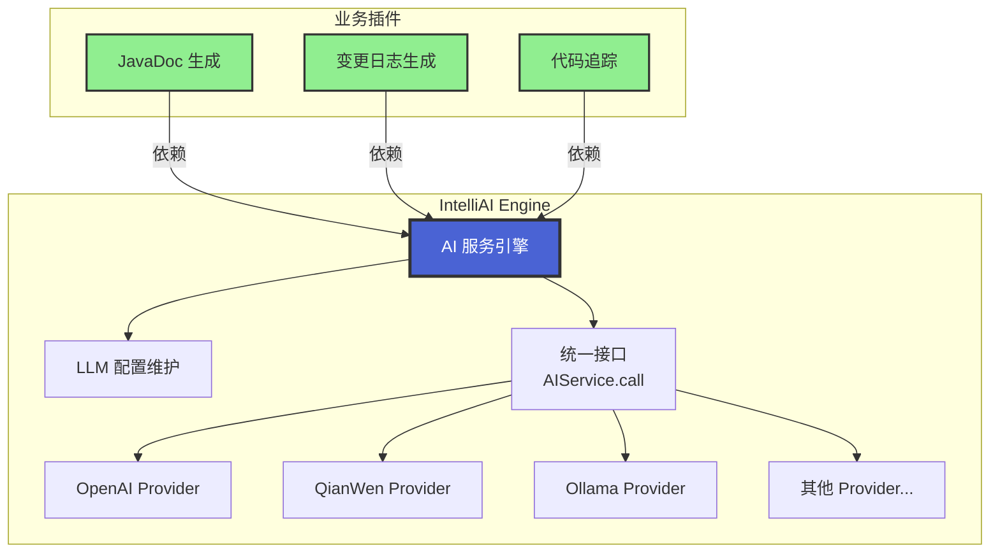

# IntelliAI Engine

IntelliAI Engine 是一个面向 IntelliJ IDEA 插件开发者的 AI 服务基础引擎，提供统一的 AI Service API、配置管理与凭证存储能力。

## 核心思路

### 设计背景

IntelliAI Engine 最初是作为 `intelli-ai-javadoc` 插件的一部分存在的。在开发过程中，我们发现其他插件（如 `intelli-ai-changelog`、
`intelli-ai-tracer` 等）也需要使用 AI 功能。如果按照原来的做法，每个插件都需要重复实现 AI 相关的调用逻辑，这会导致：

- **代码重复**：每个插件都要实现相同的 AI 服务商接入逻辑
- **维护成本高**：新增或修改 AI 服务商时，需要在多个插件中同步更新
- **配置分散**：每个插件都需要单独管理 API Key 和配置信息
- **扩展困难**：第三方插件无法便捷地接入 AI 功能

### 解决方案

为了支持代码复用和第三方插件扩展，我们将 AI 相关功能独立出来，形成了 `intelli-ai-engine` 插件。

**Engine 的核心职责**：

1. **维护 LLM 配置**：集中管理所有 AI 服务商的配置信息（API 端点、模型参数、速率限制等）
2. **提供可用服务商列表**：为外部插件提供当前可用的 AI 服务商列表
3. **统一调用接口**：对外提供简洁的 `call` 接口，外部插件只需传入输入内容和提示词即可获得 AI 响应
4. **服务商扩展**：后续新增 AI 服务商时，只需在 Engine 中实现，不会影响外部插件
5. **第三方插件**: 外部插件只需要实现使用逻辑即可, 简化插件开发

### 架构优势

采用这种架构设计带来以下优势：

1. **代码复用**：多个插件共享同一套 AI 调用逻辑，避免重复开发
2. **统一配置**：所有 AI 服务商的配置集中在 Engine 中管理，用户只需配置一次
3. **易于扩展**：新增 AI 服务商时，只需在 Engine 中实现，所有依赖 Engine 的插件自动获得支持
4. **降低耦合**：外部插件与具体的 AI 服务商解耦，只需关注业务逻辑
5. **统一体验**：所有使用 Engine 的插件具有一致的配置界面和交互体验
6. **安全可靠**：API Key 等敏感信息统一管理，基于 IntelliJ Password Safe 安全存储
7. **第三方友好**：第三方插件可以轻松接入 AI 功能，无需深入了解 AI 服务商的实现细节

### 架构关系图



### 使用方式

外部插件使用 Engine 非常简单，只需要：

```java
// 1. 获取 AIService 实例
AIService aiService = AIService.getInstance();

// 2. 调用 AI 服务
String prompt = "生成 JavaDoc 注释";
String response = aiService.call(prompt, systemPrompt);
```

Engine 会自动处理：

- 服务商选择（根据配置）
- API Key 获取（从安全存储中）
- 请求构建和发送
- 响应解析和错误处理
- 重试和超时控制

## 设置项调整

### 超时时间与 Token 单位

1. 打开 IDEA 设置：`Settings/Preferences` → `Tools` → `IntelliAI Engine`。
2. 在“高级设置”面板中：
    - **请求超时**以“秒 (s)”为单位输入与显示，数值更贴近日常认知；
    - **最大 Token 数**改为以“千 Token (K)”为单位配置，例如输入 `4.5` 即表示 4500 token；
    - **API Key** 在 Ollama 与 LM Studio 等本地提供商中为可选项，字段默认可编辑，便于按需填写；
    - **模型参数与运行时设置**在新增可用服务商时将自动绑定到该配置，实现不同服务商独立调优。
3. 调整完毕后点击 `Apply` 或 `OK` 保存，即可在最新的单位表示下生效，日志输出也会同步显示新的单位。

### 注意事项

- 超时最大可配置 600 秒；较大的值会增加任务等待时间。
- 最大 Token 数支持 0.1K 的精度，方便在 100～256000 token 之间灵活调整。

### 模型下拉列表搜索筛选

1. 在“基础连接配置”区域的**模型**下拉框中直接输入关键字，即可实时过滤候选模型；
2. 搜索支持忽略大小写，例如输入 `gpt` 会匹配 `GPT-4`, `gpt-3.5` 等；
3. 当输入清空时，下拉框会恢复显示全部模型列表；
4. 切换服务商或刷新模型列表后，系统会保留当前关键字（若已输入），方便继续筛选；
5. 若需要手动指定未在列表中的模型，可直接输入完整名称并点击 `Apply` 保存。

## ModelScope 服务商

### 功能说明

- 内置 ModelScope Dolphin 提供商，可直接通过设置页管理基础 URL、模型以及凭证。
- Base URL 默认指向 AI 问答接口 `https://api-inference.modelscope.cn/v1`，用于实际的内容生成请求。
- 刷新模型列表时会并发调用 5 次官方接口（`PUT https://modelscope.cn/api/v1/dolphin/models`），分别获取第 1-5 页数据（每页最多 50 条），自动解析 `
  BackendSupport.model_id` 并合并去重。
- 获取模型列表不需要 API Key，但如需访问受限资源仍可在 API Key 输入框中填写 Token。

### 配置步骤

1. 打开 IDEA 设置：`Settings/Preferences` → `Tools` → `IntelliAI Engine`。
2. 在“服务商”下拉框中选择 **ModelScope**，Base URL 默认填充为 `https://api-inference.modelscope.cn/v1`（AI 问答接口），可按需修改。
3. 选择或输入默认模型（如 `Qwen/Qwen3-8B`），支持直接键入自定义模型。
4. 点击“刷新模型”获取最新列表：系统会并发请求 5 页数据，刷新成功会提示返回的模型总数，并将 `modelComboBox` 更新为最新 `model_id` 集合。
5. 需要保存时，点击 `Apply` 或 `OK`，即可在任务执行链中直接调用 ModelScope 提供的模型。

### 注意事项

- 模型列表接口地址固定为 `https://modelscope.cn/api/v1/dolphin/models`，不受 Base URL 配置影响。
- 模型列表采用固定的筛选条件，仅返回 `text-generation` 且 `inference_type = 1` 的模型。
- 并发获取 5 页数据（每页 50 条），最多可获取 250 个模型。若某页请求失败，会记录警告但继续处理其他页的数据。
- 如需访问私有模型，可在 API Key 输入框中填入 ModelScope AccessToken，刷新时会自动附带 `Authorization` 头。
- 若网络波动导致刷新失败，可在终端查看 IDE 日志（`idea.log`）或启用“详细日志”定位问题。
