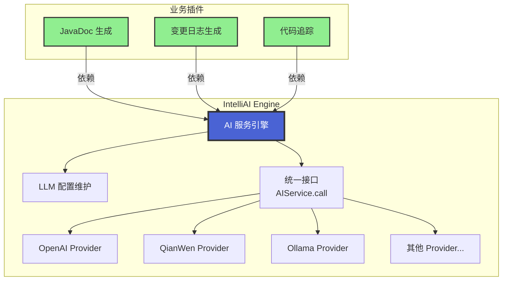

# IntelliAI Engine

IntelliAI Engine 是一个面向 IntelliJ IDEA 插件开发者的 AI 服务基础引擎，提供统一的 AI Service API、配置管理与凭证存储能力。

## 核心思路

### 设计背景

IntelliAI Engine 最初是作为 `intelli-ai-javadoc` 插件的一部分存在的。在开发过程中，我们发现其他插件（如 `intelli-ai-changelog`、
`intelli-ai-tracer` 等）也需要使用 AI 功能。如果按照原来的做法，每个插件都需要重复实现 AI 相关的调用逻辑，这会导致：

- **代码重复**：每个插件都要实现相同的 AI 服务商接入逻辑
- **维护成本高**：新增或修改 AI 服务商时，需要在多个插件中同步更新
- **配置分散**：每个插件都需要单独管理 API Key 和配置信息
- **扩展困难**：第三方插件无法便捷地接入 AI 功能

### 解决方案

为了支持代码复用和第三方插件扩展，我们将 AI 相关功能独立出来，形成了 `intelli-ai-engine` 插件。

**Engine 的核心职责**：

1. **维护 LLM 配置**：集中管理所有 AI 服务商的配置信息（API 端点、模型参数、速率限制等）
2. **提供可用服务商列表**：为外部插件提供当前可用的 AI 服务商列表
3. **统一调用接口**：对外提供简洁的 `call` 接口，外部插件只需传入输入内容和提示词即可获得 AI 响应
4. **服务商扩展**：后续新增 AI 服务商时，只需在 Engine 中实现，不会影响外部插件
5. **第三方插件**: 外部插件只需要实现使用逻辑即可, 简化插件开发

### 架构优势

采用这种架构设计带来以下优势：

1. **代码复用**：多个插件共享同一套 AI 调用逻辑，避免重复开发
2. **统一配置**：所有 AI 服务商的配置集中在 Engine 中管理，用户只需配置一次
3. **易于扩展**：新增 AI 服务商时，只需在 Engine 中实现，所有依赖 Engine 的插件自动获得支持
4. **降低耦合**：外部插件与具体的 AI 服务商解耦，只需关注业务逻辑
5. **统一体验**：所有使用 Engine 的插件具有一致的配置界面和交互体验
6. **安全可靠**：API Key 等敏感信息统一管理，基于 IntelliJ Password Safe 安全存储
7. **第三方友好**：第三方插件可以轻松接入 AI 功能，无需深入了解 AI 服务商的实现细节

### 架构关系图



### 使用方式

外部插件使用 Engine 非常简单，只需要：

```java
// 1. 获取 AIService 实例
AIService aiService = AIService.getInstance();

// 2. 调用 AI 服务
String prompt = "生成 JavaDoc 注释";
String response = aiService.call(prompt, systemPrompt);
```

Engine 会自动处理：

- 服务商选择（根据配置）
- API Key 获取（从安全存储中）
- 请求构建和发送
- 响应解析和错误处理
- 重试和超时控制

