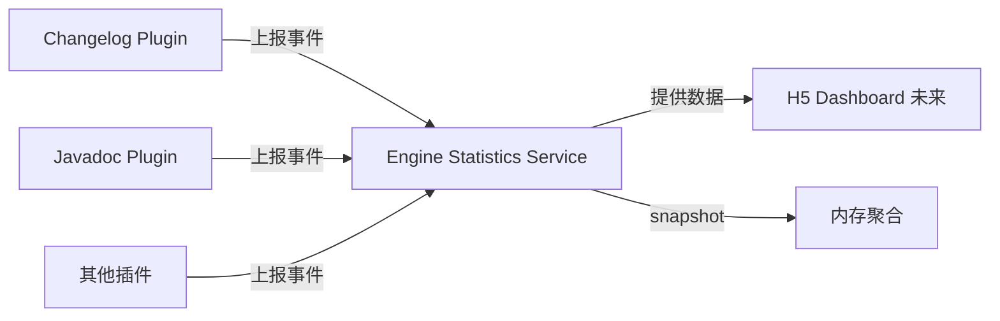

# IntelliAI Engine 统计功能需求说明

## 一、需求背景

IntelliAI 由 Engine 插件作为核心能力承载，集成 Changelog、Javadoc 等功能插件。为支持后续使用分析、能力评估、H5 数据展示，需要在 Engine 中引入*
*统一、低侵入、可扩展**的统计机制。

---

## 二、总体设计

### 2.1 核心原则

- **单一开关**：仅一个全局配置项 `enableStatistics`
- **关闭时**：不记录任何统计数据，插件上报直接忽略
- **开启时**：全量收集数据，统一由 Engine 接收、汇总、存储
- **插件职责**：只负责上报，不做统计判断逻辑

### 2.2 架构示意



---

## 三、功能范围

### 3.1 统计开关

| 配置项              | 类型      | 默认值   | 说明     |
|------------------|---------|-------|--------|
| enableStatistics | boolean | false | 全局统计开关 |

---

## 四、统计数据定义

### 4.1 Engine 全局统计

| 指标                | 类型   | 说明                |
|-------------------|------|-------------------|
| aiRequestCount    | long | AI 请求总次数（按插件维度统计） |
| autoCompleteCount | long | 自动完成功能使用次数        |

说明：

- `aiRequestCount`：记录每次 AI 请求，按 `pluginId` 区分来源
- `autoCompleteCount`：统计自动完成功能被触发的次数

---

### 4.2 Changelog 插件统计

#### 行为统计

| 指标                 | 类型   | 说明       |
|--------------------|------|----------|
| generateCount      | long | 提交信息生成次数 |
| commitSuccessCount | long | 最终成功提交次数 |

最终成功提交次数: 需要增加一个临时变量, 用于存储 AI 返回的响应，当用户提交时，判断是否与 AI 的响应相同，相同则认为成功。

#### 提交内容统计

| 指标                | 类型     | 说明                                               |
|-------------------|--------|--------------------------------------------------|
| fileCount         | int    | 单次提交涉及文件数                                        |
| addedLineCount    | int    | 新增代码行数                                           |
| modifiedLineCount | int    | 修改代码行数                                           |
| docLineCount      | int    | 文档变更行数                                           |
| commitType        | String | 提交类型：feat / fix / docs / refactor / test / chore |

---

### 4.3 Javadoc 插件统计

#### 生成统计

| 指标                 | 类型   | 说明       |
|--------------------|------|----------|
| classJavadocCount  | long | 类注释生成次数  |
| methodJavadocCount | long | 方法注释生成次数 |
| fieldJavadocCount  | long | 字段注释生成次数 |
| generatedLineCount | long | 生成的注释总行数 |

---

## 五、技术实现要求

### 5.1 事件模型

```java
class StatisticsEvent {
    String pluginId;      // engine / changelog / javadoc
    String eventType;     // GENERATE / COMMIT / AI_REQUEST / AI_RESPONSE
    long timestamp;
    Map<String, Object> data;
}
```

### 5.2 服务接口

```java
interface StatisticsService {
    // 插件调用：上报事件
    void report(StatisticsEvent event);

    // 获取当前统计快照
    StatisticsSnapshot snapshot();
}

class StatisticsSnapshot {
    EngineGlobalStats engine;
    ChangelogStats changelog;
    JavadocStats javadoc;
}
```

### 5.3 非功能性要求

- **性能**：统计逻辑必须异步执行，不得阻塞主线程
- **隐私**：不涉及任何用户隐私数据，不采集代码原文内容
- **低侵入**：插件侧只需调用一次上报接口

---

## 六、数据存储

| 方案       | 说明                               |
|----------|----------------------------------|
| **必须实现** | 内存态聚合，应用生命周期内有效，提供读取接口           |
| **可选增强** | 本地持久化（JSON/SQLite）、定期 Flush、远端上报 |

数据存储在哪里? 本地的 SQLite 还是定时调用接口?

---

## 七、验收标准

1. ✅ 关闭统计开关时，不再上报统计数据(存储到本地或通过接口上报)
2. ✅ 开启后，Changelog/Javadoc 操作数据可正确累计
3. ✅ Token / AI 请求统计数据准确
4. ✅ IDE 正常使用无卡顿
5. ✅ 可成功获取统计快照数据

---

## 八、后续扩展（不在本期实现）

- H5 Dashboard 展示
- 用户画像分析
- 成本估算
- 多 Project 维度统计

---

## 九、开发任务拆解

### 任务 1：Engine 统计服务基础

- [ ] 创建 `StatisticsService` 接口和实现类
- [ ] 实现 `StatisticsEvent` 事件模型
- [ ] 添加 `enableStatistics` 配置项
- [ ] 实现开关判断逻辑

### 任务 2：统计数据聚合

- [ ] 实现 Engine 全局统计聚合（AI 请求、Token、启动次数）
- [ ] 实现 Changelog 插件统计聚合
- [ ] 实现 Javadoc 插件统计聚合
- [ ] 实现 `snapshot()` 方法

### 任务 3：插件上报集成

- [ ] Changelog 插件集成事件上报
- [ ] Javadoc 插件集成事件上报
- [ ] 验证数据上报链路

### 任务 4：测试验收

- [ ] 开关关闭时数据为 0 验证
- [ ] 开关开启时数据累计验证
- [ ] 性能无影响验证
