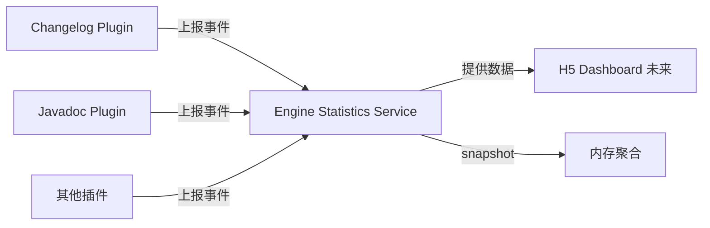
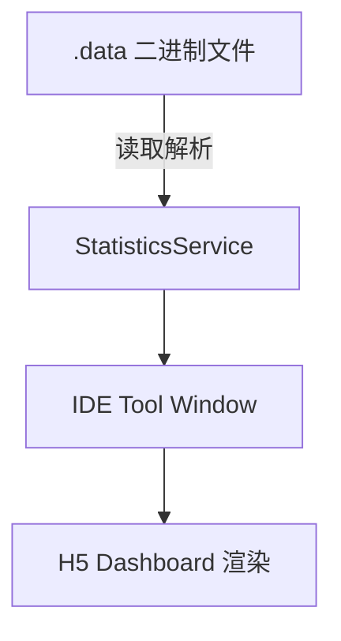
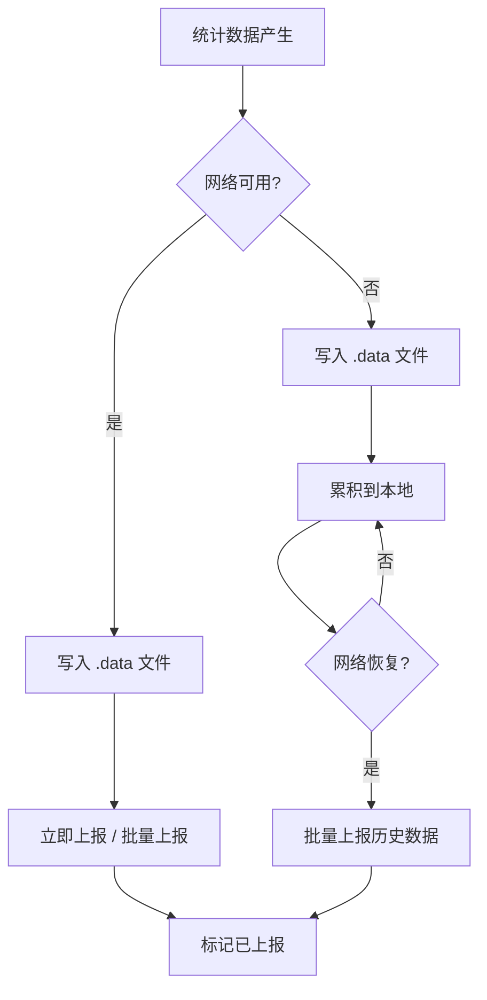
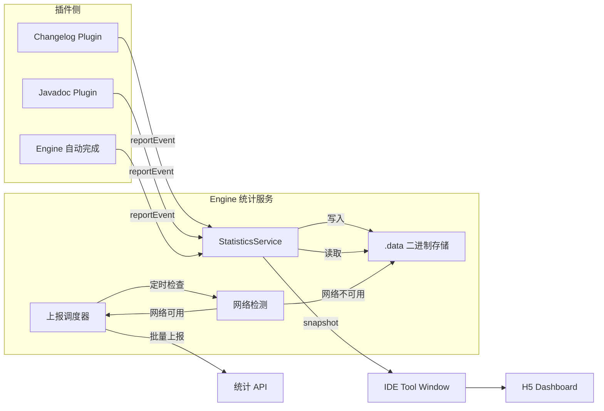

# IntelliAI Engine 统计功能需求说明

## 目录

- [1 需求背景](#1-需求背景)
- [2 总体设计](#2-总体设计)
- [3 功能范围](#3-功能范围)
- [4 统计数据定义](#4-统计数据定义)
- [5 技术实现要求](#5-技术实现要求)
- [6 数据存储与上报策略](#6-数据存储与上报策略)
- [7 后续扩展（不在本期实现）](#7-后续扩展不在本期实现)
- [8 开发任务拆解](#8-开发任务拆解)

## 1 需求背景

IntelliAI 由 Engine 插件作为核心能力承载，集成 Changelog、Javadoc 等功能插件。为支持后续使用分析、能力评估、H5 数据展示，需要在 Engine 中引入*
*统一、低侵入、可扩展**的统计机制。

---

## 2 总体设计

### 2.1 核心原则

- **单一开关**：仅一个全局配置项 `enableStatistics`
- **关闭时**：不记录任何统计数据，子插件也需要共享此配置, 在 engine 中关闭统计功能后, 子插件不进行上报
- **开启时**：全量收集数据，统一由 Engine 接收、汇总、存储
- **插件职责**：只负责上报，不做统计判断逻辑

### 2.2 架构示意



---

## 3 功能范围

### 3.1 统计开关

| 配置项              | 类型      | 默认值   | 说明     |
|------------------|---------|-------|--------|
| enableStatistics | boolean | false | 全局统计开关 |

---

## 4 统计数据定义

### 4.1 Engine 全局统计

| 指标                | 类型     | 说明                 |
|-------------------|--------|--------------------|
| projectName       | String | 项目名称, 统计数据需要使用到的维度 |
| aiRequestCount    | long   | AI 请求总次数（按插件维度统计）  |
| autoCompleteCount | long   | 自动完成功能使用次数         |

说明：

- `aiRequestCount`：记录每次 AI 请求，按 `pluginId` 区分来源
- `autoCompleteCount`：统计自动完成功能被触发的次数
- AI 请求总次数需要使用 AI 服务商 和 模型名称 维度来拆分

---

### 4.2 Changelog 插件统计

#### 4.2.1 行为统计

| 指标                         | 类型   | 说明                                         |
|----------------------------|------|--------------------------------------------|
| commitMessageCount         | long | 提交信息生成次数和 token 消耗数                        |
| releaseLogCount            | long | Release log 生成总次数和 token 消耗数               |
| releaseLogByAICount        | long | 使用 AI 生成 Release log 的次数和 token 消耗数        |
| releaseLogByGitCliffCount  | long | 使用 git-cliff 生成 Release log 的次数和 token 消耗数 |
| dailyReportCount           | long | 日报生成次数和 token 消耗数                          |
| weeklyReportCount          | long | 周报生成次数和 token 消耗数                          |
| changelogFromGitLogCount   | long | 基于 git log 生成的变更日志的生成次数和 token 消耗数         |
| changelogFromCodeDiffCount | long | 基于 Code diff 生成的变更日志的生成次数和 token 消耗数       |

#### 4.2.2 Commit Message 提交内容统计

| 指标                | 类型     | 说明                                               |
|-------------------|--------|--------------------------------------------------|
| fileCount         | int    | 单次提交涉及文件数                                        |
| addedLineCount    | int    | 新增代码行数                                           |
| modifiedLineCount | int    | 修改代码行数                                           |
| docLineCount      | int    | 文档变更行数                                           |
| commitType        | String | 提交类型：feat / fix / docs / refactor / test / chore |

---

### 4.3 Javadoc 插件统计

#### 4.3.1 生成统计

| 指标                 | 类型   | 说明                  |
|--------------------|------|---------------------|
| classJavadocCount  | long | 类注释生成次数和 token 消耗数  |
| methodJavadocCount | long | 方法注释生成次数和 token 消耗数 |
| fieldJavadocCount  | long | 字段注释生成次数和 token 消耗数 |
| generatedLineCount | long | 生成的注释总行数和 token 消耗数 |
| compressTokenCount | long | 开始代码压缩后减少的 token 数  |

说明:

- 需要区分 java 还是 kotlin 注释行数

---

## 5 技术实现要求

### 5.1 事件模型

```java
class StatisticsEvent {
    String pluginId;      // engine / changelog / javadoc
    String eventType;     // GENERATE / COMMIT / AI_REQUEST / AI_RESPONSE
    long timestamp;
    Map<String, Object> data;
}
```

### 5.2 服务接口

```java
interface StatisticsService {
    // 插件调用：上报事件
    void report(StatisticsEvent event);

    // 获取当前统计快照
    StatisticsSnapshot snapshot();
}

class StatisticsSnapshot {
    EngineGlobalStats engine;
    ChangelogStats changelog;
    JavadocStats javadoc;
}
```

### 5.3 非功能性要求

- **性能**：统计逻辑必须异步执行，不得阻塞主线程
- **隐私**：不涉及任何用户隐私数据，不采集代码原文内容
- **低侵入**：插件侧只需调用一次上报接口(定时上报? )

---

## 6 数据存储与上报策略

### 6.1 方案选择

针对你提出的三个问题，经过分析后给出以下方案：

| 问题   | 推荐方案        | 说明                   |
|------|-------------|----------------------|
| 存储介质 | SQLite      | 结构化存储、支持查询、IDEA 生态友好 |
| 上报策略 | 本地存储 + 定期上报 | 离线累积，网络可用时批量上报       |
| 用户认证 | 本地模式（第一期）   | 不需要登录，自己看自己的数据       |

---

### 6.2 本地存储方案

#### 6.2.1 存储方案演进过程

在确定最终方案前，我们评估了三种存储介质：

| 阶段       | 方案      | 优点             | 缺点            | 结论       |
|----------|---------|----------------|---------------|----------|
| **第一阶段** | SQLite  | 支持 SQL 查询、成熟稳定 | 需要添加依赖、增加插件体积 | ❌ 过于复杂   |
| **第二阶段** | JSON 文件 | 零依赖、可读性好       | 用户可手动篡改数据     | ❌ 防篡改能力弱 |
| **第三阶段** | 二进制文件   | 零依赖、防篡改、结构化    | 可读性差、需自定义解析   | ✅ 采用     |

**最终选择**：二进制文件（.data 后缀）

---

#### 6.2.2 二进制文件方案

**存储位置**：

```
{IDE_CONFIG_DIR}/IntelliAI/statistics/
├── 2025-01-05.data
└── 2025-01-06.data
```

**文件结构设计**：

```
┌─────────────────────────────────────────────────────┐
│                   FileHeader (20 字节)               │
├─────────────────────────────────────────────────────┤
│  magic[8]   │ version │ recordCount │ checksum     │
│  "INTELLAI" │   1     │     N       │   CRC32      │
└─────────────────────────────────────────────────────┘
│                                                     │
│              StatisticsRecord 1 (变长)              │
│  ┌───────────────────────────────────────────────┐  │
│  │ pluginId │ eventType │ provider │ model      │  │
│  │ tokenCount │ createdAt │ projectName (UTF)  │  │
│  └───────────────────────────────────────────────┘  │
│                                                     │
│              StatisticsRecord 2 (变长)              │
│                        ...                          │
│                                                     │
│              StatisticsRecord N (变长)              │
└─────────────────────────────────────────────────────┘
```

**详细格式定义**：

| 字段          | 类型      | 说明                   |
|-------------|---------|----------------------|
| magic       | byte[8] | 文件标识，"INTELLAI"      |
| version     | int     | 版本号，当前为 1            |
| recordCount | int     | 累计记录数                |
| checksum    | int     | 文件 CRC32 校验和（不包含文件头） |

**记录格式（使用 DataOutputStream）**：

| 顺序 | 类型        | 说明                     |
|----|-----------|------------------------|
| 1  | writeUTF  | pluginId（插件 ID）        |
| 2  | writeUTF  | eventType（事件类型）        |
| 3  | writeUTF  | provider（AI 服务商）       |
| 4  | writeUTF  | model（模型名称）            |
| 5  | writeLong | tokenCount（消耗 token 数） |
| 6  | writeLong | createdAt（时间戳）         |
| 7  | writeUTF  | projectName（项目名称）      |

**写入流程**：

```
1. 插件调用 StatisticsService.report(event)
2. 事件先存入内存 Queue（LinkedBlockingQueue）
3. 定时器每 5 分钟批量写入文件
4. 写入时：追加记录 → 更新 recordCount → 重算 CRC32
```

**写入示例**：

```java
public void writeRecord(Path file, Record record) throws IOException {
    try (DataOutputStream dos = new DataOutputStream(
            new BufferedOutputStream(new FileOutputStream(file.toFile(), true)))) {
        dos.writeUTF(record.pluginId);
        dos.writeUTF(record.eventType);
        dos.writeUTF(record.provider);
        dos.writeUTF(record.model);
        dos.writeLong(record.tokenCount);
        dos.writeLong(record.createdAt);
        dos.writeUTF(record.projectName);
    }
}
```

---

#### 6.2.3 文件生命周期管理

**新文件创建规则**：

- 每日首次写入时检查日期
- 若日期变化，创建新文件 `{YYYY-MM-DD}.data`
- 文件头中 recordCount 从 0 开始

**历史文件处理**：
| 场景 | 处理方式 |
|------|----------|
| 上报成功 | 标记已上报记录，不删除文件（保留历史） |
| 上报失败 | 保留文件，下次继续上报 |
| 手动清理 | 用户可在设置中清除历史统计数据 |

**文件保留策略**：

- 保留最近 30 天的数据文件
- 超过 30 天的文件自动归档或删除

---

#### 6.2.4 防篡改机制

| 层级           | 机制           | 说明                    |
|--------------|--------------|-----------------------|
| **Magic 标识** | 文件头前 8 字节    | 必须是 "INTELLAI"，否则拒绝读取 |
| **版本号**      | 文件头第 9-12 字节 | 不支持版本则拒绝读取            |
| **CRC32 校验** | 文件头最后 4 字节   | 每次写入后重新计算整个文件的 CRC32  |
| **XOR 加密**   | 字符串字段加密      | 防止直接看懂内容              |

**CRC32 计算时机**：

- 每次批量写入完成后
- 计算范围：整个文件（不包含文件头 20 字节）
- 写入文件头，覆盖旧的 checksum

**XOR 加密方案**：

```java
// 加密 key（硬编码，不可更改）
private static final byte[] ENCRYPT_KEY = {
    0x49, 0x4E, 0x54, 0x45, 0x4C, 0x4C, 0x41, 0x49  // "INTELLAI"
};

public byte[] encrypt(byte[] data) {
    byte[] result = new byte[data.length];
    for (int i = 0; i < data.length; i++) {
        result[i] = (byte) (data[i] ^ ENCRYPT_KEY[i % ENCRYPT_KEY.length]);
    }
    return result;
}
```

---

#### 6.2.5 上报机制与已上报标记

**上报状态管理**：

- 上报状态不写在 .data 文件中（避免破坏格式）
- 使用独立的索引文件记录已上报的记录位置

**索引文件设计**：

```
{IDE_CONFIG_DIR}/IntelliAI/statistics/
├── 2025-01-05.data      # 数据文件
├── 2025-01-05.idx       # 上报索引（每行一个已上报的记录偏移量）
└── metadata.json         # 元数据（包含 CRC32、recordCount 等）
```

**上报流程**：

```
1. 读取 .data 文件末尾的 recordCount
2. 与 .idx 中记录的已上报数量对比
3. 读取未上报的记录（偏移量区间）
4. 批量上报给服务器
5. 成功后记录偏移量到 .idx
```

**批量上报策略**：
| 参数 | 值 | 说明 |
|------|-----|------|
| 批量大小 | 100 条 | 每次最多上报 100 条 |
| 上报间隔 | 5 分钟 | 定时检查并上报 |
| 重试次数 | 3 次 | 失败后最多重试 3 次 |
| 重试间隔 | 1 分钟 | 每次失败后等待时间 |

---

#### 6.2.6 H5 本地查看

**方案：IDE 工具窗口嵌入 H5**



**实现方式**：

1. Engine 提供 `StatisticsToolWindow` 工具窗口
2. H5 页面作为资源打包到插件中
3. ToolWindow 中通过 `JsBridge` 调用 Engine 获取数据
4. Engine 读取 `.data` 二进制文件，解析后转换为 JSON 传递给 H5

**H5 页面功能（第一期）**：

- 今日/本周/本月统计概览
- 按项目切换查看
- 按插件类型筛选
- 简单的图表展示

**JsBridge 通信协议**：

```javascript
// H5 调用 Engine
window.intellij.getStatistics({ date: '2025-01-05' })
    .then(data => { render(data); });

// Engine 返回数据结构
{
    total: 100,
    byPlugin: { changelog: 60, javadoc: 40 },
    byDay: [ { date: '2025-01-05', count: 50 }, ... ]
}
```

---

### 6.3 数据上报策略

#### 6.3.1 上报机制

采用 **本地存储 + 定期上报 + 离线累积** 模式：



**上报规则**：

- **在线时**：实时写入 `.data` 文件，同时尝试上报（可批量聚合后上报，降低请求频率）
- **离线时**：仅写入本地，网络恢复后自动补报
- **重试机制**：上报失败的数据保留状态，下次继续尝试

#### 6.3.2 上报接口设计

##### 6.3.2.1 API 概述

| 项目           | 说明                                              |
|--------------|-------------------------------------------------|
| 接口地址         | `https://api.intellai.com/v1/statistics/upload` |
| 请求方式         | POST                                            |
| Content-Type | application/json                                |
| 认证方式         | 无（匿名上报）                                         |

---

##### 6.3.2.2 请求结构

**请求头**：

```
Content-Type: application/json
X-Client-Version: 1.0.0
X-Client-Platform: idea
```

**请求体（JSON）**：

```json
{
    "deviceId": "550e8400-e29b-41d4-a716-446655440000",
    "clientTimestamp": 1736083200000,
    "items": [
        {
            "projectName": "my-project",
            "pluginId": "javadoc",
            "eventType": "GENERATE",
            "provider": "OpenAI",
            "model": "gpt-4",
            "tokenCount": 150,
            "createdAt": 1736083200000
        }
    ]
}
```

**字段说明**：
| 字段 | 类型 | 必填 | 说明 |
|------|------|------|------|
| deviceId | String | 是 | 设备标识，首次启动时生成的 UUID |
| clientTimestamp | Long | 是 | 客户端时间戳（毫秒） |
| items | Array | 是 | 待上报的统计数据列表 |

**StatisticsItem 字段说明**：
| 字段 | 类型 | 必填 | 说明 |
|------|------|------|------|
| projectName | String | 是 | 项目名称 |
| pluginId | String | 是 | 插件 ID：engine / changelog / javadoc |
| eventType | String | 是 | 事件类型 |
| provider | String | 是 | AI 服务商：OpenAI / Anthropic / Ollama |
| model | String | 是 | 模型名称 |
| tokenCount | Long | 是 | 消耗的 token 数 |
| createdAt | Long | 是 | 事件发生时间戳 |

---

##### 6.3.2.3 响应结构

**成功响应**：

```json
{
    "code": 0,
    "message": "success",
    "data": {
        "receivedCount": 10,
        "failedItems": []
    }
}
```

**失败响应**：

```json
{
    "code": 40001,
    "message": "Invalid deviceId format",
    "data": null
}
```

**响应字段说明**：
| 字段 | 类型 | 说明 |
|------|------|------|
| code | Integer | 状态码：0 成功，非 0 失败 |
| message | String | 状态描述 |
| data.receivedCount | Integer | 成功接收的记录数 |
| data.failedItems | Array | 失败的记录索引列表 |

---

##### 6.3.2.4 错误码定义

| 错误码   | 说明            | 处理方式          |
|-------|---------------|---------------|
| 0     | 成功            | -             |
| 40001 | 参数错误          | 记录日志，跳过该批次    |
| 40002 | deviceId 格式错误 | 生成新的 deviceId |
| 429   | 请求过频          | 延迟 5 分钟后重试    |
| 50001 | 服务器内部错误       | 延迟 1 分钟后重试    |
| 50002 | 数据库异常         | 延迟 5 分钟后重试    |

---

##### 6.3.2.5 Java 请求示例

```java
// 上报请求
class StatisticsUploadRequest {
    String deviceId;                    // 设备标识（匿名）
    long clientTimestamp;               // 客户端时间戳
    List<StatisticsItem> items;         // 待上报的数据项
}

// 单条统计数据
class StatisticsItem {
    String projectName;
    String pluginId;
    String eventType;
    String provider;
    String model;
    long tokenCount;
    long createdAt;
}

// 上报响应
class StatisticsUploadResponse {
    int code;
    String message;
    ResponseData data;

    class ResponseData {
        int receivedCount;
        List<Integer> failedItems;      // 失败的记录索引
    }
}
```

---

##### 6.3.2.6 请求示例（cURL）

```bash
curl -X POST 'https://api.intellai.com/v1/statistics/upload' \
  -H 'Content-Type: application/json' \
  -H 'X-Client-Version: 1.0.0' \
  -H 'X-Client-Platform: idea' \
  -d '{
    "deviceId": "550e8400-e29b-41d4-a716-446655440000",
    "clientTimestamp": 1736083200000,
    "items": [
        {
            "projectName": "my-project",
            "pluginId": "javadoc",
            "eventType": "GENERATE",
            "provider": "OpenAI",
            "model": "gpt-4",
            "tokenCount": 150,
            "createdAt": 1736083200000
        }
    ]
  }'
```

#### 6.3.3 离线处理策略

| 场景       | 处理方式                                 |
|----------|--------------------------------------|
| 上报成功     | 标记已同步，可删除本地历史数据                      |
| 上报失败     | 保留本地数据，标记未同步，下次重试                    |
| 网络不通     | 累积到本地，等待网络恢复                         |
| API 返回错误 | 根据错误类型决定：429（限流）则延迟重试，400（参数错误）则记录日志 |

**重试策略**：

- 首次失败：1 分钟后重试
- 二次失败：5 分钟后重试
- 三次失败：30 分钟后重试
- 超过 3 次：标记为"上报失败"，暂停该数据项上报

---

### 6.4 用户认证方案

#### 6.4.1 第一期：本地模式（无需登录）

**设计原则**：用户无需注册登录，直接在 IDE 内查看本地统计数据

**优点**：

- 零门槛，立即可用
- 隐私友好，数据不出本地
- 实现简单，快速落地

**缺点**：

- 数据仅本地存储，换电脑无法查看历史
- 无法实现跨设备数据聚合

**数据隔离**：

- 每个用户/设备的数据独立存储
- 通过 `deviceId` 匿名标识（首次启动时生成 UUID）

#### 6.4.2 后期扩展：云端同步（可选）

后期如需支持云端同步，可增加：

| 功能      | 说明               |
|---------|------------------|
| 用户注册/登录 | 支持 GitHub / 邮箱登录 |
| 数据同步    | 本地数据加密后上传云端      |
| 多设备查看   | 登录后查看所有设备数据      |
| 数据导出    | 支持导出 JSON/CSV    |

**扩展预留字段**：

```java
class UserStatisticsConfig {
    boolean cloudSyncEnabled;           // 是否开启云端同步
    String userId;                      // 用户 ID（云端模式）
    String deviceId;                    // 设备 ID
    long lastSyncTimestamp;             // 最后同步时间
}
```

---

### 6.5 存储与上报流程图



---

## 7 后续扩展（不在本期实现）

- H5 Dashboard 展示
- 用户画像分析
- 成本估算
- 多 Project 维度统计

---

## 8 开发任务拆解

### 8.1 任务 1：Engine 统计服务基础

- [ ] 创建 `StatisticsService` 接口和实现类
- [ ] 实现 `StatisticsEvent` 事件模型
- [ ] 添加 `enableStatistics` 配置项
- [ ] 实现开关判断逻辑

### 8.2 任务 2：统计数据聚合

- [ ] 实现 Engine 全局统计聚合（AI 请求、Token、启动次数）
- [ ] 实现 Changelog 插件统计聚合
- [ ] 实现 Javadoc 插件统计聚合
- [ ] 实现 `snapshot()` 方法

### 8.3 任务 3：插件上报集成

- [ ] Changelog 插件集成事件上报
- [ ] Javadoc 插件集成事件上报
- [ ] 验证数据上报链路

### 8.4 任务 4：测试验收

- [ ] 开关关闭时数据为 0 验证
- [ ] 开关开启时数据累计验证
- [ ] 性能无影响验证

---

## 9 当前实现完成度清单（对照）

### 9.1 任务 1：Engine 统计服务基础

- [x] 创建 `StatisticsService` 接口和实现类：提供 report/snapshot/flush/upload 等基础能力
- [x] 实现 `StatisticsEvent` 事件模型（固定字段）：承载 pluginId/eventType/provider/model/token/projectName
- [x] 添加 `enableStatistics` 配置项：持久化统计开关与 deviceId
- [x] 实现开关判断逻辑：关闭时不上报、不启动定时写入/上报
- [ ] 设置 UI 暴露统计开关并与子插件共享：用户可在设置页统一控制统计开关

### 9.2 任务 2：统计数据聚合

- [ ] 实现 Engine 全局统计聚合：按 plugin/provider/model 维度统计 AI 请求数、token 与自动完成次数
- [ ] 实现 Changelog 插件统计聚合：提交信息/发布日志/日报周报等次数与 token、提交内容维度
- [ ] 实现 Javadoc 插件统计聚合（含 Java/Kotlin 维度）：class/method/field 计数、生成行数、压缩 token
- [ ] 实现符合需求的 `StatisticsSnapshot` 结构：输出 Engine/Changelog/Javadoc 专用统计视图

### 9.3 任务 3：插件上报集成

- [ ] Changelog 插件集成事件上报：在生成流程/提交分析处调用 `StatisticsService.report`
- [ ] Javadoc 插件集成事件上报：在生成流程统计 class/method/field 与 token/行数
- [ ] Engine AI 请求与自动完成事件上报：AI 请求入口与自动完成触发点埋点
- [ ] 验证数据上报链路：本地落盘、定时写入、批量上报联通验证

### 9.4 任务 4：测试验收

- [ ] 开关关闭时数据为 0 验证：关闭后不应新增记录与聚合变化
- [ ] 开关开启时数据累计验证：连续操作应累计并可读取快照
- [ ] 性能无影响验证：统计流程异步，不阻塞主线程

### 9.5 存储与上报实现对照

- [x] `.data` 二进制存储格式（文件头 + 记录写入）：每日文件、追加记录、更新 recordCount/checksum
- [x] XOR 字符串字段加密：对 UTF 字符串字段进行简单混淆
- [x] CRC32 写入与计算：写入后更新文件校验
- [ ] CRC32 校验读取流程接入：读取时校验 header 与 CRC32
- [ ] 文件保留 30 天策略：定期清理过期文件
- [ ] `metadata.json` 与偏移量索引上报：记录已上报偏移量与校验信息
- [ ] 上报间隔与重试策略按需求一致（当前实现不一致）：调整间隔、错误码处理与重试节奏
