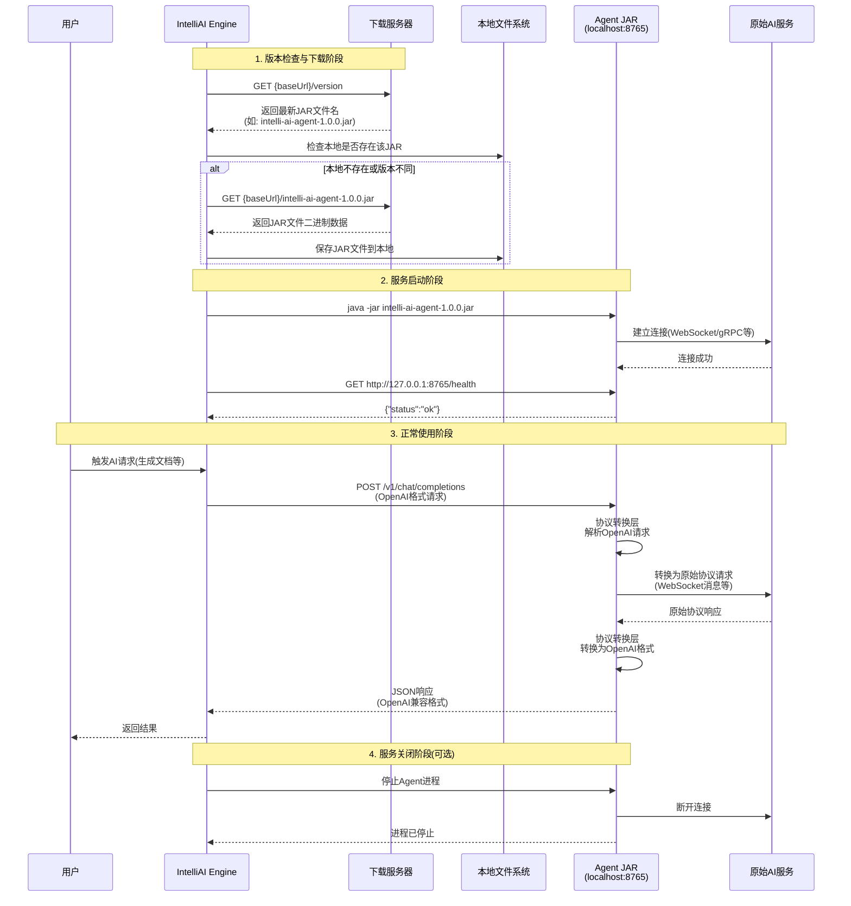
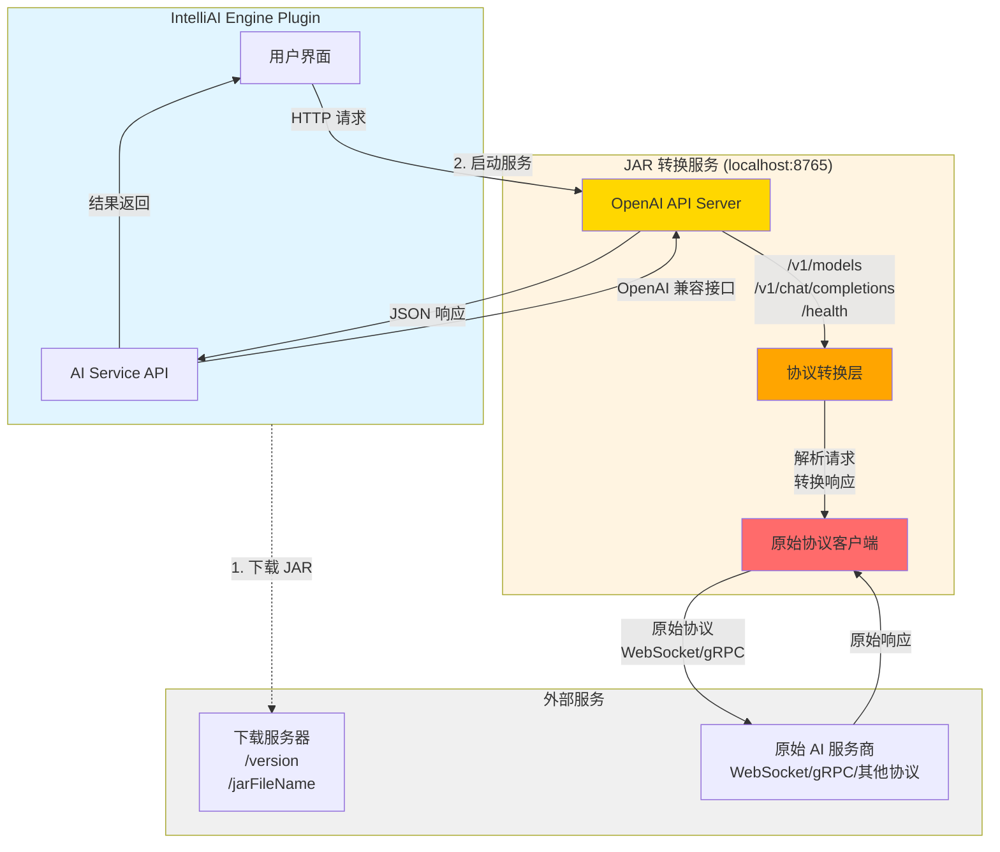

# 非标准 AI 服务集成 JAR 开发指南

本文档详细描述了如何开发一个 JAR 包，将非标准协议（如 WebSocket）的 AI 服务转换为标准的 OpenAI API，供 IntelliAI Engine 插件集成使用。

## 目录

- [1 概述](#1-概述)
- [2 核心要求](#2-核心要求)
- [3 服务端口规范](#3-服务端口规范)
- [4 实现流程](#4-实现流程)
- [5 示例项目结构](#5-示例项目结构)
- [6 开发示例](#6-开发示例)
- [7 测试与调试](#7-测试与调试)
- [8 打包与分发](#8-打包与分发)
- [9 注意事项](#9-注意事项)
- [10 参考实现](#10-参考实现)
- [11 总结](#11-总结)

## 1 概述

IntelliAI Engine 支持通过独立的 JAR 包集成非标准协议的 AI 服务商。JAR 包作为一个转换服务，将非标准协议（如 WebSocket、gRPC 等）转换为标准的
OpenAI API，使得插件可以统一使用 OpenAI 兼容的接口访问各种 AI 服务。

### 1.1 工作原理

```
IntelliAI Engine Plugin
        ↓ (HTTP 请求)
JAR 转换服务 (监听 8765 端口)
        ↓ (WebSocket/gRPC/其他协议)
原始 AI 服务商 API
```

## 2 核心要求

### 2.1 必须实现的接口

JAR 包必须提供以下接口：

#### 2.1.1 主启动类

JAR 包必须提供一个主启动类，通过 `java -jar your-agent.jar` 可以启动服务。

**要求：**

- 启动后必须监听 **8765** 端口（固定端口，不可配置）
- 必须提供健康检查端点

#### 2.1.2 HTTP 端点

JAR 服务必须实现以下 HTTP 端点：

##### 2.1.2.1 `/health` - 健康检查

**请求方式：** `GET`

**响应格式：**

```json
{
  "status": "ok"
}
```

**用途：** Engine 通过此端点检查服务是否正常运行

##### 2.1.2.2 `/v1/models` - 模型列表

**请求方式：** `GET`

**响应格式：**

```json
{
  "object": "list",
  "data": [
    {
      "id": "your-model-id",
      "object": "model",
      "owned_by": "your-service-name"
    }
  ]
}
```

**用途：** Engine 通过此端点获取可用的模型列表

##### 2.1.2.3 `/v1/chat/completions` - 聊天完成

**请求方式：** `POST`

**请求格式（标准 OpenAI API）：**

```json
{
  "model": "your-model-id",
  "messages": [
    {
      "role": "user",
      "content": "Hello"
    }
  ],
  "stream": false
}
```

**响应格式（非流式）：**

```json
{
  "id": "chatcmpl-xxx",
  "object": "chat.completion",
  "created": 1234567890,
  "model": "your-model-id",
  "choices": [
    {
      "index": 0,
      "message": {
        "role": "assistant",
        "content": "Hello! How can I help you?"
      },
      "finish_reason": "stop"
    }
  ]
}
```

**流式响应格式（SSE）：**

```
data: {"id":"chatcmpl-xxx","object":"chat.completion.chunk","created":1234567890,"model":"your-model-id","choices":[{"index":0,"delta":{"content":"Hello"},"finish_reason":null}]}

data: {"id":"chatcmpl-xxx","object":"chat.completion.chunk","created":1234567890,"model":"your-model-id","choices":[{"index":0,"delta":{"content":"!"},"finish_reason":null}]}

data: {"id":"chatcmpl-xxx","object":"chat.completion.chunk","created":1234567890,"model":"your-model-id","choices":[{"index":0,"delta":{},"finish_reason":"stop"}]}

data: [DONE]
```

**用途：** Engine 通过此端点发送聊天请求并接收响应

### 2.2 版本更新机制

Engine 通过以下机制检查和管理 JAR 版本：

#### 2.2.1 版本检查端点

JAR 的下载服务器必须提供版本检查端点：

**端点格式：** `{baseUrl}/version`

**请求方式：** `GET`

**响应格式：** 纯文本，返回最新的 JAR 文件名

**示例：**

```
请求: GET https://example.com/version
响应: agent-service-1.2.0.jar
```

#### 2.2.2 JAR 下载端点

**端点格式：** `{baseUrl}/{jarFileName}`

**请求方式：** `GET`

**响应：** JAR 文件的二进制内容

**示例：**

```
请求: GET https://example.com/agent/agent-service-1.2.0.jar
响应: [JAR 文件二进制数据]
```

#### 2.2.3 版本更新流程

Engine 的版本更新流程如下：

1. **获取最新版本**
    - Engine 向 `{baseUrl}/version` 发送 GET 请求
    - 解析返回的 JAR 文件名

2. **检查本地版本**
    - Engine 检查本地是否存在该 JAR 文件
    - 比较本地文件名和远程文件名

3. **下载新版本（如需要）**
    - 如果本地不存在或版本不同，则下载新版本
    - 下载地址：`{baseUrl}/{jarFileName}`

4. **启动服务**
    - Engine 使用 `java -jar {localJarPath}` 启动服务
    - 检查 `http://127.0.0.1:8765/health` 确认服务启动成功

**版本更新与接口调用时序图：**



## 3 服务端口规范

**固定端口：8765**

- JAR 服务必须监听 `127.0.0.1:8765`（本地回环地址）
- 端口号不可配置，必须固定为 8765
- Engine 通过 `http://127.0.0.1:8765/v1` 访问服务

**注意：** 可以通过环境变量或命令行参数支持端口配置，但默认必须是 8765，且 Engine 会固定使用 8765 端口。

## 4 实现流程

### 4.1 整体架构



### 4.2 转换流程示例（WebSocket）

以下以 WebSocket 为例说明转换流程：

#### 4.2.1 服务启动

```java
// ServerLauncher.java
public class ServerLauncher {
    private static final int PORT = 8765; // 固定端口

    public static void main(String[] args) {
        // 1. 初始化原始协议客户端（WebSocket）
        YourAIServiceClient client = new YourAIServiceClient();
        client.connect();

        // 2. 启动 OpenAI API 服务器
        OpenAiApiServer server = new OpenAiApiServer(client, PORT);
        server.start();

        // 3. 注册关闭钩子
        Runtime.getRuntime().addShutdownHook(new Thread(() -> {
            server.stop();
            client.disconnect();
        }));
    }
}
```

#### 4.2.2 请求转换流程

**步骤 1：接收 OpenAI API 请求**

```java
// OpenAiApiServer.java
public void handleChatCompletions(HttpExchange exchange) {
    // 解析 OpenAI 格式的请求
    JSONObject request = parseRequest(exchange);
    String question = extractUserMessage(request);
    boolean stream = request.getBoolean("stream");

    // 调用转换层
    if (stream) {
        handleStreamRequest(question, exchange);
    } else {
        handleStandardRequest(question, exchange);
    }
}
```

**步骤 2：转换为原始协议请求**

```java
// ProtocolConverter.java
public void convertToOriginalProtocol(String question) {
    // 构建原始协议的请求格式
    OriginalRequest originalReq = new OriginalRequest();
    originalReq.setMessage(question);
    originalReq.setConversationId(getConversationId());

    // 通过 WebSocket 发送
    websocketClient.send(originalReq);
}
```

**步骤 3：接收原始协议响应**

```java
// WebSocketClient.java
public void onMessage(String message) {
    // 解析原始协议的响应
    OriginalResponse response = parseOriginalResponse(message);

    // 转换为 OpenAI 格式
    String openAiResponse = convertToOpenAiFormat(response);

    // 返回给调用方
    callback.onResponse(openAiResponse);
}
```

**步骤 4：转换为 OpenAI API 响应**

```java
// ProtocolConverter.java
public JSONObject convertToOpenAiFormat(OriginalResponse original) {
    JSONObject response = new JSONObject();
    response.put("id", generateId());
    response.put("object", "chat.completion");
    response.put("created", System.currentTimeMillis() / 1000);
    response.put("model", "your-model-id");

    JSONObject choice = new JSONObject();
    choice.put("index", 0);

    JSONObject message = new JSONObject();
    message.put("role", "assistant");
    message.put("content", original.getContent());

    choice.put("message", message);
    choice.put("finish_reason", "stop");

    response.put("choices", List.of(choice));
    return response;
}
```

#### 4.2.3 流式响应处理

对于流式响应，需要将原始协议的流式数据转换为 SSE 格式：

```java
// 处理流式响应
public void handleStreamResponse(String question, HttpExchange exchange) {
    exchange.getResponseHeaders().add("Content-Type", "text/event-stream");
    exchange.sendResponseHeaders(200, 0);

    OutputStream os = exchange.getResponseBody();

    // 通过原始协议客户端发送请求，注册流式回调
    originalClient.askStream(question, chunk -> {
        // 每个 chunk 转换为 OpenAI SSE 格式
        JSONObject sseChunk = convertChunkToSse(chunk);
        writeSse(os, sseChunk.toJSONString());
    }, () -> {
        // 完成回调
        writeSse(os, "[DONE]");
        closeQuietly(os);
    });
}
```

## 5 示例项目结构

我们提供了一个完整的模板项目 `intelli-ai-agent-template`，你可以基于此模板进行开发。

### 5.1 模板项目位置

模板项目位于：`intelli-ai-agent-template/`

推荐的项目结构：

```
intelli-ai-agent-template/
├── pom.xml                          # Maven 配置
├── README.md                        # 项目说明
├── .gitignore                       # Git 忽略配置
└── src/
    └── main/
        ├── java/
        │   └── dev/
        │       └── dong4j/
        │           └── zeka/
        │               └── stack/
        │                   └── agent/
        │                       ├── ServerLauncher.java          # 主启动类
        │                       ├── api/
        │                       │   └── OpenAiApiServer.java    # OpenAI API 服务器
        │                       ├── client/
        │                       │   └── YourAIServiceClient.java # 原始协议客户端（示例）
        │                       ├── converter/                  # 协议转换层（可选）
        │                       ├── model/                      # 数据模型（可选）
        │                       └── config/                     # 配置管理（可选）
        └── resources/
            └── META-INF/
                └── MANIFEST.MF                         # 清单文件（Maven 会自动生成）
```

### 5.2 使用模板项目

1. **复制模板项目**
   ```bash
   cp -r intelli-ai-agent-template your-agent-service
   cd your-agent-service
   ```

2. **修改包名和项目信息**
    - 更新 `pom.xml` 中的 `groupId`、`artifactId` 和 `name`
    - 根据需要修改 Java 包名（当前为 `dev.dong4j.zeka.stack.agent`）

3. **实现原始协议客户端**
    - 根据实际需求实现 `YourAIServiceClient.java`
    - 或创建新的客户端类替换示例代码

4. **构建和测试**
   ```bash
   mvn clean package
   java -jar target/your-agent-service-1.0.0.jar
   ```

## 6 开发示例

### 6.1 主启动类示例

完整的实现请参考模板项目：`intelli-ai-agent-template/src/main/java/dev/dong4j/zeka/stack/agent/ServerLauncher.java`

核心代码示例：

```java
package dev.dong4j.zeka.stack.agent;

import dev.dong4j.zeka.stack.agent.api.OpenAiApiServer;
import dev.dong4j.zeka.stack.agent.client.YourAIServiceClient;

/**
 * 服务启动入口
 */
public class ServerLauncher {
    private static final int DEFAULT_PORT = 8765;

    public static void main(String[] args) {
        // 解析端口（可选，默认 8765）
        int port = resolvePort(args);

        // 初始化原始协议客户端
        YourAIServiceClient client = new YourAIServiceClient();
        if (!client.connect()) {
            System.err.println("Failed to connect to AI service");
            System.exit(1);
        }

        // 创建并启动 OpenAI API 服务器
        OpenAiApiServer server = new OpenAiApiServer(client, port);
        try {
            server.start();
            System.out.println("OpenAI API Server started on http://127.0.0.1:" + port);
        } catch (Exception e) {
            System.err.println("Failed to start server: " + e.getMessage());
            System.exit(1);
        }

        // 注册关闭钩子
        Runtime.getRuntime().addShutdownHook(new Thread(() -> {
            server.stop();
            client.disconnect();
        }));

        // 保持运行
        try {
            Thread.currentThread().join();
        } catch (InterruptedException e) {
            Thread.currentThread().interrupt();
        }
    }

    private static int resolvePort(String[] args) {
        // 支持 --port=xxx 参数，但默认使用 8765
        for (String arg : args) {
            if (arg != null && arg.startsWith("--port=")) {
                try {
                    int port = Integer.parseInt(arg.substring(7));
                    if (port > 0 && port < 65536) {
                        return port;
                    }
                } catch (NumberFormatException ignored) {
                }
            }
        }
        String env = System.getenv("AGENT_PORT");
        if (env != null) {
            try {
                int port = Integer.parseInt(env);
                if (port > 0 && port < 65536) {
                    return port;
                }
            } catch (NumberFormatException ignored) {
            }
        }
        return DEFAULT_PORT; // 默认 8765
    }
}
```

### 6.2 OpenAI API 服务器示例

完整的实现请参考模板项目：`intelli-ai-agent-template/src/main/java/dev/dong4j/zeka/stack/agent/api/OpenAiApiServer.java`

核心代码示例：

```java
package dev.dong4j.zeka.stack.agent.api;

import dev.dong4j.zeka.stack.agent.client.YourAIServiceClient;
import com.sun.net.httpserver.HttpExchange;
import com.sun.net.httpserver.HttpHandler;
import com.sun.net.httpserver.HttpServer;

import java.io.IOException;
import java.net.InetSocketAddress;
import java.nio.charset.StandardCharsets;
import java.util.concurrent.Executors;

/**
 * OpenAI 兼容 API 服务器
 */
public class OpenAiApiServer {
    private final YourAIServiceClient client;
    private final int port;
    private HttpServer httpServer;

    public OpenAiApiServer(YourAIServiceClient client, int port) {
        this.client = client;
        this.port = port;
    }

    public void start() throws IOException {
        httpServer = HttpServer.create(new InetSocketAddress("127.0.0.1", port), 0);

        // 注册端点
        httpServer.createContext("/health", this::handleHealth);
        httpServer.createContext("/v1/models", this::handleModels);
        httpServer.createContext("/v1/chat/completions", new ChatCompletionsHandler());

        httpServer.setExecutor(Executors.newCachedThreadPool());
        httpServer.start();
    }

    public void stop() {
        if (httpServer != null) {
            httpServer.stop(0);
        }
    }

    private void handleHealth(HttpExchange exchange) throws IOException {
        String response = "{\"status\":\"ok\"}";
        writeJsonResponse(exchange, 200, response);
    }

    private void handleModels(HttpExchange exchange) throws IOException {
        // 返回模型列表（实际应从配置或原始服务获取）
        String response = "{\"object\":\"list\",\"data\":[{\"id\":\"your-model-id\",\"object\":\"model\",\"owned_by\":\"your-service\"}]}";
        writeJsonResponse(exchange, 200, response);
    }

    // ChatCompletionsHandler 实现省略，详见模板项目
    // ...
}
```

### 6.3 原始协议客户端示例

完整的示例代码请参考模板项目：`intelli-ai-agent-template/src/main/java/dev/dong4j/zeka/stack/agent/client/YourAIServiceClient.java`

这是一个示例接口，展示如何封装原始协议的客户端。你需要根据实际的原始协议（WebSocket、gRPC、自定义协议等）实现以下方法：

```java
package dev.dong4j.zeka.stack.agent.client;

import java.util.function.Consumer;

/**
 * 原始 AI 服务客户端接口示例
 *
 * 注意：这是一个示例接口，实际实现取决于具体的原始协议
 */
public class YourAIServiceClient {

    /**
     * 连接到原始 AI 服务
     */
    public boolean connect() {
        // TODO: 实现连接逻辑
        // 1. 建立连接（WebSocket/gRPC/其他协议）
        // 2. 进行认证（如果需要）
        // 3. 初始化会话
        return true;
    }

    /**
     * 发送问题并获取完整回答（非流式）
     */
    public String ask(String question) throws Exception {
        // TODO: 实现非流式请求逻辑
        // 1. 构建原始协议的请求格式
        // 2. 通过原始协议发送请求
        // 3. 等待并接收完整响应
        // 4. 解析响应并返回内容
        return "response";
    }

    /**
     * 发送问题并流式接收回答
     */
    public void askStream(String question,
                         Consumer<String> onChunk,
                         Runnable onComplete) {
        // TODO: 实现流式请求逻辑
        // 1. 构建原始协议的请求格式
        // 2. 通过原始协议发送流式请求
        // 3. 注册流式回调，处理每个数据块
        // 4. 当流结束时调用完成回调
    }

    /**
     * 断开连接
     */
    public void disconnect() {
        // TODO: 实现断开连接逻辑
    }
}
```

模板项目中包含了详细的注释和 TODO 说明，帮助你理解如何实现各个方法。

## 7 测试与调试

### 7.1 本地测试

#### 7.1.1 启动服务

```bash
# 使用模板项目构建的 JAR
java -jar target/intelli-ai-agent-1.0.0.jar

# 或使用你自己的项目
java -jar your-agent-service.jar
```

#### 7.1.2 测试健康检查

```bash
curl http://127.0.0.1:8765/health
```

预期响应：

```json
{"status":"ok"}
```

#### 7.1.3 测试模型列表

```bash
curl http://127.0.0.1:8765/v1/models
```

#### 7.1.4 测试聊天完成（非流式）

```bash
curl -X POST http://127.0.0.1:8765/v1/chat/completions \
  -H "Content-Type: application/json" \
  -d '{
    "model": "your-model-id",
    "messages": [
      {"role": "user", "content": "Hello"}
    ],
    "stream": false
  }'
```

#### 7.1.5 测试聊天完成（流式）

```bash
curl -X POST http://127.0.0.1:8765/v1/chat/completions \
  -H "Content-Type: application/json" \
  -d '{
    "model": "your-model-id",
    "messages": [
      {"role": "user", "content": "Hello"}
    ],
    "stream": true
  }'
```

### 7.2 与 Engine 集成测试

1. 在 Engine 设置页面配置 JAR 下载地址
2. 下载并启动 JAR 服务
3. 在 Engine 中选择该服务作为 AI 提供商
4. 测试生成功能

## 8 打包与分发

### 8.1 打包要求

- 必须打包成**包含所有依赖的可执行 JAR**（Fat JAR）
- 主类必须在 `MANIFEST.MF` 中声明
- JAR 文件名建议使用版本号，如：`your-agent-1.0.0.jar`

### 8.2 Maven 打包示例

完整的 Maven 配置请参考模板项目：`intelli-ai-agent-template/pom.xml`

核心配置示例：

```xml
<properties>
    <main.class>dev.dong4j.zeka.stack.agent.ServerLauncher</main.class>
</properties>

<plugin>
    <groupId>org.apache.maven.plugins</groupId>
    <artifactId>maven-shade-plugin</artifactId>
    <version>3.4.1</version>
    <executions>
        <execution>
            <phase>package</phase>
            <goals>
                <goal>shade</goal>
            </goals>
            <configuration>
                <transformers>
                    <transformer implementation="org.apache.maven.plugins.shade.resource.ManifestResourceTransformer">
                        <mainClass>${main.class}</mainClass>
                    </transformer>
                </transformers>
            </configuration>
        </execution>
    </executions>
</plugin>
```

**注意：** 需要将 `${main.class}` 替换为你实际的主类全限定名，模板项目中为 `dev.dong4j.zeka.stack.agent.ServerLauncher`。

### 8.3 版本服务器配置

#### 8.3.1 版本检查端点实现

在你的下载服务器上实现 `/version` 端点，返回最新的 JAR 文件名：

**示例（使用 Nginx）：**

```nginx
location /version {
    default_type text/plain;
    return 200 "intelli-ai-agent-1.0.0.jar";
}

location /agent/ {
    alias /path/to/jar/files/;
    default_type application/java-archive;
}
```

**示例（使用 Spring Boot）：**

```java
@RestController
@RequestMapping("/agent")
public class VersionController {
    @GetMapping("/version")
    public String getVersion() {
        return "intelli-ai-agent-1.0.0.jar";
    }

    @GetMapping("/{jarFileName}")
    public ResponseEntity<Resource> downloadJar(@PathVariable String jarFileName) {
        // 返回 JAR 文件
    }
}
```

#### 8.3.2 JAR 文件部署

将 JAR 文件部署到服务器的 `/agent/` 目录下，确保可以通过 `{baseUrl}/intelli-ai-agent-1.0.0.jar` 访问。

**注意：** JAR 文件名应该与 `/version` 端点返回的文件名一致。默认生成的 JAR 文件名为 `intelli-ai-agent-{version}.jar`（如
`intelli-ai-agent-1.0.0.jar`）。

### 8.4 Engine 配置

在 Engine 的设置页面配置：

- **下载地址（Base URL）：** `https://your-server.com/agent`
- **自动启动：** 可选，勾选后会在 Engine 启动时自动启动服务

Engine 会自动：

1. 访问 `https://your-server.com/version` 获取最新版本（例如：`intelli-ai-agent-1.0.0.jar`）
2. 检查本地是否存在该版本
3. 如需要，下载 `https://your-server.com/agent/intelli-ai-agent-1.0.0.jar`
4. 使用 `java -jar {localJarPath}` 启动服务
5. 检查 `http://127.0.0.1:8765/health` 确认服务启动成功

## 9 注意事项

### 9.1 端口占用

- 确保 8765 端口未被占用
- 如果端口被占用，服务启动会失败
- Engine 会检测服务是否正常启动

### 9.2 线程安全

- OpenAI API 服务器需要处理并发请求
- 确保原始协议客户端是线程安全的，或使用连接池

### 9.3 错误处理

- 必须正确处理所有异常情况
- 返回标准的错误响应格式
- 记录详细的日志便于调试

### 9.4 资源清理

- 实现 `shutdown` 钩子，确保服务关闭时正确清理资源
- 关闭所有连接、线程池等资源

### 9.5 认证处理

- 如果原始服务需要认证，在服务启动时完成认证
- 保存认证 token，避免每次请求都重新认证

## 10 参考实现

### 10.1 模板项目（推荐）

我们提供了一个完整的模板项目 `intelli-ai-agent-template`，包含了：

- ✅ 完整的项目结构
- ✅ Maven 配置（包含可执行 JAR 打包）
- ✅ 主启动类实现
- ✅ OpenAI API 服务器实现
- ✅ 原始协议客户端接口示例
- ✅ 详细的代码注释和 TODO 说明

**位置：** `intelli-ai-agent-template/`

**快速开始：**

```bash
cd intelli-ai-agent-template
mvn clean package
java -jar target/intelli-ai-agent-1.0.0.jar
```

### 10.2 实际参考实现

可以参考 `reference/codefree-chat-mvp` 项目，该项目展示了如何将 WebSocket 协议转换为 OpenAI API 的实际实现：

- **主启动类：** `ServerLauncher.java`
- **OpenAI API 服务器：** `OpenAiApiServer.java`
- **原始协议客户端：** `WebSocketManager.java`
- **协议转换：** `CodeFreeChat.java`

这个项目可以作为实际开发时的参考，了解如何处理 WebSocket 连接、OAuth 认证等复杂场景。

## 11 总结

开发一个非标准 AI 服务集成的 JAR 包需要：

1. ✅ 实现标准的 OpenAI API 接口（`/health`, `/v1/models`, `/v1/chat/completions`）
2. ✅ 固定监听 8765 端口
3. ✅ 实现协议转换逻辑（原始协议 ↔ OpenAI API）
4. ✅ 提供版本检查端点（`/version`）
5. ✅ 打包成可执行 JAR
6. ✅ 实现健康检查机制

按照本文档的规范开发，即可实现与 IntelliAI Engine 的完美集成。

