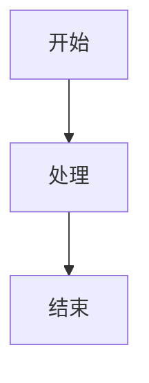

# docs.html 使用说明

## 目录结构

```
项目根目录/
├── docs.html              # 文档页面主文件
├── docs/                  # 文档目录
│   ├── 用户手册.md        # 主文档文件（必需）
│   ├── banner.png         # Banner 图片（可选）
│   └── ...                # 其他图片和资源
└── landing.html           # 首页（可选）
```

## 必需文件

### 1. 用户手册 Markdown 文件

**位置**：`docs/用户手册.md`

这是文档的主要内容文件，`docs.html` 会自动加载并渲染这个文件。

**要求**：

- 文件必须命名为 `用户手册.md`
- 必须放在 `docs/` 目录下
- 支持标准 Markdown 语法
- 支持代码高亮（指定语言，如 ` ```java `）
- 支持 Mermaid 图表（使用 ` ```mermaid `）

**示例**：

```markdown
# 用户手册

## 功能介绍

这是一个示例文档。

### 代码示例

```java
public class Example {
    public static void main(String[] args) {
        System.out.println("Hello World");
    }
}
```

### 流程图



```

## 可选文件

### 2. Banner 图片

**位置**：`docs/banner.png` 或 `docs/banner.jpg` 或 `docs/banner.webp`

Banner 图片会显示在文档内容上方。

**支持的路径**（按优先级）：
- `./docs/banner.png`
- `./docs/banner.jpg`
- `./docs/banner.webp`
- `./banner.png`
- `./banner.jpg`
- `./banner.webp`

**要求**：
- 如果文件不存在，Banner 区域会自动隐藏
- 建议尺寸：宽度 1100px 左右，高度根据内容调整

### 3. 文档中的图片

**位置**：`docs/` 目录下的任意位置

在 Markdown 文件中引用图片：

```markdown


```

**建议**：

- 将图片放在 `docs/imgs/` 目录下，便于管理
- 支持相对路径引用

## 功能特性

### 代码高亮

支持多种编程语言的语法高亮：

- Java
- Bash/Shell
- XML/HTML
- JSON
- JavaScript/TypeScript
- Kotlin
- Gradle
- YAML
- Properties
- 更多...

**使用方法**：

````markdown
```java
public class Example {
    // 代码内容
}
```
````

### Mermaid 图表

支持绘制流程图、时序图等：

````markdown

````

### 目录导航

- 自动根据 Markdown 的 `h2` 和 `h3` 标题生成侧边栏导航
- 默认只显示 `h2` 标题
- 点击或滚动到对应标题时，自动展开显示 `h3` 子标题

### 搜索功能

- 顶部搜索框支持实时搜索文档内容
- 自动高亮搜索结果
- 不会搜索代码块内的内容

### 主题切换

- 支持浅色/深色主题切换
- 主题偏好会自动保存

## 部署

### 本地预览

直接在浏览器中打开 `docs.html` 即可预览。

**注意**：由于浏览器的安全限制，直接打开 HTML 文件可能无法加载 Markdown 文件。建议使用本地服务器：

```bash
# 使用 Python
python3 -m http.server 8000

# 使用 Node.js (需要安装 http-server)
npx http-server

# 然后访问 http://localhost:8000/docs.html
```

### 服务器部署

1. 将所有文件上传到服务器
2. 确保 `docs.html` 和 `docs/` 目录在同一层级
3. 访问 `https://your-domain.com/docs.html`

## 自定义配置

### 修改链接地址

编辑 `docs.html`，找到 footer 部分的链接：

```html
<a href="https://github.com/dong4j" ...>GitHub</a>
<a href="https://dong4j.site" ...>主页</a>
<a href="https://blog.dong4j.site" ...>博客</a>
```

### 修改标题

编辑 `docs.html`，找到 logo 部分：

```html
<span>IntelliAI Javadoc</span>
```

## 注意事项

1. **文件路径**：确保所有相对路径正确
2. **Markdown 文件**：必须命名为 `用户手册.md` 并放在 `docs/` 目录下
3. **图片路径**：使用相对路径，相对于 `docs.html` 的位置
4. **浏览器兼容性**：建议使用现代浏览器（Chrome、Firefox、Safari、Edge）

## 快速开始

1. 创建 `docs/` 目录
2. 在 `docs/` 目录下创建 `用户手册.md` 文件
3. 编写 Markdown 内容
4. 在浏览器中打开 `docs.html` 查看效果


