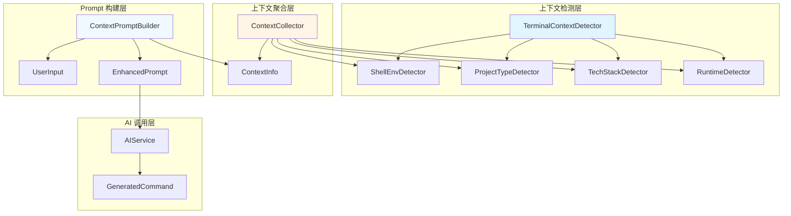

# Terminal AI 上下文实现方案

## 目录

- [1 背景与价值](#1-背景与价值)
- [2 上下文类型与优先级](#2-上下文类型与优先级)
- [3 实现架构](#3-实现架构)
- [4 上下文检测实现](#4-上下文检测实现)
- [5 Prompt 构建策略](#5-prompt-构建策略)
- [6 代码示例](#6-代码示例)
- [7 最佳实践](#7-最佳实践)
- [8 性能优化](#8-性能优化)
- [9 未来扩展](#9-未来扩展)

## 1 背景与价值

### 1.1 问题定义

Terminal AI 的核心价值不在于"会不会生成命令"，而在于"在当前上下文下生成最合理的那一条命令"。

**现状问题：**

- 无上下文时，AI 只能生成通用命令，容易跑偏
- 用户需要补充说明项目类型，降低使用体验
- 生成的命令不够贴合实际项目需求

**解决方案：**
通过自动检测当前目录的项目类型和环境上下文，让 AI 从"猜命令"升级为"懂你在干什么"。

### 1.2 价值对比

| 维度    | 无上下文     | 有上下文           |
|-------|----------|----------------|
| AI 行为 | 在猜       | 在判断            |
| 命令特点  | 偏通用      | 偏项目            |
| 命中率   | 较低       | 较高             |
| 用户体验  | 需要补充说明   | 一句话就够          |
| 用户感受  | "它能生成命令" | "它居然知道我在这个项目里" |

### 1.3 典型示例

#### 示例 1：Git 上下文

**用户输入：**

```
# 查看最近提交
```

**无上下文（通用命令）：**

```bash
git log --oneline -5
```

**有上下文（更智能）：**

```bash
git log --oneline -5 --decorate --graph
```

- 自动识别当前是 Git 仓库
- 自动带上分支、tag 装饰信息
- 无需用户说明"在 git 项目里"

#### 示例 2：Docker 上下文

**用户输入：**

```
# 启动服务
```

**无上下文（只能猜）：**

```bash
docker run ...
```

**有 docker-compose 上下文（明确知道）：**

```bash
docker compose up -d
```

#### 示例 3：Kubernetes 上下文

**用户输入：**

```
# 查看服务状态
```

**无上下文（高概率跑偏）：**

```bash
systemctl status  # ❌ 完全错了
```

**有 k8s 上下文（正确）：**

```bash
kubectl get svc
# 或
kubectl get all
```

## 2 上下文类型与优先级

### 2.1 上下文分层

根据**投入成本 vs 提升效果**，将上下文分为 5 个层级：

| 层级     | 上下文类型              | 优先级   | 说明              |
|--------|--------------------|-------|-----------------|
| **L1** | OS / Shell         | ⭐⭐⭐⭐⭐ | 基础但必须，决定命令是否可用  |
| **L2** | Git / Docker / K8s | ⭐⭐⭐⭐⭐ | 核心上下文，直接影响命令准确性 |
| **L3** | 技术栈 / 构建工具         | ⭐⭐⭐⭐  | 命中率飙升，用户最直觉的期待  |
| **L4** | 运行态 / 端口           | ⭐⭐⭐   | 体验拉满，AI 帮你避坑    |
| **L5** | 行为历史（可选）           | ⭐⭐    | 杀手级但需克制，连续对话感强  |

### 2.2 上下文类型详解

#### L1：Shell & 系统环境上下文

**1. Shell 类型（bash / zsh / fish）**

**作用：**不同 shell 语法不完全一致，不识别可能导致命令不可用。

**检测方式：**

```java
String shell = System.getenv("SHELL");
// 或
String shell = System.getProperty("SHELL");
```

**示例：**

- **bash / zsh：** `export JAVA_HOME=/opt/jdk`
- **fish：** `set -x JAVA_HOME /opt/jdk`

**2. 操作系统（macOS / Linux / WSL）**

**作用：**OS 是命令是否可用的分水岭。

**检测方式：**

```java
String os = System.getProperty("os.name");
boolean isMac = os.toLowerCase().contains("mac");
boolean isLinux = os.toLowerCase().contains("linux");
boolean isWindows = os.toLowerCase().contains("windows");
```

**示例：**

- **macOS：** `lsof -i :8080`
- **Linux：** `ss -lntp | grep 8080`

#### L2：项目类型上下文（核心）

**1. Git 项目**

**检测规则：**

- 存在 `.git` 目录

**深度检测（可选）：**

- 当前分支：`git branch --show-current`
- 是否 dirty：`git status --porcelain`
- 是否存在远程仓库：`git remote -v`

**2. Docker 项目**

**检测规则：**

- 存在 `Dockerfile`
- 存在 `docker-compose.yml` 或 `docker-compose.yaml`

**3. Kubernetes 项目**

**检测规则：**

- 存在 `k8s/` 目录
- 存在 `manifests/` 目录
- 存在 `deployment.yaml` 等 k8s 配置文件
- 存在 `.kube/` 目录
- 存在 `.helm/` 目录

#### L3：技术栈上下文

**1. 编程语言 / 构建工具**

**检测方式：**

| 构建工具    | 识别文件                                 | 命令示例                  |
|---------|--------------------------------------|-----------------------|
| Maven   | `pom.xml`                            | `mvn spring-boot:run` |
| Gradle  | `build.gradle`, `build.gradle.kts`   | `./gradlew test`      |
| Node.js | `package.json`                       | `npm run dev`         |
| Go      | `go.mod`                             | `go run .`            |
| Python  | `pyproject.toml`, `requirements.txt` | `python -m pytest`    |

**2. 测试框架**

**检测方式：**根据构建工具检测测试命令。

#### L4：运行态上下文

**1. 端口占用情况**

**作用：**AI 可以自动避坑，避免端口冲突。

**检测方式：**

```java
// macOS
Process process = Runtime.getRuntime().exec("lsof -i :8080");

// Linux
Process process = Runtime.getRuntime().exec("ss -lntp | grep 8080");
```

**示例：**

- 插件发现 8080 已被占用
- AI 输出：`SERVER_PORT=8081 java -jar app.jar`

**2. 容器 / SSH / 远程环境**

**检测方式：**

- 容器内：检查 `/proc/1/cgroup` 是否包含 `docker`
- SSH：检查 `SSH_CLIENT` 或 `SSH_TTY` 环境变量

#### L5：用户行为上下文（可选）

**1. 最近执行过的命令（Top N）**

**作用：**提供连续对话感。

**示例：**

- 用户刚执行：`kubectl get pods`
- 接着输入：`# 查看日志`
- AI 输出：`kubectl logs -f <pod-name>`

**2. 当前目录深度 / 是否在子模块**

**作用：**帮助 AI 理解目录结构。

**示例：**

- 用户在子模块中
- 输入：`# 回到项目根目录`
- AI 输出：`cd "$(git rev-parse --show-toplevel)"`

#### 安全上下文（强烈建议）

**高危命令检测**

**高危命令列表：**

- `rm -rf`
- `mkfs`
- `dd`
- `iptables`
- `chmod 777`

**处理方式：**

- 检测到高危命令时，提供更安全的替代方案
- 例如：`# 清空日志`
    - ❌ 不安全：`rm -rf /var/log/*`
    - ✅ 安全：`truncate -s 0 /var/log/app.log`

## 3 实现架构

### 3.1 整体架构



### 3.2 核心组件

#### 3.2.1 上下文检测器（Detectors）

- **`ShellEnvDetector`**：检测 Shell 类型和操作系统
- **`ProjectTypeDetector`**：检测 Git / Docker / K8s 项目类型
- **`TechStackDetector`**：检测技术栈和构建工具
- **`RuntimeDetector`**：检测运行态信息（端口、容器等）

#### 3.2.2 上下文收集器（ContextCollector）

- 统一管理所有检测器
- 聚合上下文信息
- 提供缓存机制

#### 3.2.3 Prompt 构建器（ContextPromptBuilder）

- 根据上下文构建增强的 User Prompt
- 结构化输出，便于 AI 理解

## 4 上下文检测实现

### 4.1 基础上下文检测

#### 4.1.1 Shell 环境检测

```java
public class ShellEnvDetector {
    public static class ShellEnv {
        public final String shell;
        public final String os;
        public final boolean isMac;
        public final boolean isLinux;
        public final boolean isWindows;

        public ShellEnv(String shell, String os) {
            this.shell = shell;
            this.os = os;
            this.isMac = os.toLowerCase().contains("mac");
            this.isLinux = os.toLowerCase().contains("linux");
            this.isWindows = os.toLowerCase().contains("windows");
        }
    }

    @NotNull
    public static ShellEnv detect() {
        String shell = System.getenv("SHELL");
        if (shell == null || shell.isEmpty()) {
            shell = System.getProperty("SHELL", "bash");
        }
        String os = System.getProperty("os.name");
        return new ShellEnv(shell, os);
    }
}
```

#### 4.1.2 项目类型检测

```java
public class ProjectTypeDetector {
    public static class ProjectInfo {
        public final boolean isGit;
        public final boolean hasDockerfile;
        public final boolean hasDockerCompose;
        public final boolean hasKubernetes;

        public ProjectInfo(boolean isGit, boolean hasDockerfile,
                          boolean hasDockerCompose, boolean hasKubernetes) {
            this.isGit = isGit;
            this.hasDockerfile = hasDockerfile;
            this.hasDockerCompose = hasDockerCompose;
            this.hasKubernetes = hasKubernetes;
        }
    }

    @NotNull
    public static ProjectInfo detect(@NotNull VirtualFile baseDir) {
        boolean isGit = baseDir.findChild(".git") != null;
        boolean hasDockerfile = baseDir.findChild("Dockerfile") != null;
        boolean hasDockerCompose = baseDir.findChild("docker-compose.yml") != null
                                 || baseDir.findChild("docker-compose.yaml") != null;

        boolean hasKubernetes = false;
        VirtualFile k8sDir = baseDir.findChild("k8s");
        VirtualFile manifestsDir = baseDir.findChild("manifests");
        if (k8sDir != null || manifestsDir != null) {
            hasKubernetes = true;
        } else {
            // 检查是否有 k8s 配置文件
            for (VirtualFile child : baseDir.getChildren()) {
                if (child.getName().endsWith(".yaml") || child.getName().endsWith(".yml")) {
                    // 简单检查文件名是否包含 k8s 关键字
                    String name = child.getName().toLowerCase();
                    if (name.contains("deployment") || name.contains("service")
                        || name.contains("configmap")) {
                        hasKubernetes = true;
                        break;
                    }
                }
            }
        }

        return new ProjectInfo(isGit, hasDockerfile, hasDockerCompose, hasKubernetes);
    }
}
```

#### 4.1.3 技术栈检测

```java
public class TechStackDetector {
    public static class TechStack {
        public final String buildTool;
        public final String language;

        public TechStack(String buildTool, String language) {
            this.buildTool = buildTool;
            this.language = language;
        }
    }

    @NotNull
    public static TechStack detect(@NotNull VirtualFile baseDir) {
        String buildTool = null;
        String language = null;

        // 检测构建工具
        if (baseDir.findChild("pom.xml") != null) {
            buildTool = "maven";
            language = "java";
        } else if (baseDir.findChild("build.gradle") != null
                || baseDir.findChild("build.gradle.kts") != null) {
            buildTool = "gradle";
            language = "java";
        } else if (baseDir.findChild("package.json") != null) {
            buildTool = "npm";
            language = "javascript";
        } else if (baseDir.findChild("go.mod") != null) {
            buildTool = "go";
            language = "go";
        } else if (baseDir.findChild("pyproject.toml") != null
                || baseDir.findChild("requirements.txt") != null) {
            buildTool = "pip";
            language = "python";
        }

        return new TechStack(buildTool, language);
    }
}
```

### 4.2 上下文收集器

```java
public class TerminalContextCollector {
    private final Project project;
    private final ShellEnvDetector.ShellEnv shellEnv;
    private final ProjectTypeDetector.ProjectInfo projectInfo;
    private final TechStackDetector.TechStack techStack;

    public TerminalContextCollector(@NotNull Project project) {
        this.project = project;
        this.shellEnv = ShellEnvDetector.detect();
        VirtualFile baseDir = project.getBaseDir();
        if (baseDir != null) {
            this.projectInfo = ProjectTypeDetector.detect(baseDir);
            this.techStack = TechStackDetector.detect(baseDir);
        } else {
            this.projectInfo = new ProjectTypeDetector.ProjectInfo(false, false, false, false);
            this.techStack = new TechStackDetector.TechStack(null, null);
        }
    }

    @NotNull
    public ContextInfo collect() {
        return new ContextInfo(
            shellEnv,
            projectInfo,
            techStack
        );
    }

    public static class ContextInfo {
        public final ShellEnvDetector.ShellEnv shellEnv;
        public final ProjectTypeDetector.ProjectInfo projectInfo;
        public final TechStackDetector.TechStack techStack;

        public ContextInfo(ShellEnvDetector.ShellEnv shellEnv,
                          ProjectTypeDetector.ProjectInfo projectInfo,
                          TechStackDetector.TechStack techStack) {
            this.shellEnv = shellEnv;
            this.projectInfo = projectInfo;
            this.techStack = techStack;
        }
    }
}
```

## 5 Prompt 构建策略

### 5.1 原则

#### 5.1.1 结构化输出

**❌ 不推荐（自然语言废话）：**

```
当前目录好像是一个 git 项目，而且有 docker
```

**✅ 推荐（结构化）：**

```
当前目录上下文：
- os: macos
- shell: zsh
- git: true
- docker-compose: true
- kubernetes: false
- build-tool: maven
```

#### 5.1.2 上下文放在 User Prompt

- **System Prompt：**负责"行为约束"（命令格式、输出要求等）
- **User Prompt：**负责"事实上下文"（项目类型、技术栈等）

### 5.2 Prompt 构建实现

```java
public class ContextPromptBuilder {
    @NotNull
    public static String buildUserPrompt(@NotNull TerminalContextCollector.ContextInfo context,
                                        @NotNull String userInput) {
        StringBuilder sb = new StringBuilder();

        // 添加上下文信息
        sb.append("当前目录上下文：\n");

        // Shell 环境
        ShellEnvDetector.ShellEnv shellEnv = context.shellEnv;
        sb.append("- os: ").append(shellEnv.os.toLowerCase()).append("\n");
        sb.append("- shell: ").append(extractShellName(shellEnv.shell)).append("\n");

        // 项目类型
        ProjectTypeDetector.ProjectInfo projectInfo = context.projectInfo;
        sb.append("- git: ").append(projectInfo.isGit).append("\n");
        if (projectInfo.hasDockerfile) {
            sb.append("- dockerfile: true\n");
        }
        if (projectInfo.hasDockerCompose) {
            sb.append("- docker-compose: true\n");
        }
        if (projectInfo.hasKubernetes) {
            sb.append("- kubernetes: true\n");
        }

        // 技术栈
        TechStackDetector.TechStack techStack = context.techStack;
        if (techStack.buildTool != null) {
            sb.append("- build-tool: ").append(techStack.buildTool).append("\n");
        }
        if (techStack.language != null) {
            sb.append("- language: ").append(techStack.language).append("\n");
        }

        sb.append("\n用户需求：\n");
        sb.append(userInput);

        return sb.toString();
    }

    @NotNull
    private static String extractShellName(@NotNull String shellPath) {
        if (shellPath.contains("zsh")) {
            return "zsh";
        } else if (shellPath.contains("bash")) {
            return "bash";
        } else if (shellPath.contains("fish")) {
            return "fish";
        }
        return "bash";
    }
}
```

### 5.3 集成到现有代码

```java
// 在 TerminalAiGenerateAction.actionPerformed() 中
String input = ...; // 获取用户输入

// 收集上下文
TerminalContextCollector collector = new TerminalContextCollector(project);
TerminalContextCollector.ContextInfo contextInfo = collector.collect();

// 构建增强的 User Prompt
String enhancedUserPrompt = ContextPromptBuilder.buildUserPrompt(contextInfo, input);
String finalUserPrompt = settings.terminalTemplate.replace("{content}", enhancedUserPrompt);

// 调用 AI
AIChatRequest request = new AIChatRequest(settings.systemPrompt, finalUserPrompt);
```

## 6 代码示例

### 6.1 完整实现示例

#### 6.1.1 上下文检测器工厂

```java
public class ContextDetectorFactory {
    @NotNull
    public static TerminalContextCollector createCollector(@NotNull Project project) {
        return new TerminalContextCollector(project);
    }
}
```

#### 6.1.2 在 Action 中集成

```java
public class TerminalAiGenerateAction extends DumbAwareAction {
    @Override
    public void actionPerformed(@NotNull AnActionEvent e) {
        Project project = e.getProject();
        if (project == null) {
            return;
        }

        // ... 获取输入 ...

        // 收集上下文
        TerminalContextCollector collector = ContextDetectorFactory.createCollector(project);
        TerminalContextCollector.ContextInfo contextInfo = collector.collect();

        // 构建增强的 User Prompt
        String contextPrompt = ContextPromptBuilder.buildUserPrompt(contextInfo, input);
        String userPrompt = settings.terminalTemplate.replace("{content}", contextPrompt);

        // 调用 AI
        AIChatRequest request = new AIChatRequest(settings.systemPrompt, userPrompt);
        // ... 执行 AI 调用 ...
    }
}
```

### 6.2 配置选项

可以在设置中添加上下文开关：

```java
public class SettingsState implements PersistentStateComponent<SettingsState> {
    // ... 现有字段 ...

    /** 是否启用上下文检测 */
    public boolean enableContextDetection = true;

    /** 启用的上下文层级 */
    public int contextLevel = 3; // 1-5，默认 L3
}
```

## 7 最佳实践

### 7.1 检测优先级

1. **L1 必须检测**：OS / Shell 是基础，必须检测
2. **L2 核心检测**：Git / Docker / K8s 优先级最高
3. **L3 按需检测**：技术栈检测可以按需开启
4. **L4/L5 可选**：运行态和行为历史可以用户选择开启

### 7.2 性能优化

1. **缓存检测结果**：项目结构不会频繁变化，可以缓存检测结果
2. **异步检测**：上下文检测可以在后台线程执行
3. **按需检测**：只检测用户启用的上下文层级

### 7.3 错误处理

1. **优雅降级**：检测失败时，使用默认值或跳过该上下文
2. **日志记录**：记录检测失败的原因，便于调试
3. **用户提示**：检测失败时，不阻塞 AI 调用，只是不提供该上下文

### 7.4 用户控制

1. **开关控制**：允许用户关闭某些上下文检测
2. **层级选择**：允许用户选择启用的上下文层级
3. **性能提示**：告诉用户不同层级的性能影响

## 8 性能优化

### 8.1 缓存策略

```java
public class CachedContextCollector {
    private static final Map<VirtualFile, TerminalContextCollector.ContextInfo> cache = new ConcurrentHashMap<>();

    @NotNull
    public static TerminalContextCollector.ContextInfo getOrDetect(@NotNull Project project) {
        VirtualFile baseDir = project.getBaseDir();
        if (baseDir == null) {
            return new TerminalContextCollector(project).collect();
        }

        // 检查缓存
        return cache.computeIfAbsent(baseDir, dir -> {
            return new TerminalContextCollector(project).collect();
        });
    }

    public static void clearCache(@NotNull VirtualFile baseDir) {
        cache.remove(baseDir);
    }
}
```

### 8.2 异步检测

```java
public class AsyncContextCollector {
    public static void collectAsync(@NotNull Project project,
                                   @NotNull Consumer<TerminalContextCollector.ContextInfo> callback) {
        ApplicationManager.getApplication().executeOnPooledThread(() -> {
            TerminalContextCollector collector = new TerminalContextCollector(project);
            TerminalContextCollector.ContextInfo contextInfo = collector.collect();
            ApplicationManager.getApplication().invokeLater(() -> {
                callback.accept(contextInfo);
            });
        });
    }
}
```

## 9 未来扩展

### 9.1 高级上下文

- **Git 深度上下文**：当前分支、是否 dirty、远程仓库信息
- **运行态上下文**：端口占用、容器状态、进程信息
- **用户行为上下文**：最近命令历史、常用命令模式

### 9.2 智能建议

- **命令推荐**：根据上下文推荐常用命令
- **参数补全**：根据项目类型自动补全命令参数
- **错误预防**：检测高危命令并提供安全替代方案

### 9.3 上下文学习

- **用户习惯学习**：学习用户的命令使用模式
- **项目特定上下文**：为特定项目类型定制上下文
- **上下文模板**：提供预设的上下文模板

---

**文档版本**：1.0.0
**最后更新**：2026-01-20
**参考文档**：

- [开发文档](./开发文档.md)
- [上下文设计思路](./上下文.md)
