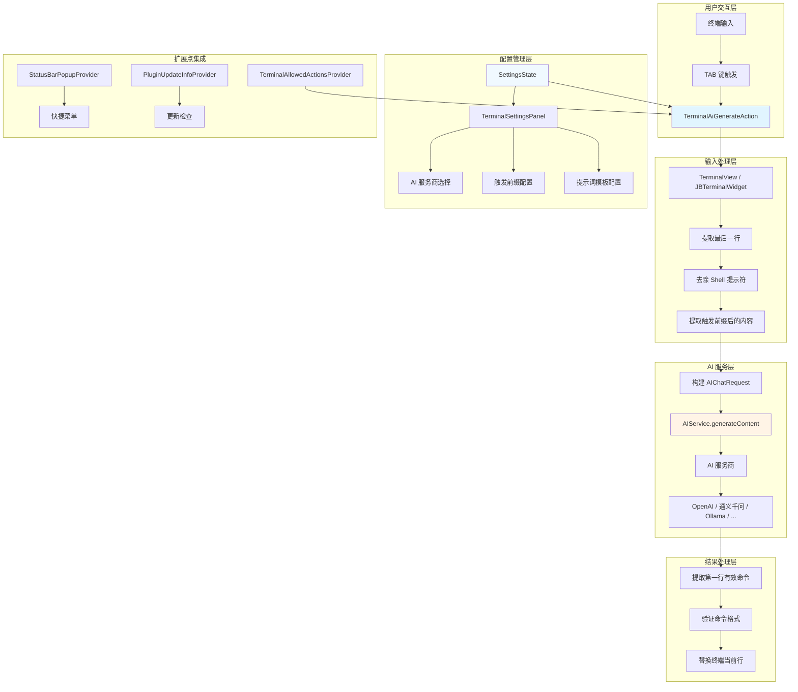
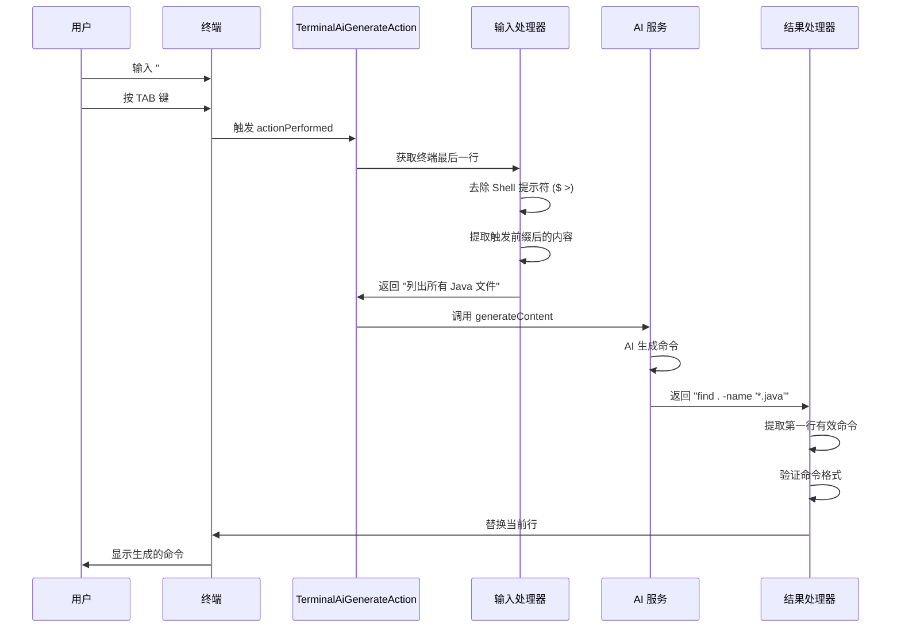

# IntelliAI Terminal 开发文档

## 目录

- [1 背景](#1-背景)
- [2 开发历程](#2-开发历程)
- [3 技术架构](#3-技术架构)
- [4 核心实现](#4-核心实现)
- [5 关键技术点](#5-关键技术点)
- [6 开发坑点](#6-开发坑点)
- [7 未来规划](#7-未来规划)

## 1 背景

### 1.1 灵感来源

iTerm2 有一个非常好用的 AI 功能，能够直接根据用户的需求生成一段可执行的 shell 命令。这个功能非常实用，因为：

- **提高效率**：不是每个命令都记得住，经常需要切换窗口去查询命令
- **减少上下文切换**：可以在终端中直接完成，无需离开当前工作环境

### 1.2 为什么在 IDEA 中实现？

作为开发者，我们大部分时间都在 IDEA 中进行开发工作，包括：

- 编写代码
- 调试程序
- **使用终端**（终端是开发过程中经常使用的工具）

但是目前 IDEA 没有在终端中集成 AI 功能，我们是否可以将 iTerm2 的 AI 功能在 IDEA 的终端中实现呢？

**答案是可以的**，而且 IDEA 还能提供更多的上下文信息，让 AI 生成的命令更准确：

- **项目上下文**：AI 可以知道当前项目结构
- **文件上下文**：AI 可以知道当前打开的文件
- **代码上下文**：AI 可以理解项目使用的技术栈

所以，`intelli-ai-terminal` 插件应运而生。

## 2 开发历程

### 2.1 技术选型

#### 2.1.1 终端 API 演进

IntelliJ Platform 提供了多种终端实现：

- **Classic Terminal**：初始实现，长期使用的默认选项
- **Reworked Terminal**：自 2025.2 版本起成为默认选项
- **Experimental Terminal**：已废弃的实验性实现

不同的实现暴露不同的 API，官方推荐使用 **Reworked Terminal API**。

#### 2.1.2 版本要求

根据官方文档 [Embedded Terminal](https://plugins.jetbrains.com/docs/intellij/embedded-terminal.html)，Terminal API 从 **2025.3**
版本开始提供，并且处于实验状态（experimental status），未来可能会有所变化。

因此，`intelli-ai-terminal` 插件最低支持版本为 **IntelliJ IDEA 2025.3**。

### 2.2 功能设计

#### 2.2.1 核心功能

1. **输入提取**：从终端最后一行提取用户输入
2. **AI 调用**：将用户输入发送给 AI 服务生成命令
3. **命令替换**：将生成的命令替换当前终端行

#### 2.2.2 触发方式

- **快捷键**：使用 `TAB` 键触发（类似 iTerm2）
- **触发前缀**：支持自定义触发前缀（默认 `#`），只有以该前缀开头的行才会触发 AI 生成

## 3 技术架构

### 3.1 整体架构



### 3.2 核心组件

#### 3.2.1 Action 层

- **`TerminalAiGenerateAction`**：核心 Action 类，处理 TAB 键触发和命令生成

#### 3.2.2 终端集成层

- **`TerminalAiAllowedActionsProvider`**：注册允许在终端中触发的动作
- **`TerminalView` / `JBTerminalWidget`**：终端视图对象，用于获取终端内容和发送文本

#### 3.2.3 配置管理层

- **`SettingsState`**：配置持久化，管理插件设置
- **`TerminalSettingsConfigurable`**：设置页面配置类
- **`TerminalSettingsPanel`**：设置页面 UI 组件

#### 3.2.4 AI 服务层

- **`AIService`**：AI 服务接口（来自 IntelliAI Engine）
- **`AIProviderConfig`**：AI 服务商配置
- **`AIChatRequest`**：AI 请求对象

#### 3.2.5 扩展点

- **`TerminalStatusBarPopupProvider`**：状态栏菜单提供者
- **`TerminalPluginUpdateInfoProvider`**：插件更新信息提供者

### 3.3 数据流



## 4 核心实现

### 4.1 TAB 键触发

#### 4.1.1 问题

在 IntelliJ IDEA 中，终端有自己的快捷键处理机制。由于终端需要处理 shell 的各种快捷键（如 `Ctrl+R` 搜索历史命令），IDE 的快捷键可能会与 shell
快捷键冲突。

为了解决这个问题，IDE 提供了 **"Override IDE shortcuts"** 选项，限制可以在终端中执行的 IDE 动作列表，避免 IDE 动作与 shell 快捷键冲突。

#### 4.1.2 解决方案

根据官方文档，要在终端中使用快捷键触发自定义动作，需要：

1. **实现 `TerminalAllowedActionsProvider`**：注册允许在终端中触发的动作 ID
2. **在 `plugin.xml` 中注册**：将 Provider 注册到 `org.jetbrains.plugins.terminal.allowedActionsProvider` 扩展点
3. **定义 Action 和快捷键**：在 `plugin.xml` 中定义 Action 和快捷键

**关键代码：**

```java
// TerminalAiAllowedActionsProvider.java
public class TerminalAiAllowedActionsProvider implements TerminalAllowedActionsProvider {
    @Override
    public @NotNull List<String> getActionIds() {
        return List.of("dev.dong4j.zeka.stack.idea.plugin.terminal.action.TerminalAiGenerateAction");
    }
}
```

```xml
<!-- plugin.xml -->
<extensions defaultExtensionNs="org.jetbrains.plugins.terminal">
    <allowedActionsProvider implementation="dev.dong4j.zeka.stack.idea.plugin.terminal.terminal.TerminalAiAllowedActionsProvider"/>
</extensions>

<actions>
    <action id="dev.dong4j.zeka.stack.idea.plugin.terminal.action.TerminalAiGenerateAction"
            class="dev.dong4j.zeka.stack.idea.plugin.terminal.action.TerminalAiGenerateAction">
        <keyboard-shortcut keymap="$default" first-keystroke="TAB"/>
    </action>
</actions>
```

### 4.2 输入提取

#### 4.2.1 终端 API 获取

根据官方文档，有两种方式获取终端实例：

1. **`TerminalView.DATA_KEY`**：从 Action 的 DataContext 获取
2. **`JBTerminalWidget.TERMINAL_DATA_KEY`**：兼容旧版终端实现

**关键代码：**

```java
TerminalView terminalView = e.getData(TerminalView.DATA_KEY);
JBTerminalWidget jbWidget = e.getData(JBTerminalWidget.TERMINAL_DATA_KEY);
```

#### 4.2.2 获取终端输出

使用 `TerminalOutputModel` 获取终端输出：

```java
TerminalOutputModelsSet models = terminalView.getOutputModels();
TerminalOutputModel regular = models.getRegular();
TerminalOutputModelSnapshot snapshot = regular.takeSnapshot();
```

#### 4.2.3 提取最后一行

从终端输出快照中提取最后一行非空内容：

```java
TerminalLineIndex lineIndex = snapshot.getLastLineIndex();
TerminalOffset start = snapshot.getStartOfLine(lineIndex);
TerminalOffset end = snapshot.getEndOfLine(lineIndex, true);
CharSequence text = snapshot.getText(start, end);
```

#### 4.2.4 去除 Shell 提示符

支持去除常见的 shell 提示符：

- `$ ` 或 `$`（bash/zsh）
- `> ` 或 `>`（PowerShell）

```java
private static String stripPromptPrefix(@NotNull String line) {
    String trimmed = line.stripLeading();
    if (trimmed.startsWith("$ ")) {
        return trimmed.substring(2);
    }
    if (trimmed.startsWith("$")) {
        return trimmed.substring(1).stripLeading();
    }
    // ... 其他提示符
}
```

#### 4.2.5 处理续行输入

支持处理以反斜杠结尾的续行输入，将多行合并为一行：

```java
private static String getLastLogicalLine(@NotNull List<String> lines) {
    // 从最后一行开始，向前查找以 \ 结尾的行
    // 将多行合并为一行
}
```

### 4.3 AI 调用

#### 4.3.1 构建请求

使用 `AIChatRequest` 构建 AI 请求：

```java
String userPrompt = settings.terminalTemplate.replace("{content}", input);
AIChatRequest request = new AIChatRequest(settings.systemPrompt, userPrompt);
```

#### 4.3.2 调用服务

在后台线程中调用 AI 服务：

```java
ProgressManager.getInstance().run(new Task.Backgroundable(project, "生成命令", true) {
    @Override
    public void run(@NotNull ProgressIndicator indicator) {
        AIService aiService = ApplicationManager.getApplication().getService(AIService.class);
        String result = aiService.generateContent(project, request, providerConfig, null);
        // 处理结果
    }
});
```

### 4.4 结果处理

#### 4.4.1 提取命令

从 AI 响应中提取第一行有效命令，跳过代码块和空行：

```java
private static String extractCommand(@NotNull String result) {
    String[] lines = result.replace("\r", "").split("\n");
    boolean inFence = false;
    for (String line : lines) {
        String trimmed = line.trim();
        if (trimmed.startsWith("```")) {
            inFence = !inFence;
            continue;
        }
        if (inFence || trimmed.isEmpty()) {
            continue;
        }
        return trimmed;
    }
    return result.trim();
}
```

#### 4.4.2 验证格式

验证生成的命令是否符合 shell 命令规范：

```java
private static boolean isValidShellOutput(@NotNull String output) {
    return output.matches("^[a-zA-Z0-9/.$].*")
        && !output.contains("```")
        && !output.contains("\n\n");
}
```

#### 4.4.3 替换当前行

使用 `Ctrl+U`（`\u0015`）清除当前行，然后写入新命令：

```java
private static void replaceCurrentLine(@NotNull TerminalView terminalView, @NotNull String newText) {
    terminalView.sendText("\u0015");  // Ctrl+U 清除当前行
    terminalView.sendText(newText);    // 写入新命令
}
```

## 5 关键技术点

### 5.1 双终端支持

插件同时支持两种终端实现：

- **`TerminalView`**：新版 Reworked Terminal（推荐）
- **`JBTerminalWidget`**：旧版 Classic Terminal（兼容）

在代码中兼容两种实现：

```java
TerminalView terminalView = getTerminalView(e);
JBTerminalWidget jbWidget = e.getData(JBTerminalWidget.TERMINAL_DATA_KEY);

if (terminalView != null) {
    // 使用 TerminalView
} else if (jbWidget != null) {
    // 使用 JBTerminalWidget
}
```

### 5.2 线程安全

遵循 IntelliJ Platform 线程模型：

- **UI 操作**：必须在 EDT（Event Dispatch Thread）执行
- **耗时操作**：必须在 BGT（Background Thread）执行
- **Action 更新**：使用 `ActionUpdateThread.BGT`

### 5.3 错误处理

完善的错误处理机制：

- **终端未找到**：提示用户终端不可用
- **AI 服务不可用**：提示用户配置 AI 服务商
- **生成失败**：显示错误通知并记录日志
- **命令格式无效**：提示用户并保持原输入

### 5.4 日志记录

所有 AI 请求和响应都记录到 Engine Console：

```java
AIConsoleLoggerUtil.printWithTimestamp(project, "=== Terminal AI Request ===");
AIConsoleLoggerUtil.printSuccess(project, "=== Terminal AI Response ===");
AIConsoleLoggerUtil.print(project, result);
AIConsoleLoggerUtil.printError(project, message);
```

## 6 开发坑点

### 6.1 TAB 键触发问题

#### 问题描述

在开发过程中，尝试了各种 API 都无法使用 TAB 键触发 AI 生成的逻辑。

#### 原因分析

- 终端有自己的快捷键处理机制
- IDE 的快捷键会被 shell 快捷键覆盖
- 必须使用 `TerminalAllowedActionsProvider` 注册允许的动作

#### 解决方案

按照官方文档 [Embedded Terminal](https://plugins.jetbrains.com/docs/intellij/embedded-terminal.html) 实现：

1. 实现 `TerminalAllowedActionsProvider` 接口
2. 注册到 `org.jetbrains.plugins.terminal.allowedActionsProvider` 扩展点
3. 在 `plugin.xml` 中定义 Action 和快捷键

### 6.2 API 版本要求

#### 问题描述

Terminal API 要求 IntelliJ IDEA 2025.3+，这限制了插件的兼容性。

#### 原因分析

- Terminal API 从 2025.3 版本开始提供
- 旧版本不支持 Reworked Terminal API
- 无法向下兼容

#### 解决方案

- 插件最低支持版本设置为 2025.3
- 在 `gradle.properties` 中配置：
  ```properties
  platformVersion=2025.3
  platformSinceBuild=253.0
  ```

### 6.3 必须覆盖 IDE 快捷键

#### 问题描述

要在终端中使用 TAB 键触发自定义动作，必须覆盖 IDE 的快捷键。

#### 原因分析

- 终端需要处理 shell 的各种快捷键
- IDE 的快捷键可能会与 shell 快捷键冲突
- 终端有 "Override IDE shortcuts" 选项，限制可以在终端中执行的 IDE 动作

#### 解决方案

- 使用 `TerminalAllowedActionsProvider` 注册允许的动作
- 确保在 `plugin.xml` 中正确配置快捷键
- 用户需要在终端设置中启用 "Override IDE shortcuts"（或使用默认配置）

### 6.4 终端输出模型变化

#### 问题描述

终端输出模型使用绝对偏移量（absolute offsets）导航，而不是简单的行号。

#### 原因分析

- 终端输出历史会被定期裁剪（trimmed）以节省内存
- 使用绝对偏移量可以准确定位文本位置
- 不能直接使用行号访问

#### 解决方案

- 使用 `TerminalOffset` 和 `TerminalLineIndex` 导航
- 从 `TerminalOutputModelSnapshot` 获取快照
- 使用 `getStartOfLine()` 和 `getEndOfLine()` 获取行的偏移量

### 6.5 续行输入处理

#### 问题描述

用户可能输入多行命令（使用 `\` 续行），需要将多行合并为一行处理。

#### 原因分析

- Shell 支持使用 `\` 进行续行
- 需要识别以 `\` 结尾的行
- 需要将多行合并为一行后再发送给 AI

#### 解决方案

- 从最后一行开始向前查找
- 识别以 `\` 结尾的行
- 将多行合并为一行，使用空格连接

## 7 未来规划

### 7.1 功能增强

- [ ] 支持流式响应，实时显示 AI 生成过程
- [ ] 支持命令历史，可以重新使用之前的命令
- [ ] 支持命令建议，根据输入提示可能的命令
- [ ] 支持多命令生成，一次生成多个相关命令

### 7.2 性能优化

- [ ] 优化输入提取性能，减少终端输出扫描次数
- [ ] 缓存 AI 响应，避免重复请求
- [ ] 支持并发请求，提高响应速度

### 7.3 用户体验

- [ ] 支持自定义快捷键
- [ ] 支持命令预览，生成后可以选择是否执行
- [ ] 支持命令解释，显示命令的作用和参数说明
- [ ] 支持错误纠正，AI 生成失败时提供建议

### 7.4 技术优化

- [ ] 更好的错误处理和恢复机制
- [ ] 支持更多终端类型（如 PowerShell）
- [ ] 优化终端兼容性，支持更多终端实现
- [ ] 更好的日志和调试工具

---

**文档版本**：1.0.0
**最后更新**：2026-01-20
**参考文档**：[IntelliJ Platform Embedded Terminal](https://plugins.jetbrains.com/docs/intellij/embedded-terminal.html)
